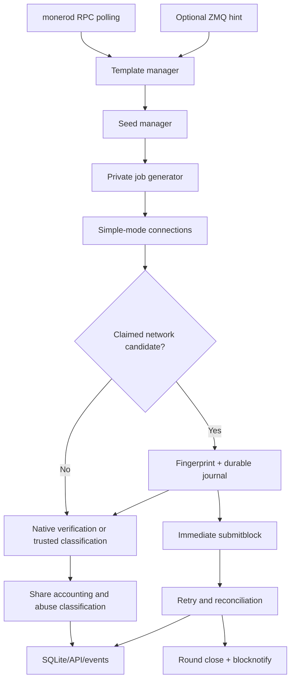

# `monero-solo-stratum` — normative architecture and implementation blueprint

**Blueprint revision:** 1

**Snapshot date:** 2026-08-12

**Purpose:** complete implementation handoff to a fresh coding agent

**Target license:** MIT, subject to retained third-party notices

This document is the authoritative transfer record for the standalone
`monero-solo-stratum` project. It collects the decisions made in the original
design conversation, incorporates the user's later corrections, resolves the
few remaining implementation choices explicitly, and documents the published
`monero-stratum-pow-verifier` API at the exact pinned revision.

The words **MUST**, **MUST NOT**, **SHOULD**, and **MAY** are normative. A fresh
agent should read this file completely before changing code. Where a historical
XMRig Proxy behavior conflicts with a later rule in this document, this
document wins.

## Document map

- Sections 1–5: handoff, exact GitHub provenance, scope, architecture, and tree.
- Sections 6–10: complete config, lifecycle, entropy, daemon/template flow,
  and XMRig simple-mode wire protocol.
- Sections 11–16: validation, difficulty, dedupe, verifier mode, immediate
  candidates, retries, and reconciliation.
- Sections 17–22: executable SQLite schema, rounds/hashrate, read-only JSON
  API, Unix events, DDoS controls, and `blocknotify`.
- Section 23: the pinned verifier's complete public C API and integration guide.
- Sections 24–26: security invariants, operator documentation, and test matrix.
- Sections 27–30: ordered build plan, definition of done, frozen decisions,
  and exact primary/reference source map.

## 1. Fresh-chat handoff instructions

The next agent should begin with these actions:

1. Read this entire file.
2. Inspect `git status`, the current branch, remotes, and submodules before
   editing anything.
3. Treat GitHub—not an uncommitted local prototype—as the authoritative
   starting point.
4. Preserve every user-owned or uncommitted local change. If the existing
   checkout is dirty, create a separate clean clone or worktree from the
   target repository's `master` branch.
5. Implement from this specification and from permissively licensed primary
   sources. Do not copy GPL XMRig Proxy source into the MIT target.
6. Keep the first development branch focused. A suitable name is
   `agent/standalone-core`.
7. Do not add a web dashboard, HTML, CSS, JavaScript, terminal dashboard, or
   another visual client. The server exposes data only.
8. Before publishing, run unit, integration, sanitizer, crash-recovery, and
   Monero regtest tests described later in this document.

At the time this blueprint was created, a local `monero-solo-stratum` checkout
contained staged, uncommitted verifier-prototype work on
`verifier/native-randomx-library`, and a local verifier checkout also had
uncommitted files despite the authoritative verifier already being published.
Those local changes belong to the user and MUST NOT be overwritten or silently
committed. A clean clone/worktree is the safe implementation base.

## 2. Exact repositories, revisions, and provenance

| Role | Exact repository/ref | Snapshot used by this blueprint |
| --- | --- | --- |
| Standalone target | [`SeriousPassenger/monero-solo-stratum`](https://github.com/SeriousPassenger/monero-solo-stratum), branch [`master`](https://github.com/SeriousPassenger/monero-solo-stratum/tree/master) | commit [`b1f1e365d7ab344ca5ca7f3334fdfbea5da7f9fd`](https://github.com/SeriousPassenger/monero-solo-stratum/commit/b1f1e365d7ab344ca5ca7f3334fdfbea5da7f9fd); only `README.md` and MIT `LICENSE` were published |
| Native verifier | [`SeriousPassenger/monero-stratum-pow-verifier`](https://github.com/SeriousPassenger/monero-stratum-pow-verifier), branch [`master`](https://github.com/SeriousPassenger/monero-stratum-pow-verifier/tree/master) | pin exact commit [`856c015de433a23fe45d88a18dc08c821e50f1cb`](https://github.com/SeriousPassenger/monero-stratum-pow-verifier/commit/856c015de433a23fe45d88a18dc08c821e50f1cb), package version `0.1.0` |
| Behavioral reference | [`SeriousPassenger/xmrig-proxy`](https://github.com/SeriousPassenger/xmrig-proxy), branch **[`improvised-daemon-mining`](https://github.com/SeriousPassenger/xmrig-proxy/tree/improvised-daemon-mining)** | commit [`fe6977291b5bea14e88579e867987e759c96d584`](https://github.com/SeriousPassenger/xmrig-proxy/commit/fe6977291b5bea14e88579e867987e759c96d584), tree `78054b8b08a3bc07b0f68aeb6b34b00b9fc5f98e` |
| XMRig Proxy base | [`xmrig/xmrig-proxy`](https://github.com/xmrig/xmrig-proxy), release [`v6.26.0`](https://github.com/xmrig/xmrig-proxy/releases/tag/v6.26.0) | commit [`0dc23f69b546ae973ae0ae6fb65593f998256589`](https://github.com/xmrig/xmrig-proxy/commit/0dc23f69b546ae973ae0ae6fb65593f998256589); the reference branch was exactly 19 commits ahead and 0 behind |
| Monero consensus reference | [`monero-project/monero`](https://github.com/monero-project/monero), tag [`v0.18.5.1`](https://github.com/monero-project/monero/releases/tag/v0.18.5.1) | annotated tag points to commit [`4f92268d7c16741cfb41e5bbe2aa46cc260a9ea5`](https://github.com/monero-project/monero/commit/4f92268d7c16741cfb41e5bbe2aa46cc260a9ea5) |
| RandomX | [`tevador/RandomX`](https://github.com/tevador/RandomX), tag [`v1.2.2`](https://github.com/tevador/RandomX/releases/tag/v1.2.2) | commit [`6c4340ba4561aec9a3611c1aedf9931239777fb3`](https://github.com/tevador/RandomX/commit/6c4340ba4561aec9a3611c1aedf9931239777fb3), nested inside the verifier |

Important spelling: the source branch is **`improvised-daemon-mining`**, not
`improved-daemon-mining`.

Useful historical reference commits are:

- [`5bcaee693e2ae0aa27bb1913a0d30bc5f67db994`](https://github.com/SeriousPassenger/xmrig-proxy/commit/5bcaee693e2ae0aa27bb1913a0d30bc5f67db994): cached daemon mining and event stream;
- [`4fefd27f49885c7c9fd857df4299f70be7f20ffe`](https://github.com/SeriousPassenger/xmrig-proxy/commit/4fefd27f49885c7c9fd857df4299f70be7f20ffe): independent RandomX verification;
- [`dc29914acca6411d0086bad9aa84225eac6270fd`](https://github.com/SeriousPassenger/xmrig-proxy/commit/dc29914acca6411d0086bad9aa84225eac6270fd): verified-daemon hardening;
- [`d4a16aa24be3efe1c8b383cfa2d322e982b3ed3c`](https://github.com/SeriousPassenger/xmrig-proxy/commit/d4a16aa24be3efe1c8b383cfa2d322e982b3ed3c): stale and global duplicate policy;
- [`739edfba4b4d35da0e6cc2b266e6b04780df93b4`](https://github.com/SeriousPassenger/xmrig-proxy/commit/739edfba4b4d35da0e6cc2b266e6b04780df93b4)
  and [`9c2fe30e6d4a5dab7a75a2743f578d65ae7f6c1e`](https://github.com/SeriousPassenger/xmrig-proxy/commit/9c2fe30e6d4a5dab7a75a2743f578d65ae7f6c1e): daemon reconciliation.

### 2.1 Licensing boundary

- `monero-solo-stratum` is MIT licensed.
- `monero-stratum-pow-verifier` is MIT licensed.
- RandomX is BSD 3-Clause licensed and its notice MUST ship.
- Monero's relevant implementation is BSD 3-Clause licensed. If minimal
  address, CryptoNote parsing, Keccak/tree-hash, or difficulty code is copied
  from the pinned Monero source, preserve its copyright/license notices and
  identify the source revision in `THIRD_PARTY_NOTICES.md`.
- XMRig Proxy and the `improvised-daemon-mining` branch are GPLv3. They are a
  behavioral and test-oracle reference only. Do not copy, mechanically
  translate, or extract their source into the MIT repository. Reimplement the
  externally described behavior independently. If any GPL implementation is
  ever copied, stop and revisit the target project's licensing first.

## 3. Product contract

`monero-solo-stratum` is a standalone Monero solo-mining Stratum server. Its
topology is deliberately small:

```text
ordinary XMRig simple-mode miners
              |
              v
      monero-solo-stratum
       |       |       |
       |       |       +--> SQLite + read-only JSON API
       |       +----------> optional Unix NDJSON live stream
       +------------------> one monerod RPC endpoint
                              + optional ZMQ notification endpoint
```

The server MUST:

- use one configured primary Monero payout address;
- obtain daemon block templates directly;
- derive a private template and private job ID for each connection/job;
- implement its own bounded TCP connection lifecycle and XMRig-compatible
  CryptoNote `simple` protocol;
- optionally verify every share in-process with the pinned verifier library;
- bypass verifier waiting for a miner-claimed network candidate and submit its
  frozen block to `monerod` immediately after durable journaling, deduplication,
  and candidate-abuse admission;
- persist connections, jobs, claimed/computed hashes, shares, candidates,
  attempts, rounds, bans, events, hashrate buckets, and block notifications;
- expose a versioned read-only JSON API;
- optionally expose a live Unix-domain newline-delimited JSON event stream;
- enforce aggressive but normal-miner-tolerant connection and request limits;
- optionally execute `blocknotify` after an authoritative local block
  acceptance.

### 3.1 Explicit exclusions

The first implementation MUST NOT contain:

- upstream mining pools or proxy-to-pool behavior;
- upstream failover strategies;
- splitter/mapper abstractions, nonce splitting, or extra-nonce splitters;
- donation mining;
- NiceHash nonce-splitting mode; a narrow legacy compact-target wire profile
  may be selected from the declared agent without changing nonce ownership;
- self-select mining;
- multiple daemon/pool identities;
- a verifier subprocess or the historical verifier Unix-socket protocol;
- HTML, CSS, JavaScript, an embedded web dashboard, a terminal dashboard, or
  any bundled visual client;
- the XMRig Proxy API schema;
- wallet-RPC polling or wallet accounting;
- orphan detection or later reorg correction of already closed rounds;
- hot configuration reload;
- miner-signature/secret-spend-key templates in v1.

If a parsed daemon template requires miner signature material, v1 MUST fail
that template closed, mark readiness false, and explain that the template type
is unsupported. It MUST NOT ask for or silently derive a wallet spend secret.

## 4. Architecture and runtime model



Recommended components and ownership:

1. `Config`: strict JSON loading, defaults, validation, and redaction metadata.
2. `EntropyManager`: OS entropy plus HMAC-DRBG-SHA-256.
3. `Database`: migrations, one prioritized writer, read-only query pool.
4. `DaemonRpc`: bounded HTTP JSON-RPC requests and response classification.
5. `DaemonZmq`: optional `json-minimal-chain_main` notifications.
6. `TemplateManager`: coalesced polling/ZMQ refresh and validated public snapshots.
7. `MoneroTemplate`: permissively licensed parsing, mutation, hashing-blob,
   miner-transaction hash, and exact block reconstruction.
8. `VerifierAdapter`: the pinned public `mspv_*` API only.
9. `JobManager`: per-connection private job creation/retention and seed references.
10. `StratumServer`/`Connection`: framing, login, job delivery, submit, keepalive.
11. `DuplicateRegistry`: process-global active 48-byte share identities.
12. `CandidateManager`: durable frozen-block idempotency, attempts, recovery,
    reconciliation, and exactly one logical terminal transition.
13. `Accounting`: share states, rounds, one-second work buckets, rolling H/s.
14. `Defense`: token buckets, counters, immutable-peer-IP bans.
15. `ApiServer`: read-only JSON backed by snapshots and SQLite readers.
16. `EventStream`: optional live Unix NDJSON broadcaster.
17. `BlockNotify`: durable, asynchronous, no-shell command dispatcher.

### 4.1 Concurrency rules

- One event-loop thread SHOULD own TCP connections, timers, HTTP completions,
  and ZMQ dispatch.
- Each Stratum output queue is hard-capped by
  `stratum.max_output_bytes_per_connection`; enqueue is all-or-nothing.
- The verifier owns its preparation and hashing threads.
- A verifier callback MUST only signal an event-loop wakeup; it MUST NOT call
  another `mspv_*` function on the same context.
- One prioritized SQLite writer serializes mutations. Candidate-journal commits
  have priority over ordinary telemetry batches. Read-only API connections use
  WAL snapshots and MUST NOT block the mining hot path.
- The writer queue is capped by configured item/byte bounds. At startup reserve
  one fixed-size priority command slot for every possible MSPV outstanding job
  plus every claimed-candidate active slot; configuration is invalid unless
  `max_writer_queue_items >= verifier.max_outstanding +
  defense.candidate_global_inflight + 1024` in verified mode and
  `max_writer_queue_bytes` covers 512 bytes for each reserved command.
  Command envelopes are capped at 512 bytes and reference already-owned
  immutable job blobs, rather than copying blobs into the queue. Ordinary
  reads/submits are paused before consuming this reserve, so an admitted
  completion that proves a block always has a journal command slot.
- `blocknotify` children run under a bounded supervisor and never on the event
  loop.
- No API client, stream client, database history query, or notification program
  may delay RandomX execution or a daemon RPC after the candidate's mandatory
  durable commit has completed.

The daemon scheduler permits at most `daemon.max_concurrent_requests` on-wire
RPCs and `daemon.max_pending_requests` in-memory intents. One in-memory slot is
reserved for verified candidates. Additional verified candidates remain as
durable `journaled` rows and are selected before template/telemetry work as
slots open; capacity never deletes a candidate.

## 5. Repository layout and build contract

A recommended target tree is:

```text
monero-solo-stratum/
├── CMakeLists.txt
├── LICENSE
├── THIRD_PARTY_NOTICES.md
├── README.md
├── config.example.json
├── cmake/
├── docs/
│   ├── ARCHITECTURE.md
│   ├── CONFIGURATION.md
│   ├── API.md
│   ├── PERSISTENCE.md
│   ├── STRATUM_PROTOCOL.md
│   ├── SECURITY.md
│   ├── VERIFIER.md
│   └── TESTING.md
├── include/monero_solo/
├── src/
│   ├── api/
│   ├── config/
│   ├── crypto/
│   ├── daemon/
│   ├── db/
│   ├── events/
│   ├── monero/
│   ├── notify/
│   ├── stratum/
│   └── verifier/
├── tests/
│   ├── unit/
│   ├── integration/
│   ├── fuzz/
│   └── regtest/
└── third_party/
    └── monero-stratum-pow-verifier/   # gitlink pinned to 856c015de433a23fe45d88a18dc08c821e50f1cb
```

The server SHOULD use C++20 (C++17 is the verifier's minimum), CMake 3.16 or
newer, and system dependencies with permissive/compatible licenses:

- libuv for event-loop/TCP/process integration;
- libcurl for daemon HTTP RPC;
- libzmq for optional ZMQ;
- SQLite3;
- OpenSSL 3 EVP/HMAC primitives for HMAC-DRBG and SHA-256 fingerprints;
- a bounded JSON parser such as RapidJSON or nlohmann/json;
- Boost.Multiprecision or equivalent for exact Monero 128/256-bit difficulty
  calculations.

Dependency choice may change if tests preserve the exact contracts, but the
native verifier pin may not float. Add it as a submodule and link its exported
target:

```cmake
cmake_minimum_required(VERSION 3.16)
project(monero-solo-stratum LANGUAGES C CXX)

set(CMAKE_CXX_STANDARD 20)
set(CMAKE_CXX_STANDARD_REQUIRED ON)
set(CMAKE_CXX_EXTENSIONS OFF)

add_subdirectory(third_party/monero-stratum-pow-verifier)

add_executable(monero-solo-stratum
    # explicit source list
)

target_link_libraries(monero-solo-stratum
    PRIVATE
        mspv::verifier
)
```

The published target snapshot does not contain this gitlink yet. The first
clean implementation worktree adds it with these exact operations:

```bash
git clone \
  https://github.com/SeriousPassenger/monero-solo-stratum.git

git -C monero-solo-stratum checkout \
  b1f1e365d7ab344ca5ca7f3334fdfbea5da7f9fd
git -C monero-solo-stratum switch -c agent/standalone-core

git -C monero-solo-stratum submodule add \
  https://github.com/SeriousPassenger/monero-stratum-pow-verifier.git \
  third_party/monero-stratum-pow-verifier

git -C monero-solo-stratum/third_party/monero-stratum-pow-verifier \
  checkout 856c015de433a23fe45d88a18dc08c821e50f1cb

git -C monero-solo-stratum submodule update --init --recursive
```

After that gitlink is committed, every consumer clones with
`git clone --recurse-submodules` or runs the final update command. The verifier
contains the nested RandomX gitlink pinned to
`6c4340ba4561aec9a3611c1aedf9931239777fb3`; CI must assert both gitlink object
IDs rather than trusting movable branch names.

## 6. Normative configuration

Configuration is startup-only strict JSON. Unknown keys, duplicate object keys,
wrong types, invalid encodings, out-of-range values, invalid addresses, and
missing required keys MUST fail startup before a public listener opens. An
explicit configuration-file error MUST NOT fall through to a different file.

This is the complete v1 example. It contains no dashboard setting by design.

```json
{
  "schema_version": 1,
  "network": "mainnet",
  "wallet_address": "4...",
  "blocknotify": null,
  "stratum": {
    "listen": [
      "0.0.0.0:3333",
      "[::]:3333"
    ],
    "access_password": null,
    "max_connections": 2048,
    "max_connections_per_ip": 128,
    "login_timeout_ms": 10000,
    "idle_timeout_ms": 300000,
    "max_line_bytes": 16384,
    "max_output_bytes_per_connection": 1048576,
    "max_json_depth": 32,
    "job_history": 6,
    "job_ttl_ms": 120000,
    "max_pending_verifications_per_connection": 8,
    "submit_workers": 0
  },
  "daemon": {
    "rpc_url": "http://127.0.0.1:18081",
    "rpc_username": null,
    "rpc_password": null,
    "zmq_address": "tcp://127.0.0.1:18083",
    "poll_interval_ms": 20000,
    "request_timeout_ms": 15000,
    "max_concurrent_requests": 8,
    "max_pending_requests": 256,
    "max_response_bytes": 16777216,
    "refresh_retry_ms": 1000,
    "submit_attempts": 4,
    "submit_retry_ms": 2000
  },
  "difficulty": {
    "mode": "fixed",
    "value": 1048576
  },
  "verifier": {
    "enabled": true,
    "memory_mode": "fast",
    "workers": 0,
    "seed_init_threads": 0,
    "max_seeds": 2,
    "pending_capacity": 256,
    "max_outstanding": 512,
    "max_input_size": 4096,
    "max_buffered_input_bytes": 16777216,
    "large_pages": "try",
    "jit": "secure",
    "aes": "auto",
    "log_level": "info"
  },
  "entropy": {
    "reseed_interval_seconds": 1200,
    "max_reseed_age_seconds": 1260,
    "max_generate_calls": 1048576
  },
  "database": {
    "path": "/var/lib/monero-solo-stratum/state.sqlite3",
    "busy_timeout_ms": 5000,
    "max_writer_queue_items": 100000,
    "max_writer_queue_bytes": 67108864,
    "retention_days": 0,
    "store_rejected_shares": true
  },
  "events": {
    "enabled": true,
    "unix_socket": "/run/monero-solo-stratum/events.sock",
    "permissions": "0660",
    "max_clients": 8,
    "max_pending_bytes_per_client": 1048576
  },
  "api": {
    "enabled": true,
    "listen": "127.0.0.1:8787",
    "access_token": null,
    "max_page_size": 1000,
    "max_connections": 64,
    "request_rate_per_second": 20,
    "request_burst": 40,
    "max_pending_bytes_per_connection": 2097152
  },
  "defense": {
    "enabled": true,
    "profile": "aggressive",
    "ban_seconds": 7200,
    "connection_rate_per_minute": 60,
    "connection_burst": 20,
    "request_rate_per_second": 50,
    "request_burst": 100,
    "submit_rate_per_second": 20,
    "submit_burst": 40,
    "malformed_limit": 10,
    "auth_failure_limit": 10,
    "unknown_job_limit": 20,
    "duplicate_limit": 20,
    "abuse_window_seconds": 60,
    "hammer_rate_multiplier": 4,
    "hammer_sustain_seconds": 5,
    "candidate_rate_per_minute": 12,
    "candidate_burst": 3,
    "candidate_inflight_per_ip": 2,
    "candidate_global_inflight": 64,
    "false_candidate_limit": 3,
    "false_candidate_window_seconds": 600,
    "trusted_candidate_rejection_limit": 3,
    "trusted_candidate_rejection_window_seconds": 600,
    "verification_mismatch_limit": 10,
    "verification_mismatch_window_seconds": 600
  },
  "logging": {
    "level": "info",
    "file": null,
    "include_private_job_entropy": false
  }
}
```

### 6.1 Required keys and exact semantics

The following keys MUST be present even when their value is `null`:

- `schema_version`, `network`, `wallet_address`, `blocknotify`, and top-level
  objects `stratum`, `daemon`, `difficulty`, `verifier`, `entropy`, `database`,
  `events`, `api`, `defense`, and `logging`;
- `stratum.listen`, `stratum.access_password`;
- `daemon.rpc_url`, `daemon.zmq_address`;
- `difficulty.mode`, `difficulty.value`;
- `verifier.enabled`;
- `database.path`;
- `events.enabled`;
- `api.enabled`;
- `defense.enabled`.

Other omitted keys use the exact defaults shown above.

| Key | Contract |
| --- | --- |
| `schema_version` | Exactly integer `1` for this blueprint. |
| `network` | One of `mainnet`, `testnet`, `stagenet`, `regtest`; use the exact mapping in section 6.4 and cross-check daemon before readiness. |
| `wallet_address` | Full Base58/checksum/prefix validation; primary address only. Reject integrated addresses, subaddresses, unknown prefixes, checksum errors, and network mismatch using section 6.4. |
| `blocknotify` | `null` or a nonempty no-shell command template documented in section 22. Empty string is treated as disabled. |
| `stratum.listen` | Nonempty array of unique TCP endpoints. Binding any configured endpoint failure is fatal. |
| `stratum.access_password` | Missing is fatal; `null` or `""` disables authentication; any nonempty value requires an exact, untrimmed match. Whitespace is significant. |
| `daemon.rpc_url` | HTTP(S) base URL for trusted `monerod`; userinfo in the URL is forbidden. Credentials use separate fields. |
| `daemon.rpc_username/password` | Both `null`, both empty strings, or both nonempty strings. A mixed empty/nonempty pair is invalid. A nonempty pair uses monerod-compatible HTTP Digest authentication, including over HTTPS; Basic-only fallback is forbidden. Never log, persist, stream, or expose the password. |
| `daemon.zmq_address` | `null`/`""` means polling only; otherwise ZMQ is an accelerator and polling remains active. |
| `difficulty.mode` | Exactly `fixed` or `minimum`; there is no vardiff in v1. |
| `difficulty.value` | Unsigned decimal integer, at least 1 and at most `UINT64_MAX`. |
| `verifier.enabled` | `true` gives authoritative computed RandomX hashes; `false` is trusted-miner mode and allocates no RandomX verifier resources. |
| `database.retention_days` | V1 requires exact integer `0`: unlimited retention and no automatic deletion. |
| `api.access_token` | `null`/`""` disables API authentication; nonempty means exact Bearer token. It is independent from the Stratum password. |

Every omitted optional key takes the value in the complete example. JSON
numbers below are integer tokens: fractional/exponent notation, negative zero,
and values outside the stated range are invalid. Byte limits apply after UTF-8
decoding unless a field is explicitly hex.

#### Complete scalar/range matrix

| Stratum key | Type and allowed value |
| --- | --- |
| `listen` | Required nonempty array of unique endpoint strings; each is `IPv4:port`, `[IPv6]:port`, or `hostname:port`; port 1..65535; hostname is resolved once per bind attempt; maximum 32 endpoints. |
| `access_password` | Required null or UTF-8 string up to 4,096 bytes; null/empty disables authentication. |
| `max_connections` | 1..1,000,000; default 2,048. |
| `max_connections_per_ip` | 1..`max_connections`; default 128 for rental-service fan-in. |
| `login_timeout_ms` | 1,000..600,000; default 10,000. |
| `idle_timeout_ms` | 10,000..86,400,000; default 300,000. |
| `max_line_bytes` | 1,024..1,048,576; default 16,384, excluding LF. |
| `max_output_bytes_per_connection` | 4,096..67,108,864; default 1,048,576. A job/result that cannot fit closes the connection without changing latest-sent state. |
| `max_json_depth` | 4..128; default 32. |
| `job_history` | 1..64 total retained current/prior jobs; default 6. |
| `job_ttl_ms` | 1,000..3,600,000 for prior jobs; default 120,000. |
| `max_pending_verifications_per_connection` | 1..4,096 and no greater than `verifier.max_outstanding`; default 8. Validated even when verification is disabled. |
| `submit_workers` | 0..256; default 0 selects a hardware-derived nonzero value while retaining CPU for I/O. |

A nonempty Stratum password bypasses only the pre-authentication connection
rate bucket so rental-service fan-in is not rejected before credentials can be
presented. Global/per-IP socket ceilings and subsequent defense checks remain.

| Daemon key | Type and allowed value |
| --- | --- |
| `rpc_url` | Required absolute `http`/`https` URL, no fragment/query/userinfo, path empty or `/`; URL UTF-8 length at most 4,096. Redirects are disabled. |
| `rpc_username`, `rpc_password` | Both null, both empty, or both nonempty strings up to 4,096 bytes; mixed empty/nonempty is invalid. Null/empty pair means no authentication. A nonempty pair sets libcurl to Digest only (`CURLAUTH_DIGEST`) for both HTTP and HTTPS. HTTPS additionally requires normal certificate-chain and hostname verification; it never downgrades to Basic. |
| `zmq_address` | Required null/empty or a libzmq endpoint string up to 4,096 bytes. |
| `poll_interval_ms` | 1,000..300,000; default 20,000. |
| `request_timeout_ms` | 100..300,000; default 15,000. |
| `max_concurrent_requests` | 1..1,024; default 8 total daemon HTTP requests. |
| `max_pending_requests` | 2..100,000; default 256. This total includes one slot permanently reserved for a newly verified real candidate, leaving at least one ordinary pending slot. |
| `max_response_bytes` | 4,096..67,108,864; default 16,777,216, enforced while receiving before JSON parse. |
| `refresh_retry_ms` | 100..60,000; default 1,000 before bounded backoff. |
| `submit_attempts` | 1..4; default and production recommendation 4. |
| `submit_retry_ms` | 100..60,000; default 2,000. |

| Difficulty/verifier key | Type and allowed value |
| --- | --- |
| `difficulty.mode` | Required `fixed` or `minimum`. |
| `difficulty.value` | Required JSON unsigned integer 1..18,446,744,073,709,551,615. |
| `verifier.enabled` | Required boolean. |
| `memory_mode` | `light` or `fast`; default `fast` for this server. |
| `workers`, `seed_init_threads` | 0..256; defaults 0/0. Zero selects hardware-derived nonzero values while retaining CPU for I/O. |
| `max_seeds` | 2..64; default 2. The server requires at least two for normal RandomX transitions. |
| `pending_capacity` | 1..1,000,000; default 256. |
| `max_outstanding` | `pending_capacity`..1,000,000; default 512. |
| `max_input_size` | 1..67,108,864 bytes; default 4,096 and must cover every accepted hashing blob. |
| `max_buffered_input_bytes` | `max_input_size`..17,179,869,184; default 16,777,216. |
| `large_pages` | `disabled`, `try`, or `require`; default `try`. |
| `jit` | `disabled`, `enabled`, or `secure`; default `secure`. |
| `aes` | `auto` or `software`; default `auto`. |
| `log_level` | `error`, `warning`, `info`, `debug`, or `trace`; default `info`. Runtime trace still requires verifier trace compiled in. |

| Entropy/database key | Type and allowed value |
| --- | --- |
| `entropy.reseed_interval_seconds` | 1..86,400; default 1,200. |
| `entropy.max_reseed_age_seconds` | `reseed_interval_seconds`..604,800; default 1,260. |
| `entropy.max_generate_calls` | 1..4,294,967,295; default 1,048,576. |
| `database.path` | Required nonempty absolute path up to 4,096 bytes; parent must already exist, be a directory, and not be world-writable unless sticky and owned as securely as `/tmp`; database must not be a symlink. |
| `database.busy_timeout_ms` | 1..60,000; default 5,000. |
| `database.max_writer_queue_items` | 1,024..10,000,000; default 100,000. |
| `database.max_writer_queue_bytes` | 1,048,576..1,073,741,824; default 67,108,864. Candidate dispatch intents use a separately reserved priority slot. |
| `database.retention_days` | Exact integer 0 in v1; nonzero is rejected. |
| `database.store_rejected_shares` | Boolean; default true. |

| Data-interface key | Type and allowed value |
| --- | --- |
| `events.enabled` | Required boolean. |
| `events.unix_socket` | Absolute path up to 4,096 bytes; required/nonempty when enabled. |
| `events.permissions` | Four-character octal string `0xyz`; no execute or other-user bits; default `0660`. |
| `events.max_clients` | 1..1,024; default 8. |
| `events.max_pending_bytes_per_client` | 4,096..67,108,864; default 1,048,576. |
| `api.enabled` | Required boolean. |
| `api.listen` | One TCP endpoint using the same grammar as a Stratum endpoint; required when enabled; default `127.0.0.1:8787`. |
| `api.access_token` | Null or UTF-8 string up to 4,096 bytes; null/empty disables authentication. |
| `api.max_page_size` | 1..10,000; default 1,000; collection request default remains 100. |
| `api.max_connections` | 1..10,000; default 64. |
| `api.request_rate_per_second`, `api.request_burst` | Each 1..1,000,000 per immutable peer IP; defaults 20/40. |
| `api.max_pending_bytes_per_connection` | 4,096..67,108,864; default 2,097,152. |

| Defense/logging key | Type and allowed value |
| --- | --- |
| `defense.enabled` | Required boolean. False is allowed on `regtest`, when every Stratum listener is loopback, or when a nonempty Stratum password protects public listeners. |
| `defense.profile` | Exactly `aggressive` in v1. |
| `ban_seconds` | 1..2,592,000; default 7,200. |
| `connection_rate_per_minute`, `connection_burst` | Each 1..1,000,000; defaults 60/20. |
| `request_rate_per_second`, `request_burst` | Each 1..1,000,000; defaults 50/100. |
| `submit_rate_per_second`, `submit_burst` | Each 1..1,000,000; defaults 20/40. |
| `malformed_limit`, `auth_failure_limit`, `unknown_job_limit`, `duplicate_limit` | Each 1..1,000,000; defaults 10/10/20/20. |
| `abuse_window_seconds` | 1..86,400; default 60. |
| `hammer_rate_multiplier` | 2..1,000; default 4. |
| `hammer_sustain_seconds` | 1..3,600; default 5. |
| `candidate_rate_per_minute`, `candidate_burst`, `candidate_inflight_per_ip`, `candidate_global_inflight` | Each 1..1,000,000 in production; defaults 12/3/2/64. All four may be 0, meaning no candidate-policy limit, only on regtest; hard writer/HTTP queue bounds still apply. Per-IP in-flight cannot exceed global in-flight when nonzero. |
| `false_candidate_limit` | 1..1,000,000; default 3. |
| `false_candidate_window_seconds` | 1..86,400; default 600. |
| `trusted_candidate_rejection_limit` | 1..1,000,000; default 3; used only in trusted mode. |
| `trusted_candidate_rejection_window_seconds` | 1..86,400; default 600; used only in trusted mode. |
| `verification_mismatch_limit` | 1..1,000,000; default 10. |
| `verification_mismatch_window_seconds` | 1..86,400; default 600. |
| `logging.level` | `error`, `warning`, `info`, `debug`, or `trace`; default `info`. |
| `logging.file` | Null/empty for stderr or an absolute path up to 4,096 bytes; refuse symlinks and unsafe parent ownership. |
| `logging.include_private_job_entropy` | Default false. At debug, true adds the 16-byte per-job template entropy to `job.queued`; trace includes it automatically. Either path requires a nonempty file. |

All fields are validated even when their subsystem is disabled, preventing a
misspelled/invalid setting from becoming active unnoticed later. Disabled
events/API/verifier allocate no listener/RandomX resources. All secrets remain
subject to section 6.3.

### 6.2 Difficulty modes

```text
fixed:
    every connection receives exactly difficulty.value

minimum:
    difficulty.value is the floor
    an XMRig-compatible login suffix +<decimal-difficulty> may request higher
    values below the floor are ignored
    a miner can never lower the floor
```

In `minimum` mode only, a login ending in `+<digits>` is interpreted as a
difficulty request when the base label is nonempty and the decimal value fits
`uint64_t`. The suffix is removed from the logical worker label. An invalid or
overflowing suffix makes login invalid rather than being silently reinterpreted.
In `fixed` mode, `+...` has no special meaning and remains part of the label.

### 6.3 Secret handling

The Stratum password, API token, daemon RPC password, DRBG state, OS entropy,
reseed material, and any future wallet secret MUST NOT appear in:

- startup or validation errors;
- normal/debug/trace logs;
- SQLite;
- API responses;
- event payloads;
- crash diagnostics generated by the application.

Startup logs report only `stratum authentication: enabled/disabled`,
`API authentication: enabled/disabled`, and `daemon authentication:
enabled/disabled`.

The 16-byte per-job template entropy is not OS seed or DRBG state. It is the
single logging exception: trace automatically includes its 32-lowercase-hex
encoding in a mode-0600 file, and debug may include it through
`logging.include_private_job_entropy=true`. It is never valid on stderr.

### 6.4 Exact network and address mapping

Use the pinned Monero `cryptonote::get_config` mapping, not inferred first
characters of a Base58 string:

| Config value | Required `get_info.nettype` | Accepted primary Base58 numeric prefix | Rejected integrated/subaddress prefixes |
| --- | --- | ---: | ---: |
| `mainnet` | `mainnet` | 18 | 19 / 42 |
| `testnet` | `testnet` | 53 | 54 / 63 |
| `stagenet` | `stagenet` | 24 | 25 / 36 |
| `regtest` | `fakechain` | 18 | 19 / 42 |

Monero's `FAKECHAIN` deliberately returns the mainnet address configuration,
so regtest uses a checksum-valid mainnet-format **primary** address while
requiring the daemon to report `fakechain`. Decode the complete address,
verify its Keccak checksum and exact payload length, then compare the decoded
varint prefix. Do not accept a mainnet daemon merely because regtest shares
prefix 18. A missing/unknown daemon `nettype` is not ready.

## 7. Startup, readiness, recovery, and shutdown

### 7.1 Startup order

Startup MUST be fail-closed and ordered:

```text
load strict JSON
validate all types, ranges, paths, secrets, and payout address
open SQLite and run forward-only migrations
set WAL + synchronous=FULL + foreign_keys=ON
create a new server-session record
restore unexpired bans and the single open round
initialize EntropyManager from exactly 32 OS-random bytes
create/start native verifier if enabled
start API and optional event stream in not-ready state
connect to monerod; verify network and RPC capability
reconcile journaled dispatching/retry/ambiguous candidates
obtain and validate first public template
prepare/activate the template's RandomX seed if verification is enabled
derive jobs
open Stratum listeners
mark ready
```

The API may expose liveness while initialization is continuing. The Stratum
port MUST NOT accept miners until the database, entropy manager, daemon
template, and required verifier seed are ready.

### 7.2 Readiness

Readiness is true only if all enabled mandatory subsystems are usable:

- configuration is valid;
- SQLite writer accepts durable work;
- OS-seeded DRBG is within its maximum reseed age/output limit;
- daemon RPC recently succeeded and a valid current template exists;
- the current seed is ready in verified mode;
- Stratum listeners are bound.

ZMQ, API history readers, event-stream subscribers, and `blocknotify` delivery
are not readiness prerequisites. ZMQ failure degrades health but RPC polling
continues. A failed notification hook is visible but cannot make mining
unready.

### 7.3 Recovery

On restart:

1. Reopen the existing open round; do not create another if one already exists.
2. Restore active bans by normalized address and expiry.
3. Reconstruct active duplicate identities from persisted, still-eligible jobs
   and submissions so restart does not reopen a replay window.
4. Load candidates in `journaled`, `dispatching`, `retry_wait`, or `ambiguous`.
5. Reconcile each against confirmed chain evidence before sending another RPC.
6. Resume an existing logical submission sequence with the same frozen bytes,
   attempt count, and `had_indeterminate` flag. Never create a second candidate
   row for the same fingerprint.
7. Resume pending `blocknotify` deliveries according to its at-least-once rule.

### 7.4 Shutdown

```text
stop accepting new TCP connections
stop issuing new jobs
stop admitting new ordinary shares
allow already journaled candidate state to reach a safe persisted state
shutdown verifier with DRAIN for graceful stop or CANCEL_PENDING for forced stop
poll and persist every remaining completion until MSPV_CLOSED after successful
shutdown, or persist/degrade on a surfaced shutdown failure
persist unresolved daemon submissions as ambiguous/recoverable
flush ordinary SQLite batches and checkpoint only if nonblocking
stop/terminate notification children, leaving unfinished deliveries pending
close API/event sockets and unlink only this process's configured Unix socket
destroy verifier after every other MSPV call/callback has returned
```

Shutdown MUST NOT mark a transport-uncertain candidate rejected merely to make
the process exit cleanly.

## 8. Entropy manager

### 8.1 Required construction

The process CSPRNG is the exact HMAC-SHA-256 update/generate construction below,
derived from HMAC_DRBG in NIST SP 800-90A. It deliberately uses the agreed
single 256-bit OS input plus domain separation and does **not** claim full
SP 800-90A `Instantiate` conformance, which would require a separately handled
nonce/personalization contract. It MUST obtain OS randomness with a direct
operating-system facility such as Linux `getrandom(2)`, not
`std::random_device`.

1. At startup, read exactly 32 bytes (256 bits) from the OS. Failure is fatal.
2. Initialize `K = 0x00` repeated 32 bytes and `V = 0x01` repeated 32 bytes.
3. Update with the OS bytes plus the static domain string
   `monero-solo-stratum/HMAC-DRBG-SHA256/v1`. The string adds separation, not
   claimed entropy.
4. Serialize access to the state and never copy it into logs or persistence.
5. Every 1,200 seconds, read a fresh independent 32-byte OS value and reseed.
6. Reseed earlier after `entropy.max_generate_calls` generate calls.
7. Store the process ID; if it changes, treat this as a fork and require a
   fresh 32-byte OS reseed before returning any output in the child.
8. Zero temporary entropy buffers when practical.

Normative pseudocode:

```text
update(provided_data):
    K = HMAC_SHA256(K, V || 0x00 || provided_data)
    V = HMAC_SHA256(K, V)
    if provided_data is not empty:
        K = HMAC_SHA256(K, V || 0x01 || provided_data)
        V = HMAC_SHA256(K, V)

instantiate(os_entropy):
    K = 00^32
    V = 01^32
    update(os_entropy || domain)
    last_successful_reseed = monotonic_now
    generate_calls = 0
    creator_pid = getpid()
    timed_retry_delay = 1 second
    next_timed_reseed_retry_at = last_successful_reseed + reseed_interval

generate(n, additional_domain):
    lock
    if getpid() != creator_pid:
        reseed_from_os_or_fail_current_generate("fork")
    if generate_calls >= max_generate_calls:
        reseed_from_os_or_fail_current_generate("count")
    now = monotonic_now
    if now - last_successful_reseed >= reseed_interval and
       now >= next_timed_reseed_retry_at:
        try_timed_reseed_once()
    if monotonic_now - last_successful_reseed >= max_reseed_age:
        fail generation without changing K, V, or generate_calls
    update(additional_domain)
    output = empty
    while len(output) < n:
        V = HMAC_SHA256(K, V)
        append V to output
    update(additional_domain)
    generate_calls += 1
    unlock
    return first n bytes

reseed_with_sample(entropy, reason):
    update(entropy || reason_domain)
    zero(entropy)
    last_successful_reseed = monotonic_now
    generate_calls = 0
    creator_pid = getpid()
    timed_retry_delay = 1 second
    next_timed_reseed_retry_at = last_successful_reseed + reseed_interval
    clear degraded entropy state

reseed_from_os_or_fail_current_generate(reason):
    entropy = getrandom_exactly_32_bytes()
    on failure: fail this generate call without changing K, V, or counters
    on success: reseed_with_sample(entropy, reason)

try_timed_reseed_once():
    make exactly one nonblocking/bounded OS-entropy read of 32 bytes
    on success:
        reseed_with_sample(the same 32-byte sample, "time")
    on failure:
        preserve K, V, last_successful_reseed, and generate_calls
        mark health degraded and emit one transition event
        next_timed_reseed_retry_at = monotonic_now + timed_retry_delay
        timed_retry_delay = min(timed_retry_delay * 2, 60 seconds)
```

Every private job uses two separate generate calls:

```text
private_entropy = generate(16, "private-template-entropy/v1")
job_id_bytes     = generate(16, "private-job-id/v1")
```

The outputs are independent CSPRNG draws. Do not reuse, truncate one to make
the other, persist DRBG state, or deliberately regenerate values after restart.

### 8.2 Reseed failure behavior

- A timed reseed failure marks health degraded, emits a nonsecret persistent
  transition event, and retries after exactly 1, 2, 4, 8, 16, 32, then 60
  seconds (60 seconds thereafter). Calls before `next_timed_reseed_retry_at`
  do not touch the OS entropy source. A success resets the delay to one second.
- Existing DRBG state may continue only until
  `entropy.max_reseed_age_seconds` from the last successful reseed.
- When that age is exceeded, new job issuance stops. Retained-job submissions,
  verifier completions, daemon candidate attempts, reconciliation, API reads,
  event delivery, and recovery continue.
- If the output-count limit or a fork requires a reseed, the current generate
  call makes one exact blocking/bounded 32-byte OS read and fails without
  output if it cannot complete. Later calls retry; the count limit may not be
  exceeded and a child never returns parent-state output.
- Recovery from a successful reseed automatically permits new jobs again once
  the remaining readiness conditions hold.

## 9. Daemon RPC, ZMQ, and public templates

### 9.1 RPC methods

Use HTTP POST to `/json_rpc` with unique signed-64-bit request IDs. The core
template request deliberately uses monerod's canonical compact method name
`getblocktemplate`, matching the pinned behavioral branch:

```json
{
  "jsonrpc": "2.0",
  "id": 1,
  "method": "getblocktemplate",
  "params": {
    "wallet_address": "4...",
    "reserve_size": 16
  }
}
```

Redirects are disabled. The daemon client enforces the configured global
on-wire/pending bounds and aborts a response as soon as
`daemon.max_response_bytes` would be exceeded; excess/malformed bytes are an
indeterminate RPC observation, never an explicit rejection.

The pinned Monero Python RPC framework names block submission `submitblock`
(with `submit_block` as a client alias). Send:

```json
{
  "jsonrpc": "2.0",
  "id": 42,
  "method": "submitblock",
  "params": ["<frozen-full-block-hex>"]
}
```

Template parsing MUST validate at least:

- `blocktemplate_blob`: nonempty even-length hex and a valid full block;
- `blockhashing_blob`: nonempty even-length hex;
- `reserved_offset`: in bounds and points to exactly the requested 16-byte
  miner-transaction extra-nonce field;
- `height`: positive integer;
- `prev_hash`: required, nonempty, valid 32-byte hex;
- `seed_hash`: exactly 32 bytes for `rx/0`;
- `next_seed_hash` when present;
- network difficulty: positive, preferring exact `wide_difficulty` when
  supplied and retaining decimal and hexadecimal canonical forms;
- daemon `status` and matched JSON-RPC ID.

Parse the original full block locally and regenerate its hashing blob. For
Monero, it MUST exactly match the daemon's `blockhashing_blob` before the
snapshot is installable. Failure is a template error and no job is emitted.

### 9.2 Refresh behavior

1. Request an initial template as part of startup.
2. Poll after `poll_interval_ms` measured from the last successful refresh.
3. If configured, subscribe to ZMQ topic `json-minimal-chain_main`.
4. Treat ZMQ only as a hint. On notification, perform a `/getheight` barrier
   until RPC's returned tip hash differs from the cached template `prev_hash`
   (while also parsing its height metadata), then request a template
   immediately. Tip hash—not height alone—is the gate, so a same-height reorg
   triggers refresh.
5. Coalesce simultaneous timer, startup, retry, and ZMQ triggers into one
   in-flight refresh; remember the highest-priority pending reason.
6. Retry transient RPC failure after `refresh_retry_ms` with a bounded backoff.
7. Install **every** valid successful template response and derive/send fresh
   private jobs, including a byte-identical response and a same-height
   transaction-set or parent change. There is no equality suppression in v1;
   height equality is not template equality.
8. Assign a monotonically increasing `template_generation` for every installed
   successful response.

The historical branch used up to ten 100 ms `/getheight` retries when ZMQ
arrived before RPC state. This is an acceptable default for the barrier. If
the bounded barrier still observes the cached tip, drop that hint and shorten
the ordinary poll deadline to `refresh_retry_ms`; never re-arm the same hint in
a busy loop. A duplicate/stale notification may therefore cause one harmless
poll, while polling remains authoritative.

### 9.3 Seed preparation

With verification enabled:

- prepare the current `seed_hash` before issuing work;
- pre-prepare `next_seed_hash` when it is distinct and capacity permits;
- activate the exact current seed;
- retain an old seed while any retained job or admitted verification needs it;
- every job stores the exact `mspv_seed_id`; never hash implicitly with merely
  the verifier's current designation.

`max_seeds = 2` is the minimum supported configuration. During a boundary,
prioritize the current seed and the seed required by retained late work. If a
third future seed appears while both slots are still legitimately referenced,
defer prefetch rather than releasing a needed seed or advertising unverifiable
work. Operators may configure 3 or more when memory permits.

### 9.4 Private job derivation

For every active connection and every public-template update:

```text
for attempt in 1..8:
    copy exact validated public full-block bytes
    draw independent private_entropy[16]
    draw independent job_id[16]
    replace exactly bytes [reserved_offset, reserved_offset + 16)
    reparse the mutated full block
    recompute miner transaction hash, Merkle root, and RandomX hashing blob
    attempt one writer transaction inserting under both UNIQUE constraints
    if either value collides:
        discard both draws and retry with two fresh generate calls
    retain the complete private context
    encode and queue the Stratum job
    only after queue success assign connection_last_sent_height = this_job.height
    return
fail job derivation closed, mark readiness degraded, and emit a nonsecret event
```

The successful serialized SQLite insert is the atomic reservation. The
uniqueness scope is the lifetime of the configured SQLite database, which
is stronger and simpler than live-job-only uniqueness. `public_job_id` and
`entropy` each have independent UNIQUE constraints. A losing concurrent insert
counts as that attempt's collision. Never reuse the noncolliding half of a
pair, and never expose or persist a job whose transaction did not commit.

The retained private context MUST include:

- database/public template ID and generation;
- 16-byte job ID and 16-byte private entropy;
- exact mutated full block bytes;
- exact hashing blob bytes;
- height, previous hash, current and next seed hashes;
- exact verifier seed ID when enabled;
- nonce offset and size;
- reserved offset and size;
- assigned miner difficulty/target and exact network difficulty;
- monotonic creation time and UTC timestamp;
- reference counts for connection history, verifier work, and candidate work.

Retain the current job plus five previous jobs by default (six total). A prior
job expires after 120 seconds. The current job remains until replaced even if
older than the TTL. Submitted nonces are always applied to the exact retained
private template, never to the newest template.

## 10. XMRig simple-mode Stratum protocol

### 10.1 Transport and framing

- Plain TCP, one UTF-8 JSON object per LF-terminated line.
- CRLF is accepted by removing one terminal CR before parsing.
- NUL bytes, invalid UTF-8 in JSON strings, a line over `max_line_bytes`, JSON
  deeper than `max_json_depth`, non-object roots, duplicate keys, or trailing
  non-whitespace data are protocol violations.
- TLS is out of scope for v1; operators may place a TCP/TLS proxy in front, but
  abuse identity remains the actual accepted peer unless a separately trusted
  proxy protocol is deliberately implemented. Never trust `X-Forwarded-For`.

Supported methods are exactly `login`, `submit`, and `keepalived`. A method
before successful login other than `login` is rejected. Unknown methods are
rejected and scored.

Every request method uses the section 10.3 ID type/range rule and requires an
object `params`. `jsonrpc` may be omitted for compatibility with `keepalived`;
when present it must be exact string `"2.0"`. Notifications from miners (no
`id`) are invalid because each supported miner operation requires a response.

### 10.2 Login and authentication

Example request:

```json
{
  "id": 1,
  "jsonrpc": "2.0",
  "method": "login",
  "params": {
    "login": "worker-label",
    "pass": "configured-access-password",
    "agent": "XMRig/6.26.0",
    "rigid": "rig-01",
    "algo": ["rx/0"]
  }
}
```

`login` is a label, not a wallet or routing address. Duplicate labels are
allowed. Bound login and rigid to 256 bytes each and agent to 512 bytes. Reject
embedded NUL. `pass` is the access credential:

- `params.login` and `params.pass` are required strings; login is nonempty;
- `agent` and `rigid` are optional strings defaulting to empty;
- optional `algo` is either string `"rx/0"` or a nonempty array of unique
  strings containing `"rx/0"`; any list with no supported algorithm fails;
- unknown login parameters, including NiceHash/self-select controls, fail the
  strict v1 request instead of activating hidden modes.

```text
configured null or ""  -> authentication disabled; any string pass is accepted
configured nonempty    -> exact byte-for-byte match is required
missing config key     -> startup error, never an accidental public service
```

Do not trim either value. Compare a nonempty secret in constant time. Failed
responses do not reveal whether a label is known.

Successful response:

```json
{
  "id": 1,
  "jsonrpc": "2.0",
  "error": null,
  "result": {
    "id": "<32-lowercase-hex-connection-rpc-id>",
    "job": {
      "blob": "<hashing-blob-hex>",
      "job_id": "<32-lowercase-hex-private-job-id>",
      "target": "<16-lowercase-hex-target>",
      "algo": "rx/0",
      "height": 3736190,
      "seed_hash": "<64-lowercase-hex>"
    },
    "extensions": ["algo", "keepalive"],
    "status": "OK"
  }
}
```

Later work is a notification:

```json
{
  "jsonrpc": "2.0",
  "method": "job",
  "params": {
    "blob": "<hashing-blob-hex>",
    "job_id": "<32-lowercase-hex-private-job-id>",
    "target": "<16-lowercase-hex-target>",
    "algo": "rx/0",
    "height": 3736191,
    "seed_hash": "<64-lowercase-hex>"
  }
}
```

`connection_last_sent_height` is assigned the height of the **latest** complete
job line accepted into that connection's bounded output queue. It is not a
maximum-ever height: after a downward reorg, successfully queueing the new
lower-height job replaces the stored value with that lower height. If enqueue
fails, do not change it; close the unhealthy connection rather than pretending
it received work.

### 10.3 Submission

```json
{
  "id": 2,
  "jsonrpc": "2.0",
  "method": "submit",
  "params": {
    "id": "<connection-rpc-id>",
    "job_id": "<private-job-id>",
    "nonce": "d0030040",
    "result": "e1364b8782719d7683e2ccd3d8f724bc59dfa780a9e960e7c0e0046acdb40100",
    "algo": "rx/0"
  }
}
```

Requirements:

- request `id` MUST be a JSON string of 1..128 UTF-8 bytes or a signed 64-bit
  JSON integer written without exponent/fraction; null, boolean, floating, and
  container IDs are invalid. Echo the exact type and value. The same ID may be
  reused after its earlier response is fully queued, but the pair
  `(id_type,id_value)` may not have two live requests on one connection;
- `params.id` must match this authenticated connection;
- `job_id` must be exactly 16 bytes of hex and belong to this connection;
- `nonce` must be exactly four bytes/eight hex characters; copy its decoded raw
  bytes into the nonce field without host-endian numeric re-encoding;
- `result` must be exactly 32 bytes/64 hex characters;
- optional `algo` must be `rx/0`;
- IDs and hashes normalize to lowercase only after strict decoding.

Assign every syntactically accepted submit a monotonically increasing internal
`request_sequence` scoped to the connection. Persist request ID type and value
for correlation, never as a uniqueness key; legal reuse after response creates
a new sequence/share row.

Successful share response:

```json
{
  "id": 2,
  "jsonrpc": "2.0",
  "error": null,
  "result": {"status": "OK"}
}
```

For compatibility, application share/login errors use wire code `-1` and a
short message such as `Unauthenticated`, `Unknown job`, `Duplicate share`,
`Low difficulty share`, `Stale share`, `Invalid result`, or `Server busy`.
JSON syntax/JSON-RPC envelope errors may use standard `-32700`, `-32600`, and
`-32601`. Rich stable internal error codes belong in persistence/API events,
not in miner-facing detail that leaks policy.

The response always describes **share validation**, never daemon block
acceptance:

- verified mode sends exactly one response only after its MSPV completion and
  final duplicate/target/stale transaction;
- trusted mode sends exactly one response after its synchronous claimed-share
  classification and required durable transactions;
- candidate `submitblock`, retry, reconciliation, and `blocknotify` continue
  independently and never delay or rewrite the miner response;
- if the TCP route disappears first, persist the final result and send nothing;
- there is no second “block accepted/rejected” Stratum response. Operators use
  API/events for that outcome.

This is an intentional supersession of the pinned
`improvised-daemon-mining` branch. That branch coupled a direct candidate's
single miner response to the daemon retry outcome. The standalone product's
later decision decouples share classification from daemon block outcome, so
black-box compatibility tests MUST expect the behavior above rather than the
historical coupling.

A verified request deferred by claimed-candidate admission limits still enters
the bounded verifier. Its later computed candidate gets the high-priority path
in section 15.3. In trusted mode there is no proof path, so a claimed candidate
denied by candidate admission returns `Server busy` and receives no credit.
Duplicate frozen-candidate identity alone does not override verified share
classification; in trusted mode it is `Duplicate share` because no computed
identity can distinguish a forged replay.

### 10.4 Keepalive

```json
{
  "id": 3,
  "method": "keepalived",
  "params": {"id": "<connection-rpc-id>"}
}
```

Reply with the exact normal JSON-RPC envelope:

```json
{
  "id": 3,
  "jsonrpc": "2.0",
  "error": null,
  "result": {"status": "KEEPALIVED"}
}
```

A valid keepalive requires `params.id` to match the connection, resets the idle
timer, and changes no authentication/share counter.

## 11. Share validation, staleness, and classification

### 11.1 Cheap-to-expensive order

```text
enforce frame/JSON/rate bounds
require authenticated connection RPC ID
find retained job owned by this connection
decode exact nonce/result/algo
reconstruct hashing blob and frozen block from the retained private job
compute height_is_older flag (not yet a final stale classification)
reserve claimed global duplicate identity
classify claimed network-candidate threshold
if claimed candidate: candidate admission + durable journal + immediate RPC
if verifier enabled: submit exact hashing blob and claimed hash asynchronously
else: classify from trusted claimed hash
after authoritative/computed validation: assign accepted/stale/low/mismatch
persist final share state, hash rows, work bucket, event, and response
```

Malformed or unknown-job submissions never reach candidate or verifier code.

### 11.2 Exact stale rule

The user's semantic rule is:

> Work is stale only when it is otherwise valid and the latest template
> successfully sent to that same miner is higher than the template for the
> submitted work.

```cpp
const bool height_is_older =
    submitted_job_height != 0 &&
    connection_last_sent_height > submitted_job_height;

const bool stale = work_is_valid && height_is_older;
```

Consequences:

- a same-height earlier job is not stale merely because another template was
  generated or sent;
- global daemon height and another connection's height are irrelevant;
- a template fetch, cache install, ZMQ notice, or failed job enqueue does not
  stale work;
- invalid work from an older height is invalid, not stale;
- unknown/expired job IDs are `unknown_job`, not stale;
- after a downward reorg and successful lower-height job queue, that latest
  lower height is the comparison value; a maximum-ever implementation is
  forbidden.

A structurally valid **claimed candidate** that passes claimed-candidate
admission still enters the immediate daemon path even when `height_is_older`
is true. The server cannot call it stale until validity is known, and admitted
candidate forwarding must not wait for RandomX. If admission is capped,
section 15.3's verified rescue path applies. Monerod is safe to reject a
consensus-stale block. Parallel verification later assigns the share's
accounting status. Daemon `OK` always wins for the block outcome.

This is also an intentional supersession of the pinned behavioral branch. The
branch short-circuited an older-height retained job as stale before duplicate
reservation, verification, or candidate submission. The user's later rule
requires proof before final stale classification and preserves immediate
candidate forwarding. Therefore stale does not have the branch's early
precedence in this standalone implementation.

### 11.3 Final ordinary-share precedence

After verifier/trusted classification, use this precedence:

```text
verifier infrastructure failure -> verifier_failed/server_busy, no credit
computed identity already exists -> duplicate, no credit
claimed/computed mismatch        -> invalid_result, no ordinary share credit
does not meet assigned target    -> low_difficulty, no credit
valid and height_is_older        -> stale, no credit
valid, current-enough, unique    -> accepted, credit assigned difficulty once
```

Blueprint resolution: an ordinary computed hash that meets the target but does
not equal the submitted `result` is rejected as a protocol mismatch. Both
identities remain reserved. If its computed identity was already reserved by
earlier work, definitive `duplicate` outranks `invalid_result`; keep the new
claimed provisional identity as well so rotating lies cannot retry cheaply.
If that computed hash meets the **network** target, the real block is
nevertheless journaled/submitted idempotently before the share result is
finalized; block consensus safety takes priority over ordinary share credit.

## 12. Difficulty and target mathematics

### 12.1 Miner target

For assigned 64-bit share difficulty `D >= 1`:

```text
target64 = floor((2^64 - 1) / D)
```

Encode `target64` as exactly eight little-endian bytes and then 16 lowercase
hex characters. This is directly accepted by XMRig's normal CryptoNote job
parser. To test a raw 32-byte RandomX hash against the assigned pool target,
decode the last eight raw hash bytes (`hash[24..31]`) as a little-endian
`uint64_t` and require the strict comparison `word < target64`. XMRig v6.26.0
submits only under this strict boundary; `word == target64` is low difficulty.
Do not replace it with `<=`. This pool-share shortcut is intentionally
different in shape from the full Monero network check below.

The diagnostic actual difficulty is:

```text
actual_diff = word == 0
    ? UINT64_MAX
    : floor((2^64 - 1) / word)
```

Credited work is the **assigned** share difficulty, not `actual_diff`. This
prevents a lucky non-block share from distorting hashrate accounting.

### 12.2 Network target

Network-candidate detection MUST use Monero's full canonical check, not only
the 64-bit pool shortcut. Interpret the raw 32-byte hash as an unsigned
little-endian 256-bit integer `H` and daemon difficulty as an unsigned 128-bit
integer `D`. A hash passes exactly when:

```text
H * D <= 2^256 - 1
```

This matches `cryptonote::check_hash` in Monero v0.18.5.1. Prefer the daemon's
wide difficulty. Store exact network difficulty as canonical unsigned decimal
text because SQLite and JSON/JavaScript cannot safely represent all values.

Use the same full check on the miner's claimed hash to decide whether it is a
claimed candidate and on the computed hash to discover an unclaimed candidate.
Test the implementation against pinned Monero difficulty vectors and boundary
values; do not improvise endian conversions.

## 13. Global duplicate detection

### 13.1 Ordinary share identity

The RandomX duplicate key is exactly 48 raw bytes:

```text
private_job_entropy[16] || PoW_result[32]
```

It is global across the process and all connections. Connection ID, IP, label,
nonce, public template ID, source ID, and height are not equality inputs.
Height/source buckets exist only for lifecycle cleanup.

Required properties:

- decode hex before forming the binary key; hex case cannot bypass equality;
- equal PoW results on different private entropy are distinct;
- the same entropy/result is a duplicate through any connection;
- different claimed results on one private template are distinct claimed
  identities until verification connects them to the same computed work;
- reserve atomically so two concurrent identical submissions have one winner;
- capacity exhaustion fails closed as `server_busy`; never evict a still-
  eligible identity merely to admit another;
- the active cache is memory-bounded and its historical record remains in
  SQLite after memory release.

Suggested configurable/default caps, inherited as reference values, are
131,072 active entries process-wide and 65,536 per source **summed across all
of that source's retained height buckets**. These may become explicit config
fields before v1; until then they are documented compile-time constants.

### 13.2 Provisional and authoritative identities

```text
on structurally valid submission:
    reserve entropy || claimed_hash provisionally
    duplicate -> reject before expensive work

on verified MATCH:
    claimed key is also authoritative; keep it

on verified MISMATCH:
    atomically reserve entropy || computed_hash as well
    keep both claimed and computed identities
    reject ordinary share credit
    still escalate a computed network candidate

on verifier infrastructure/admission failure:
    release only the provisional reservation so a genuine retry is possible

on low-difficulty or stale but successfully computed work:
    keep the authoritative identity to prevent replay
```

Trusted mode has no computed identity and retains the claimed key.

### 13.3 Bucket lifetime

- A same-height public-template refresh does not clear entries.
- When height advances, logically retire older buckets but keep each one while
  a connection retains an eligible job, an admitted verifier task references
  it, or candidate submission/reconciliation still references it.
- When the final reference disappears, free the in-memory bucket immediately.
- A downward reorg can retain higher- and lower-height buckets together.
- An old submission may never roll a source's observed height backward.
- On restart, rebuild still-relevant identities from SQLite before opening
  Stratum listeners.

Use generation-tagged reservation tokens so releasing an old provisional
token cannot erase a later reservation of the same key.

## 14. Verified mode and trusted mode

### 14.1 Verified mode

When `verifier.enabled = true`:

- initialize the exact pinned in-process verifier;
- do not issue a job until its exact seed is ready;
- insert the submitted nonce into an owned copy of the exact job hashing blob;
- call `mspv_verify_submit` with the exact seed ID and all 32 claimed bytes;
- use a durable numeric share/verification row ID as `user_tag`, not a pointer;
- persist the library ticket-to-share mapping;
- treat `completion.hash` as authoritative only when
  `completion.result == MSPV_RESULT_OK` and `completion.error == MSPV_OK`;
- derive target, duplicate, candidate, stale, and accounting outcomes from the
  computed hash;
- expose hashrate source as `verified`;
- bound global and per-connection pending verification counts;
- classify queue/seed/library failures as infrastructure errors, not proof of
  miner dishonesty.

Claimed candidates still bypass verifier waiting. Verification runs in
parallel for authoritative accounting and false-candidate detection.

### 14.2 Trusted mode

When `verifier.enabled = false`:

- do not create an MSPV context or allocate RandomX cache/dataset memory;
- use the claimed hash for pool-target, candidate, duplicate, and hashrate
  accounting;
- label API/event provenance `claimed`, never `verified`;
- continue to treat monerod as the only block-consensus authority;
- apply candidate rate/in-flight bounds and score repeated deterministic daemon
  rejections as abuse, because cryptographic false-candidate verification is
  unavailable. One candidate contributes exactly one
  `trusted_candidate_rejection` event only after all of its snapshotted
  attempts ended in explicit rejection and its terminal state is `rejected`.
  Reaching `trusted_candidate_rejection_limit` such events for one immutable
  peer IP within `trusted_candidate_rejection_window_seconds` creates the
  configured ban. Indeterminate/ambiguous outcomes, infrastructure failures,
  and a candidate that ever received daemon `OK` contribute zero.

Documentation MUST warn clearly: trusted mode permits an untrusted miner to
forge shares and reported hashrate. It exists only for an operator-controlled
environment.

Naming is frozen: the operating mode is called **trusted mode**, while the
database/API/event provenance string for work accepted without computation is
exactly `claimed`. Do not introduce a competing `trusted` provenance enum.

### 14.3 Admission pseudocode

```text
function admit_verification(share, job, hashing_blob, claimed_hash):
    if connection.pending_verifications == per_connection_limit:
        release provisional duplicate key
        finalize infrastructure_busy without miner strike
        return

    status, ticket = mspv_verify_submit(
        context,
        job.mspv_seed_id,
        hashing_blob,
        claimed_hash,
        user_tag = share.database_id)

    if status == MSPV_OK:
        persist ticket and state=verifying
        increment connection pending count
    else if status == MSPV_QUEUE_FULL:
        release provisional duplicate key
        finalize infrastructure_busy without miner strike
    else:
        release provisional duplicate key
        finalize verifier_failed; degrade health when appropriate
```

Completion order is arbitrary. A completion handler finds the immutable share
row by `user_tag`, checks the ticket/seed ID, updates hashes and duplicate
reservations, performs exact target checks, and only then sends one final miner
response if the connection/request route still exists.

## 15. Immediate candidate path and idempotency

### 15.1 Separate frozen-block identity

The ordinary 48-byte share key is insufficient: an attacker could resend the
same nonce/block with different fake result hashes. Define:

```text
candidate_key = SHA256(
    "monero-solo-stratum/candidate/v1\0" || frozen_full_block_bytes)
```

Store the 32 raw bytes under a durable SQLite unique constraint. This key is
independent of the claimed result and survives restart. The exact frozen full
block is immutable after key calculation.

### 15.2 Claimed-candidate sequence

A claimed candidate is a structurally valid submission whose **claimed** hash
passes the full Monero network target for that retained job.

```text
parse and bound-check request
find connection-owned retained job
decode nonce/result
copy retained private full block and insert raw nonce bytes
reparse finalized block
calculate canonical miner/coinbase transaction hash
freeze exact binary full block
calculate candidate_key

enter the serialized writer-side key critical section
if a durable candidate row already has candidate_key:
    attach this share to it; mark candidate_admission=existing
else:
    acquire a generation-tagged in-memory provisional key reservation
    apply claimed-candidate per-IP token bucket and active-sequence caps
    in one synchronous=FULL transaction:
        if admitted:
            insert candidate row + frozen bytes + dispatch intent
            mark candidate_admission=admitted
        else if verified mode:
            persist the share as candidate_admission=deferred, with no candidate row
        else:
            persist candidate_admission=trusted_rate_limited, with no candidate row
    after successful commit or rollback, release the provisional reservation
leave the key critical section

without waiting for RandomX, when admitted:
    send submitblock RPC using those exact bytes

regardless of claimed-candidate admission, when verification is enabled:
    submit exact hashing blob to MSPV
```

“Immediately” means it skips the verifier queue. The mandatory duplicate,
abuse-admission, and durable-journal operations happen first. No daemon RPC may
begin before the candidate transaction commits successfully.

The rate/in-flight checks are not a verification gate. If claimed forwarding
is denied by a cap in verified mode, persist `candidate_admission = deferred`, do
not create/send an unjournaled daemon request, and still admit the share to the
normal bounded MSPV queue. Section 15.3 guarantees that a later computed real
candidate cannot be lost. In trusted mode, denied admission is terminal
`server_busy` because there can be no computed proof; this is part of trusted
mode's documented risk.

The provisional candidate-key token is never durable and never survives its
writer operation. It serializes the cap decision with a competing claimed or
computed insertion; it is atomically upgraded by the transaction's UNIQUE
candidate-row insert, or released after a denied/failed transaction. Thus a
deferred share cannot strand `candidate_key`, and section 15.3 can later
acquire the same key, insert the missing row, and set that share's
`candidate_id`. The insert transaction also links all pending
`candidate_verdicts` with that key. A crash leaves either a committed candidate row or no
reservation at all. Generation-tagged release prevents an old cleanup from
removing a newer in-memory reservation.

If the candidate fingerprint already exists:

- do not send another independent logical sequence;
- attach the share attempt to the existing candidate for audit;
- do not use its daemon state as the miner response; apply the section 10.3
  share-response rule;
- rotating fake result strings cannot trigger more daemon requests.

### 15.3 Computed but unclaimed candidate

If native verification finds any network-valid computed hash whose candidate
is not already journaled—including work whose claimed forwarding was denied:

1. reconstruct/freeze the exact block from its retained job and nonce;
2. enter the same writer-side key critical section and check the durable
   UNIQUE key;
3. if absent, acquire the provisional token, durably insert/journal, then
   release the token; otherwise attach to the existing row;
4. if newly journaled, submit immediately; if an existing row is active, let
   its one logical dispatcher continue; never restart a terminal row;
5. record the claimed/computed mismatch separately.

This **verified-candidate** path bypasses claimed-candidate per-IP token and
in-flight caps. It still obeys durable candidate-key uniqueness and enters the
bounded daemon HTTP scheduler at its highest priority, ahead of template/API
work. It may wait only for an existing on-wire daemon slot; it is never dropped
because the queue is full. Reserve capacity for at least one such pending item
and apply mining backpressure before that reserve can be exhausted. The block
is not sacrificed because the miner supplied a wrong `result` or flooded
claimed-candidate admission.

A claimed candidate counts against per-IP/global candidate in-flight caps from
its successful durable `journaled` commit through `journaled`, `dispatching`,
and `retry_wait`. It stops counting immediately on `accepted`, `rejected`, or
`ambiguous`. An `ambiguous` candidate's later reconciliation uses the separate
four-cycle global bound and does not pin candidate admission indefinitely.

### 15.4 False-candidate behavior

- An occasional claimed candidate that computes below network difficulty is
  recorded and tolerated.
- In verified mode, `false_candidate_limit` actionable verified false claims
  from one immutable peer IP within `false_candidate_window_seconds` make that
  IP eligible for the configured ban.
- A rate-limited/deferred claimed candidate has no daemon sequence. When it is
  later verified below network difficulty, persist a pending verdict keyed by
  its 32-byte `candidate_key`. If that key is journaled before the retained job
  retires, link the verdict to the candidate and follow its daemon outcome. If
  the job retires with no durable candidate row and no provisional key token,
  the writer makes the verdict actionable then. Thus rate limiting does not
  erase evidence, but a later daemon-authoritative outcome can still suppress
  it before any ban is created.
- For a journaled candidate, a below-target verifier result is persisted as a
  pending verdict linked to both share and candidate but creates no
  `abuse_events` row and cannot trigger a ban yet. It becomes one actionable
  `verified_false_candidate` abuse event only if the candidate reaches
  terminal `rejected` after wholly explicit daemon rejections. An `ambiguous`
  candidate never contributes false-candidate or candidate-related mismatch
  ban evidence, even after automatic reconciliation is exhausted, because a
  lost daemon response may still have represented acceptance.
- Per-IP and global in-flight caps prevent unlimited RPCs before verification
  catches up.
- Verifier infrastructure failure is not a false-candidate verdict.
- If monerod returned authoritative `OK` while native verification says the
  candidate was false, keep the block accepted, permanently suppress pending
  false-candidate and candidate-related mismatch abuse for that item, and emit
  a high-severity `verifier_consistency_error`. Since actionable evidence is
  never created before this outcome is known, no ban rollback or reconnection
  semantics are required.

## 16. Daemon submission, retries, and reconciliation

### 16.1 Frozen submission journal

Before attempt 1, durably store:

- candidate ID/key and immutable binary block;
- job, template, connection, worker, and normalized immutable peer IP IDs;
- height, nonce, private entropy;
- claimed hash and computed hash if available;
- assigned/share/network difficulties;
- canonical locally calculated miner transaction hash;
- logical submission ID, state, attempt count, immutable configured
  `max_attempts`, and timestamps;
- `had_indeterminate = false` and dispatch intent.

Retries MUST send the identical frozen bytes. Never rebuild from a newer
template or recalculate a different private block.

### 16.2 Attempt classification

The configured default is exactly four total attempts and 2,000 ms between
unsuccessful responses. Snapshot `daemon.submit_attempts` into each candidate's
`max_attempts` at journaling, so a restart with changed config cannot alter an
existing sequence. The first daemon `result.status == "OK"` is authoritative
and stops all later attempts.

| Observation | Attempt classification |
| --- | --- |
| matched JSON-RPC ID, no error object, result object with exact non-NUL string `status: "OK"` | accepted |
| explicit JSON-RPC error object whose `message` is any JSON string (empty allowed) without embedded NUL | explicit rejection; integer `code` is optional and defaults to persisted value 0 when absent/noninteger |
| valid nonempty non-`OK` status | explicit rejection |
| transport failure/timeout | indeterminate |
| non-200 HTTP response | indeterminate |
| malformed JSON | indeterminate |
| mismatched/missing RPC ID | indeterminate |
| result/error both present | never let result `OK` override explicit error; classify the well-formed error as rejection, otherwise indeterminate |
| missing, empty, nonstring, or embedded-NUL status | indeterminate |

All nonaccepted outcomes retry while attempts remain, preserving the earlier
agreed policy. Before an indeterminate retry, a quick positive reconciliation
MAY stop needless replay, but absence of evidence does not change uncertainty.

Terminal rule:

```text
if any attempt returned OK:
    accepted
else if any attempt was indeterminate:
    ambiguous
else after four explicit rejections:
    rejected
```

A later rejection cannot erase the possibility that an earlier request reached
and was accepted by monerod before its response was lost. A miner receives at
most one final response while its route is live; disconnect never changes the
persistent outcome.

### 16.3 Block identifiers

- A valid 64-hex `block_id` returned with `OK` is canonical daemon metadata.
- Missing or malformed optional `block_id` does not reverse `OK`.
- Normalize a valid ID to lowercase.
- Never reject `OK` because a local guessed block hash differs.
- Calculate `expected_block_id` from the frozen bytes with the pinned Monero
  block-hash algorithm and persist it before dispatch. It is an exact
  reconciliation identity; a direct daemon `OK` remains authoritative even if
  its optional `block_id` is absent or surprising.
- Always retain the locally calculated `miner_tx_hash`; it is the identifier
  supplied to `blocknotify`.

### 16.4 Positive reconciliation

Use the pinned Monero JSON-RPC method `get_block`, registered at `/json_rpc`.
Its request contains both selectors; set the unused selector to its empty/zero
value. A reconciliation cycle is exact:

```text
if expected_block_id is available:
    get_block({hash: hex(expected_block_id), height: 0,
               fill_pow_hash: false})
    test response for positive evidence

if the hash query was absent or not positive:
    get_block({hash: "", height: candidate.height,
               fill_pow_hash: false})
    test response for positive evidence
```

A query is positive only when all of the following hold:

- HTTP/JSON-RPC framing is valid, the request ID matches, there is no error,
  and result `status` is exact string `OK`;
- `block_header.orphan_status` is false;
- `block_header.height` equals the candidate height;
- `block_header.hash` is valid 64-hex and equals the journaled
  `expected_block_id` for both hash and height queries;
- result `miner_tx_hash` is valid 64-hex and byte-equals the journaled local
  `miner_tx_hash`;
- result `blob` is valid block hex, parses under the pinned Monero rules, its
  independently recomputed miner transaction hash equals the same value, and
  its independently recomputed block ID equals both `block_header.hash` and
  the journaled `expected_block_id`.

On positive evidence, store `block_header.hash` as `canonical_block_id` and
perform the single idempotent candidate/round/notification acceptance
transaction. A same-height block with a different nonce/block ID (including
one with the same miner transaction), a different miner transaction, an
orphan response, absent/malformed fields, a not-found error, and every
transport error are **inconclusive**, never negative proof. Do not query the
mempool and do not scan neighboring heights: a coinbase is not a normal
mempool transaction and this candidate's encoded height is fixed.

Scheduling is also fixed:

- after each indeterminate submit attempt, start one bounded cycle
  asynchronously; it must not postpone the already scheduled two-second
  identical-block retry;
- during startup recovery, run one cycle before resuming a due dispatch for
  every nonexhausted `journaled`, `dispatching`, `retry_wait`, or `ambiguous`
  candidate;
- after terminal transition to `ambiguous`, schedule cycles at offsets 0, 5,
  30, 120, 600, and 3,600 seconds, then every 3,600 seconds;
- stop automatic cycles only when candidate age is at least 24 hours **and**
  the observed main-chain height is at least `candidate.height + 60`;
- record `reconciliation_exhausted_unix_us` but leave the outcome
  `ambiguous`; never rewrite it to rejected. An exhausted row is not requeued
  on restart.

Only one cycle per candidate and four cycles globally may run at once. Each
RPC uses `daemon.request_timeout_ms`; observations and sanitized response
excerpts are committed individually. Positive reconciliation transitions the
same candidate exactly once, closes one round, and schedules one logical block
notification.

### 16.5 Candidate state machine

```text
journaled
    -> dispatching
        -> retry_wait -> dispatching
        -> accepted
        -> rejected
        -> ambiguous

ambiguous
    -> accepted_by_reconciliation
    -> remains ambiguous
```

Terminal acceptance is idempotent under database uniqueness/conditional
updates. Retries, duplicate miner submits, restart recovery, and reconciliation
must not close two rounds or deliver two logical notifications.

## 17. SQLite persistence

### 17.1 Database guarantees

On every writer connection execute and verify:

```sql
PRAGMA foreign_keys = ON;
PRAGMA journal_mode = WAL;
PRAGMA synchronous = FULL;
PRAGMA busy_timeout = 5000;
```

`busy_timeout` uses configuration. If WAL or FULL cannot be established, do
not open Stratum. The candidate journal and its dispatch intent commit before
network send. Ordinary share finalization and its work bucket commit before a
success response. A writer may batch ordinary rows for at most 10 ms, but a
candidate request preempts the batch queue.

Store binary hashes, entropy, IDs, and blobs as SQLite `BLOB`, not hex text.
The exception is unsigned numeric identifiers: store every MSPV seed ID/ticket
and every 128-bit/potentially unsigned-64-bit difficulty as canonical decimal
`TEXT`, since SQLite `INTEGER` is signed 64-bit. Application validation rejects
leading zeroes (except `"0"`), signs, whitespace, and values above the source
type. Store time as signed UTC Unix microseconds and monotonic duration as
integer nanoseconds/milliseconds. Convert to RFC 3339 UTC only at API/event
boundaries.

### 17.2 Normative logical schema

The following DDL is a blueprint-level v1 schema. Migrations may split fields
for performance, but names, uniqueness, durability, and relationships must be
preserved.

```sql
CREATE TABLE schema_meta (
    key TEXT PRIMARY KEY,
    value TEXT NOT NULL
) STRICT;

INSERT INTO schema_meta(key, value) VALUES ('schema_version', '1');

CREATE TABLE server_sessions (
    id INTEGER PRIMARY KEY,
    public_id BLOB NOT NULL UNIQUE CHECK(length(public_id) = 16),
    started_unix_us INTEGER NOT NULL,
    stopped_unix_us INTEGER,
    version TEXT NOT NULL,
    verifier_commit TEXT,
    clean_shutdown INTEGER NOT NULL DEFAULT 0 CHECK(clean_shutdown IN (0, 1))
) STRICT;

CREATE TABLE workers (
    id INTEGER PRIMARY KEY,
    login TEXT NOT NULL,
    rigid TEXT NOT NULL DEFAULT '',
    first_seen_unix_us INTEGER NOT NULL,
    last_seen_unix_us INTEGER NOT NULL,
    UNIQUE(login, rigid)
) STRICT;

CREATE TABLE connections (
    id INTEGER PRIMARY KEY,
    public_id BLOB NOT NULL UNIQUE CHECK(length(public_id) = 16),
    session_id INTEGER NOT NULL REFERENCES server_sessions(id),
    worker_id INTEGER REFERENCES workers(id),
    peer_family INTEGER NOT NULL,
    peer_address BLOB NOT NULL,
    peer_port INTEGER NOT NULL,
    listen_address TEXT NOT NULL,
    agent TEXT NOT NULL DEFAULT '',
    opened_unix_us INTEGER NOT NULL,
    authenticated_unix_us INTEGER,
    closed_unix_us INTEGER,
    close_reason TEXT,
    last_sent_height INTEGER NOT NULL DEFAULT 0,
    rx_bytes INTEGER NOT NULL DEFAULT 0,
    tx_bytes INTEGER NOT NULL DEFAULT 0
) STRICT;

CREATE INDEX connections_worker_time
    ON connections(worker_id, opened_unix_us);
CREATE INDEX connections_peer_time
    ON connections(peer_family, peer_address, opened_unix_us);

CREATE TABLE public_templates (
    id INTEGER PRIMARY KEY,
    session_id INTEGER NOT NULL REFERENCES server_sessions(id),
    generation INTEGER NOT NULL,
    height INTEGER NOT NULL CHECK(height > 0),
    prev_hash BLOB NOT NULL CHECK(length(prev_hash) = 32),
    seed_hash BLOB NOT NULL CHECK(length(seed_hash) = 32),
    next_seed_hash BLOB CHECK(next_seed_hash IS NULL OR length(next_seed_hash) = 32),
    difficulty_dec TEXT NOT NULL,
    wide_difficulty_hex TEXT,
    reserved_offset INTEGER NOT NULL,
    reserve_size INTEGER NOT NULL CHECK(reserve_size = 16),
    blocktemplate_blob BLOB NOT NULL,
    blockhashing_blob BLOB NOT NULL,
    fetched_unix_us INTEGER NOT NULL,
    fetch_reason TEXT NOT NULL,
    UNIQUE(session_id, generation)
) STRICT;

CREATE INDEX public_templates_height
    ON public_templates(height, id);

CREATE TABLE private_jobs (
    id INTEGER PRIMARY KEY,
    public_job_id BLOB NOT NULL UNIQUE CHECK(length(public_job_id) = 16),
    connection_id INTEGER NOT NULL REFERENCES connections(id),
    template_id INTEGER NOT NULL REFERENCES public_templates(id),
    height INTEGER NOT NULL,
    entropy BLOB NOT NULL UNIQUE CHECK(length(entropy) = 16),
    seed_hash BLOB NOT NULL CHECK(length(seed_hash) = 32),
    mspv_seed_id_dec TEXT,
    assigned_difficulty_dec TEXT NOT NULL,
    target64_le BLOB NOT NULL CHECK(length(target64_le) = 8),
    network_difficulty_dec TEXT NOT NULL,
    nonce_offset INTEGER NOT NULL,
    nonce_size INTEGER NOT NULL CHECK(nonce_size = 4),
    reserved_offset INTEGER NOT NULL,
    reserved_size INTEGER NOT NULL CHECK(reserved_size = 16),
    private_block_blob BLOB NOT NULL,
    hashing_blob BLOB NOT NULL,
    created_unix_us INTEGER NOT NULL,
    queued_unix_us INTEGER,
    expires_unix_us INTEGER NOT NULL,
    retired_unix_us INTEGER
) STRICT;

CREATE INDEX private_jobs_connection_time
    ON private_jobs(connection_id, created_unix_us DESC);
CREATE INDEX private_jobs_height
    ON private_jobs(height, id);

CREATE TABLE shares (
    id INTEGER PRIMARY KEY,
    connection_id INTEGER NOT NULL REFERENCES connections(id),
    worker_id INTEGER REFERENCES workers(id),
    job_id INTEGER REFERENCES private_jobs(id),
    request_sequence INTEGER NOT NULL CHECK(request_sequence >= 1),
    miner_request_id_type TEXT CHECK(
        miner_request_id_type IS NULL OR miner_request_id_type IN ('integer', 'string')
    ),
    miner_request_id_text TEXT,
    received_unix_us INTEGER NOT NULL,
    completed_unix_us INTEGER,
    nonce BLOB CHECK(nonce IS NULL OR length(nonce) = 4),
    assigned_difficulty_dec TEXT,
    actual_difficulty_dec TEXT,
    network_difficulty_dec TEXT,
    height_is_older INTEGER NOT NULL DEFAULT 0 CHECK(height_is_older IN (0, 1)),
    claimed_candidate INTEGER NOT NULL DEFAULT 0 CHECK(claimed_candidate IN (0, 1)),
    candidate_admission TEXT NOT NULL DEFAULT 'not_candidate' CHECK(
        candidate_admission IN (
            'not_candidate', 'admitted', 'deferred', 'existing',
            'trusted_rate_limited'
        )
    ),
    status TEXT NOT NULL CHECK(status IN (
        'received', 'verifying', 'accepted', 'stale', 'duplicate',
        'low_difficulty', 'invalid_result', 'unknown_job', 'malformed',
        'unauthenticated', 'server_busy', 'verifier_failed', 'cancelled'
    )),
    error_code TEXT,
    error_message TEXT,
    provenance TEXT NOT NULL CHECK(provenance IN ('verified', 'claimed', 'pending')),
    credited_difficulty_dec TEXT,
    verifier_ticket_dec TEXT,
    verifier_seed_id_dec TEXT,
    verifier_queue_ns INTEGER,
    verifier_hash_ns INTEGER,
    verifier_total_ns INTEGER,
    candidate_id INTEGER,
    CHECK(
        (miner_request_id_type IS NULL AND miner_request_id_text IS NULL) OR
        (miner_request_id_type IS NOT NULL AND miner_request_id_text IS NOT NULL)
    ),
    UNIQUE(connection_id, request_sequence)
) STRICT;

CREATE INDEX shares_time ON shares(received_unix_us, id);
CREATE INDEX shares_worker_time ON shares(worker_id, received_unix_us, id);
CREATE INDEX shares_status_time ON shares(status, received_unix_us, id);

CREATE TABLE share_hashes (
    share_id INTEGER NOT NULL REFERENCES shares(id) ON DELETE CASCADE,
    role TEXT NOT NULL CHECK(role IN ('claimed', 'computed')),
    hash BLOB NOT NULL CHECK(length(hash) = 32),
    meets_share_target INTEGER CHECK(meets_share_target IN (0, 1)),
    meets_network_target INTEGER CHECK(meets_network_target IN (0, 1)),
    PRIMARY KEY(share_id, role)
) WITHOUT ROWID, STRICT;

CREATE TABLE duplicate_keys (
    key BLOB PRIMARY KEY CHECK(length(key) = 48),
    height INTEGER NOT NULL,
    first_share_id INTEGER NOT NULL REFERENCES shares(id),
    role TEXT NOT NULL CHECK(role IN ('claimed', 'computed', 'both')),
    active INTEGER NOT NULL CHECK(active IN (0, 1)),
    reserved_unix_us INTEGER NOT NULL,
    retired_unix_us INTEGER,
    generation_token INTEGER NOT NULL
) WITHOUT ROWID, STRICT;

CREATE INDEX duplicate_keys_active_height
    ON duplicate_keys(active, height);

CREATE TABLE candidates (
    id INTEGER PRIMARY KEY,
    candidate_key BLOB NOT NULL UNIQUE CHECK(length(candidate_key) = 32),
    first_share_id INTEGER NOT NULL REFERENCES shares(id),
    job_id INTEGER NOT NULL REFERENCES private_jobs(id),
    connection_id INTEGER NOT NULL REFERENCES connections(id),
    height INTEGER NOT NULL,
    peer_family INTEGER NOT NULL,
    peer_address BLOB NOT NULL,
    frozen_block_blob BLOB NOT NULL,
    miner_tx_hash BLOB NOT NULL CHECK(length(miner_tx_hash) = 32),
    expected_block_id BLOB CHECK(expected_block_id IS NULL OR length(expected_block_id) = 32),
    canonical_block_id BLOB CHECK(canonical_block_id IS NULL OR length(canonical_block_id) = 32),
    state TEXT NOT NULL CHECK(state IN (
        'journaled', 'dispatching', 'retry_wait', 'accepted',
        'rejected', 'ambiguous', 'accepted_by_reconciliation'
    )),
    attempt_count INTEGER NOT NULL DEFAULT 0,
    max_attempts INTEGER NOT NULL CHECK(max_attempts BETWEEN 1 AND 4),
    had_indeterminate INTEGER NOT NULL DEFAULT 0 CHECK(had_indeterminate IN (0, 1)),
    reconciliation_cycle_count INTEGER NOT NULL DEFAULT 0,
    next_reconciliation_unix_us INTEGER,
    reconciliation_exhausted_unix_us INTEGER,
    created_unix_us INTEGER NOT NULL,
    updated_unix_us INTEGER NOT NULL,
    accepted_unix_us INTEGER,
    terminal_reason TEXT
) STRICT;

CREATE INDEX candidates_state_time ON candidates(state, updated_unix_us, id);
CREATE INDEX candidates_miner_tx ON candidates(miner_tx_hash);

CREATE TABLE candidate_attempts (
    id INTEGER PRIMARY KEY,
    candidate_id INTEGER NOT NULL REFERENCES candidates(id),
    attempt_number INTEGER NOT NULL CHECK(attempt_number >= 1),
    rpc_request_id INTEGER NOT NULL,
    started_unix_us INTEGER NOT NULL,
    completed_unix_us INTEGER,
    classification TEXT NOT NULL CHECK(classification IN (
        'dispatching', 'accepted', 'explicit_rejection', 'indeterminate'
    )),
    http_status INTEGER,
    rpc_error_code INTEGER,
    daemon_status TEXT,
    daemon_block_id BLOB CHECK(daemon_block_id IS NULL OR length(daemon_block_id) = 32),
    response_excerpt TEXT,
    UNIQUE(candidate_id, attempt_number)
) STRICT;

CREATE TRIGGER candidate_attempt_within_snapshot
BEFORE INSERT ON candidate_attempts
WHEN NEW.attempt_number > (
    SELECT max_attempts FROM candidates WHERE id = NEW.candidate_id
)
BEGIN
    SELECT RAISE(ABORT, 'candidate attempt exceeds snapshotted maximum');
END;

CREATE TABLE candidate_reconciliations (
    id INTEGER PRIMARY KEY,
    candidate_id INTEGER NOT NULL REFERENCES candidates(id),
    cycle_number INTEGER NOT NULL CHECK(cycle_number >= 1),
    lookup_kind TEXT NOT NULL CHECK(lookup_kind IN ('expected_hash', 'height')),
    rpc_request_id INTEGER NOT NULL,
    requested_block_id BLOB CHECK(requested_block_id IS NULL OR length(requested_block_id) = 32),
    started_unix_us INTEGER NOT NULL,
    completed_unix_us INTEGER,
    classification TEXT NOT NULL CHECK(classification IN (
        'querying', 'positive', 'inconclusive', 'indeterminate'
    )),
    observed_block_id BLOB CHECK(observed_block_id IS NULL OR length(observed_block_id) = 32),
    observed_height INTEGER,
    observed_miner_tx_hash BLOB CHECK(
        observed_miner_tx_hash IS NULL OR length(observed_miner_tx_hash) = 32
    ),
    observed_orphan INTEGER CHECK(observed_orphan IS NULL OR observed_orphan IN (0, 1)),
    response_excerpt TEXT,
    UNIQUE(candidate_id, cycle_number, lookup_kind)
) STRICT;

CREATE INDEX candidate_reconciliations_candidate
    ON candidate_reconciliations(candidate_id, cycle_number, id);

CREATE TABLE rounds (
    id INTEGER PRIMARY KEY,
    opened_unix_us INTEGER NOT NULL,
    closed_unix_us INTEGER,
    state TEXT NOT NULL CHECK(state IN ('open', 'closed')),
    accepted_candidate_id INTEGER UNIQUE REFERENCES candidates(id),
    accepted_height INTEGER,
    miner_tx_hash BLOB CHECK(miner_tx_hash IS NULL OR length(miner_tx_hash) = 32),
    block_id BLOB CHECK(block_id IS NULL OR length(block_id) = 32),
    credited_difficulty_dec TEXT NOT NULL DEFAULT '0',
    accepted_share_count INTEGER NOT NULL DEFAULT 0
) STRICT;

CREATE UNIQUE INDEX exactly_one_open_round
    ON rounds(state) WHERE state = 'open';

CREATE TABLE hashrate_buckets (
    scope_type TEXT NOT NULL CHECK(scope_type IN ('global', 'connection', 'worker')),
    scope_id INTEGER NOT NULL,
    second_utc INTEGER NOT NULL,
    credited_difficulty_dec TEXT NOT NULL,
    accepted_shares INTEGER NOT NULL,
    source TEXT NOT NULL CHECK(source IN ('verified', 'claimed')),
    PRIMARY KEY(scope_type, scope_id, second_utc, source),
    CHECK(
        (scope_type = 'global' AND scope_id = 0) OR
        (scope_type IN ('connection', 'worker') AND scope_id > 0)
    )
) WITHOUT ROWID, STRICT;

CREATE INDEX hashrate_buckets_time ON hashrate_buckets(second_utc);

CREATE TABLE bans (
    id INTEGER PRIMARY KEY,
    peer_family INTEGER NOT NULL,
    peer_address BLOB NOT NULL,
    created_unix_us INTEGER NOT NULL,
    expires_unix_us INTEGER NOT NULL,
    evidence_window_started_unix_us INTEGER NOT NULL,
    evidence_window_ended_unix_us INTEGER NOT NULL,
    reason TEXT NOT NULL,
    active INTEGER NOT NULL CHECK(active IN (0, 1))
) STRICT;

CREATE INDEX bans_expiry ON bans(active, expires_unix_us);
CREATE UNIQUE INDEX one_active_ban_per_peer
    ON bans(peer_family, peer_address) WHERE active = 1;

CREATE TABLE abuse_events (
    id INTEGER PRIMARY KEY,
    connection_id INTEGER REFERENCES connections(id),
    share_id INTEGER REFERENCES shares(id),
    candidate_id INTEGER REFERENCES candidates(id),
    peer_family INTEGER NOT NULL,
    peer_address BLOB NOT NULL,
    kind TEXT NOT NULL,
    weight INTEGER NOT NULL,
    created_unix_us INTEGER NOT NULL,
    detail TEXT
) STRICT;

CREATE INDEX abuse_peer_time
    ON abuse_events(peer_family, peer_address, created_unix_us);

CREATE UNIQUE INDEX one_candidate_abuse_event_per_kind
    ON abuse_events(candidate_id, kind)
    WHERE candidate_id IS NOT NULL AND kind IN (
        'verified_false_candidate', 'candidate_mismatch',
        'trusted_candidate_rejection'
    );

CREATE TABLE candidate_verdicts (
    share_id INTEGER NOT NULL REFERENCES shares(id),
    kind TEXT NOT NULL CHECK(kind IN ('false_candidate', 'candidate_mismatch')),
    candidate_key BLOB NOT NULL CHECK(length(candidate_key) = 32),
    candidate_id INTEGER REFERENCES candidates(id),
    disposition TEXT NOT NULL CHECK(
        disposition IN ('pending', 'actionable', 'suppressed')
    ),
    created_unix_us INTEGER NOT NULL,
    resolved_unix_us INTEGER,
    abuse_event_id INTEGER UNIQUE REFERENCES abuse_events(id),
    PRIMARY KEY(share_id, kind),
    CHECK(
        (disposition = 'pending' AND resolved_unix_us IS NULL AND
         abuse_event_id IS NULL) OR
        (disposition = 'actionable' AND resolved_unix_us IS NOT NULL AND
         abuse_event_id IS NOT NULL) OR
        (disposition = 'suppressed' AND resolved_unix_us IS NOT NULL AND
         abuse_event_id IS NULL)
    )
) WITHOUT ROWID, STRICT;

CREATE INDEX candidate_verdicts_candidate
    ON candidate_verdicts(candidate_id, disposition, share_id);

CREATE INDEX candidate_verdicts_key
    ON candidate_verdicts(candidate_key, disposition, share_id);

CREATE TRIGGER candidate_verdict_key_matches_on_insert
BEFORE INSERT ON candidate_verdicts
WHEN NEW.candidate_id IS NOT NULL AND NOT EXISTS (
    SELECT 1 FROM candidates
    WHERE id = NEW.candidate_id AND candidate_key = NEW.candidate_key
)
BEGIN
    SELECT RAISE(ABORT, 'candidate verdict key does not match candidate');
END;

CREATE TRIGGER candidate_verdict_key_matches_on_update
BEFORE UPDATE OF candidate_id, candidate_key ON candidate_verdicts
WHEN NEW.candidate_id IS NOT NULL AND NOT EXISTS (
    SELECT 1 FROM candidates
    WHERE id = NEW.candidate_id AND candidate_key = NEW.candidate_key
)
BEGIN
    SELECT RAISE(ABORT, 'candidate verdict key does not match candidate');
END;

CREATE TABLE ban_abuse_events (
    ban_id INTEGER NOT NULL REFERENCES bans(id) ON DELETE CASCADE,
    abuse_event_id INTEGER NOT NULL REFERENCES abuse_events(id),
    PRIMARY KEY(ban_id, abuse_event_id)
) WITHOUT ROWID, STRICT;

CREATE INDEX ban_abuse_events_event
    ON ban_abuse_events(abuse_event_id, ban_id);

CREATE TABLE events (
    id INTEGER PRIMARY KEY AUTOINCREMENT,
    session_id INTEGER NOT NULL REFERENCES server_sessions(id),
    created_unix_us INTEGER NOT NULL,
    type TEXT NOT NULL,
    connection_id INTEGER REFERENCES connections(id),
    worker_id INTEGER REFERENCES workers(id),
    template_id INTEGER REFERENCES public_templates(id),
    job_id INTEGER REFERENCES private_jobs(id),
    share_id INTEGER REFERENCES shares(id),
    candidate_id INTEGER REFERENCES candidates(id),
    round_id INTEGER REFERENCES rounds(id),
    payload_json TEXT NOT NULL
) STRICT;

CREATE INDEX events_time ON events(created_unix_us, id);
CREATE INDEX events_type_id ON events(type, id);

CREATE TABLE blocknotify_deliveries (
    id INTEGER PRIMARY KEY,
    candidate_id INTEGER NOT NULL UNIQUE REFERENCES candidates(id),
    miner_tx_hash BLOB NOT NULL CHECK(length(miner_tx_hash) = 32),
    state TEXT NOT NULL CHECK(state IN ('pending', 'running', 'delivered', 'retry_wait')),
    attempt_count INTEGER NOT NULL DEFAULT 0,
    next_attempt_unix_us INTEGER,
    started_unix_us INTEGER,
    completed_unix_us INTEGER,
    exit_code INTEGER,
    term_signal INTEGER,
    stderr_excerpt TEXT,
    last_error TEXT
) STRICT;
```

SQLite does not allow a foreign key to a table declared later in all migration
styles equally cleanly; production migrations may create `shares.candidate_id`
without an immediate FK and add integrity checks, or reorder/split creation.
The logical relationship remains mandatory.

### 17.3 Candidate acceptance transaction

One `BEGIN IMMEDIATE` transaction performs the terminal accepted transition:

```text
UPDATE candidate from nonaccepted state to accepted state WHERE id=?
if changed row count == 0: acceptance was already processed; stop
UPDATE exactly one open round to closed with this candidate
INSERT the next open round
INSERT event round_closed and candidate_accepted
INSERT OR IGNORE blocknotify_delivery(candidate_id, miner_tx_hash, pending)
COMMIT
```

The conditional update and unique accepted candidate prevent double round
closure under retries/reconciliation. Before inserting acceptance events, the
same transaction applies section 17.5's pending-verdict suppression and emits
`verifier_consistency_error` when required; acceptance never leaves actionable
candidate evidence behind.

### 17.4 Ordinary share acceptance transaction

The same SQLite transaction that changes a share from pending to `accepted`
MUST do all accounting exactly once:

```text
UPDATE share to accepted with completed time and credited assigned difficulty
    WHERE id=? AND status is a nonterminal pending state
if changed row count == 0: this completion was already finalized; stop
INSERT/UPSERT global one-second hashrate bucket with scope_type='global', scope_id=0
INSERT/UPSERT connection one-second hashrate bucket
INSERT/UPSERT worker one-second hashrate bucket when worker exists
UPDATE the exactly one open round:
    credited_difficulty_dec += this assigned difficulty using checked uint128
    accepted_share_count += 1
INSERT committed share_result event
COMMIT
only after commit, queue the one miner response if its route is still live
```

SQLite has no unsigned-128 arithmetic, so read/parse/add/canonicalize the open
round and bucket decimal strings inside the serialized writer transaction with
checked application arithmetic. A missing/multiple open round or overflow is a
fatal writer invariant: roll back and make Stratum unready. Candidate
acceptance may close that same open round before a share completion arrives;
the writer's serialized transaction order defines which round receives the
share, and every event records both IDs for audit.

### 17.5 Candidate-verdict and ban transaction

Candidate-linked verifier evidence is resolved by the serialized writer:

```text
on verified false-candidate or candidate-related mismatch:
    if share has no candidate row because admission was deferred:
        insert candidate_verdict with candidate_key and disposition=pending
    else if candidate state is accepted/accepted_by_reconciliation:
        insert candidate_verdict disposition=suppressed; emit consistency error
    else if candidate state is rejected:
        insert abuse_event linked to share and candidate
        insert candidate_verdict disposition=actionable linked to that event
    else:
        insert candidate_verdict with candidate_key and disposition=pending

on insertion of a candidate row:
    link every pending verdict with the same candidate_key to that candidate

on retirement of the verdict's retained job, while no candidate row with its
key and no provisional key token exists:
    insert one abuse_event linked to the share
    update the still-unlinked pending verdict to actionable

on candidate transition to accepted/accepted_by_reconciliation:
    update all its pending verdicts to suppressed in the acceptance transaction
    emit one verifier_consistency_error when any existed

on candidate transition to rejected:
    for each pending verdict, insert one linked abuse_event and atomically
    update that verdict to actionable
    if operating in trusted mode, insert exactly one
    trusted_candidate_rejection abuse_event for this candidate

on candidate transition to ambiguous:
    leave verdicts pending forever unless later positive reconciliation accepts
```

`candidate_verdicts.kind = false_candidate` maps to abuse kind
`verified_false_candidate`; `candidate_mismatch` keeps the same name. After
each actionable abuse-event insertion, count only the matching kind and
immutable peer in its configured window. If the threshold is reached, create
the ban and its `ban_abuse_events` evidence links in that same transaction.
Unique `(share_id, kind)` and conditional disposition updates make completion,
retry, and recovery idempotent. No actionable event is later revoked.

### 17.6 Retention

- V1 accepts only `retention_days = 0` and deletes nothing automatically.
- Nonzero retention is a reserved future feature and MUST fail v1 config
  validation; it cannot silently start a partial purge implementation.
- `store_rejected_shares = false` may suppress only ordinary noncandidate
  rejected-share detail after counters/abuse state are safely recorded. It
  never suppresses malformed/candidate/security evidence needed for bans.

## 18. Rounds and hashrate accounting

### 18.1 Round rules

The database contains exactly one open local round after initialization. A
round closes only when a block submitted by this server receives:

- daemon `status: "OK"`; or
- later positive reconciliation of that exact local candidate.

These do **not** close a round:

- a network height change;
- a remote miner's block;
- a candidate claim;
- a rejected submission;
- an unresolved ambiguous submission.

After a close, atomically open the next monotonically increasing round. Store
the accepted candidate, height, miner transaction hash, canonical/reconciled
block ID, timestamps, credited work, and accepted share count. Orphans and
later reorg correction are out of scope; a closed round is not reopened.

### 18.2 Hashrate windows

Expose raw whole-number hashes per second for exactly:

- 1 minute;
- 5 minutes;
- 10 minutes;
- 1 hour;
- 6 hours;
- 24 hours.

For window `W` seconds at integer UTC second `now`:

```text
work = sum(credited assigned share difficulty)
       for bucket seconds in (now - W, now]

hashrate_H_per_s = floor(work / W)
```

Use the nominal window denominator even when process uptime is shorter. Only
final `accepted` shares contribute. Stale, duplicate, mismatch, low-difficulty,
infrastructure-failed, rejected, and ambiguous shares contribute zero.

Update global, connection, and logical worker buckets in the same transaction
as share acceptance. Buckets survive restart. In verified mode the source is
`verified`; in trusted mode it is `claimed`. Never mix the two silently if a
configuration migration changes mode: expose separate source series and use
the active mode for the summary.

The canonical global key is always `scope_type = 'global', scope_id = 0`.
Connection and worker scopes use their positive SQLite row IDs. All bucket
UPSERTs include `source` in the conflict key; no other global sentinel is
valid.

Example:

```json
{
  "unit": "H/s",
  "source": "verified",
  "1m": "2271730",
  "5m": "2269104",
  "10m": "2261000",
  "1h": "2249000",
  "6h": "2238000",
  "24h": "2215000"
}
```

H/s values are canonical unsigned decimal JSON strings, never formatted values
such as `2.27 MH/s`. This one representation remains exact even when aggregate
credited work exceeds JavaScript's safe integer range. Consumers may parse it
as arbitrary-precision integer and add their own presentation units.

## 19. Read-only JSON HTTP API

### 19.1 General contract

- Base prefix: `/v1`.
- JSON only. Unknown routes return JSON 404; there is no HTML fallback.
- RFC 3339 UTC timestamps with microseconds and `Z`.
- Every response includes `schema_version: 1` and `generated_at`.
- IDs exposed externally are lowercase 32-hex public IDs or decimal strings;
  do not expose raw pointers.
- Collection order is stable ascending database ID unless explicitly
  documented otherwise.
- Default page size 100; hard maximum `api.max_page_size`.
- `cursor` is unpadded URL-safe base64 of exactly
  `0x01 || resource_tag_u16_be || last_database_id_u64_be ||
  SHA256(canonical_filters)[0..15]`. Reject a malformed cursor, one used for
  another endpoint, or one whose filter digest differs. It is opaque, stable,
  and not an authorization token. `canonical_filters` is the endpoint path
  followed by sorted `name=NULvalue=NUL` pairs, excluding `cursor` and
  `limit`.
- Filters use prepared SQL statements and bounded values.
- API query failure does not stop mining. Database-writer failure does.
- Listen on loopback by default. TLS is not built in.

Authentication:

```text
api.access_token null or "" -> unauthenticated API
nonempty                    -> require Authorization: Bearer <exact-token>
```

Compare in constant time. Never reuse or return the Stratum password.

Error shape:

```json
{
  "schema_version": 1,
  "generated_at": "2026-08-12T05:30:00.000000Z",
  "error": {
    "code": "invalid_cursor",
    "message": "The cursor is not valid for this resource"
  }
}
```

### 19.2 Endpoints

| Method/path | Meaning |
| --- | --- |
| `GET /v1/health/live` | Process/event loop alive; no database history scan. |
| `GET /v1/health/ready` | Readiness and per-subsystem reasons. |
| `GET /v1/summary` | Version, uptime, mode, daemon/template, current round, connection/share counters, all six global H/s windows. |
| `GET /v1/daemon` | RPC/ZMQ state, last successful RPC, current height/template generation; no credentials. |
| `GET /v1/verifier` | Enabled/mode, MSPV operational stats, seed states/timings, queue use, large-page outcomes. |
| `GET /v1/hashrate` | Global six windows; optional `source`. |
| `GET /v1/connections` | Cursor-paginated connections; filters `active`, `worker_id`, `peer`, `after_time`. |
| `GET /v1/connections/{public_id}` | Connection metadata and its six H/s windows. |
| `GET /v1/workers` | Logical `(login, rigid)` workers and six H/s windows. |
| `GET /v1/templates` | Public-template metadata; optional bounded `include_blobs=true`. |
| `GET /v1/jobs` | Private-job metadata. Entropy/hash/blob fields require authenticated API and `include_blobs=true`; never expose secrets. |
| `GET /v1/shares` | Filters for status, connection, worker, height, min difficulty, time. Includes hash provenance and candidate ID. |
| `GET /v1/shares/{id}` | Full share/hash/verification record and linked candidate summary. |
| `GET /v1/hashes` | Claimed/computed hash rows with share/status filters. |
| `GET /v1/submissions` | Candidate journal and final states. Large frozen blobs are omitted by default. |
| `GET /v1/submissions/{id}` | Candidate metadata, exact attempt list, reconciliation evidence; `include_blobs=true` is authenticated and bounded. |
| `GET /v1/rounds` | Persistent local rounds. |
| `GET /v1/rounds/current` | The single open round. |
| `GET /v1/bans` | Active/history bans; read-only in v1. |
| `GET /v1/events` | Persistent cursor-paginated events; filters by type and linked IDs. |
| `GET /v1/persistence` | Schema version, WAL state, writer queue depth, last commit/error, database size. |

There are no POST, PUT, PATCH, or DELETE control endpoints in v1.

### 19.3 Summary example

```json
{
  "schema_version": 1,
  "generated_at": "2026-08-12T05:30:00.000000Z",
  "data": {
    "server": {
      "version": "0.1.0",
      "git_commit": "0123456789abcdef0123456789abcdef01234567",
      "session_id": "0123456789abcdef0123456789abcdef",
      "started_at": "2026-08-11T05:30:00.000000Z",
      "uptime_seconds": 86400,
      "network": "mainnet",
      "verification": "verified",
      "stratum_authentication": "enabled",
      "api_authentication": "disabled"
    },
    "daemon": {
      "ready": true,
      "rpc": "healthy",
      "zmq": "healthy",
      "height": 3736190,
      "template_generation": "664",
      "template_id": "912"
    },
    "connections": {
      "active": 24,
      "total": "297289"
    },
    "workers": {
      "active": 20,
      "total": "451"
    },
    "shares": {
      "pending": "0",
      "accepted": "61000",
      "stale": "55",
      "duplicate": "12",
      "low_difficulty": "8",
      "invalid_result": "2",
      "infrastructure_failed": "0",
      "total": "61077"
    },
    "candidates": {
      "active": "0",
      "accepted": "1",
      "rejected": "2",
      "ambiguous": "0",
      "total": "3"
    },
    "round": {
      "id": "12",
      "state": "open",
      "opened_at": "2026-08-12T04:10:00.000000Z"
    },
    "hashrate": {
      "unit": "H/s",
      "source": "verified",
      "1m": "0",
      "5m": "0",
      "10m": "0",
      "1h": "0",
      "6h": "0",
      "24h": "0"
    }
  }
}
```

### 19.4 Readiness example

```json
{
  "schema_version": 1,
  "generated_at": "2026-08-12T05:30:00.000000Z",
  "data": {
    "ready": false,
    "height": 3736190,
    "components": {
      "database": {"ready": true, "degraded": false, "reason": null},
      "entropy": {"ready": true, "degraded": false, "reason": null},
      "daemon_rpc": {"ready": true, "degraded": false, "reason": null},
      "template": {"ready": true, "degraded": false, "reason": null},
      "verifier": {"ready": false, "degraded": false, "reason": "current seed preparing"},
      "stratum": {"ready": false, "degraded": false, "reason": "waiting for verifier seed"}
    }
  }
}
```

### 19.5 Representation and nullability rules

Collection responses have one exact envelope:

```json
{
  "schema_version": 1,
  "generated_at": "2026-08-12T05:30:00.000000Z",
  "data": [],
  "page": {
    "limit": 100,
    "next_cursor": null
  }
}
```

Detail responses use the same first two fields and one `data` object. A
missing resource is JSON 404; it is not represented as `data: null`. A field
listed below is always present. Use JSON `null` for a known nullable value,
never `""`, `0`, or an omitted key. Unknown extension fields are forbidden in
schema version 1 so clients can validate snapshots strictly, with the one
explicit exception of the versioned opaque `event.payload.data` map below.

Wire conversions are exact:

- database IDs and every unsigned counter/difficulty that could exceed
  JavaScript's safe integer range are canonical unsigned decimal strings;
- bounded counts, ports, durations, heights, and booleans are JSON
  integers/booleans; H/s fields are always canonical decimal strings;
- hashes, public/private job IDs, entropy, nonce, targets, IP bytes, and blobs
  are lowercase even-length hexadecimal without `0x`;
- timestamps are UTC RFC 3339 with exactly six fractional digits and `Z`;
- IPv4 and IPv6 are returned as canonical text; an IPv4-mapped IPv6 peer is
  returned as IPv4;
- enum values are the lowercase database/protocol vocabulary documented here;
- elapsed/timing fields end in `_ns`, durations in `_ms`/`_seconds`, heights
  in `_height`; hashrate windows live only in the exact `hashrate` object and
  declare `unit: "H/s"`.

The following are the exact reusable v1 resource objects. Fields described as
nullable are present with `null` when unavailable.

| Object | Required fields and types |
| --- | --- |
| `connection` | `id` string (32 hex), `session_id` string (32 hex), `worker_id` decimal string/null, `peer` string, `peer_port` integer, `listen_address` string, `agent` string, `opened_at` timestamp, `authenticated_at` timestamp/null, `closed_at` timestamp/null, `close_reason` string/null, `last_sent_height` integer, `rx_bytes` decimal string, `tx_bytes` decimal string, `active` boolean, `hashrate` object |
| `worker` | `id` decimal string, `login` string, `rigid` string, `first_seen_at` timestamp, `last_seen_at` timestamp, `active_connections` integer, `accepted_shares` decimal string, `rejected_shares` decimal string, `hashrate` object |
| `template` | `id` decimal string, `session_id` string (32 hex), `generation` decimal string, `height` integer, `prev_hash` 64-hex, `seed_hash` 64-hex, `next_seed_hash` 64-hex/null, `difficulty` decimal string, `wide_difficulty_hex` string/null, `reserved_offset` integer, `reserve_size` integer, `fetched_at` timestamp, `fetch_reason` string; authenticated `include_blobs=true` additionally adds `blocktemplate_blob` and `blockhashing_blob` hex strings |
| `job` | `id` 32-hex, `connection_id` 32-hex, `template_id` decimal string, `height` integer, `seed_hash` 64-hex, `verifier_seed_id` decimal string/null, `assigned_difficulty` decimal string, `target64_le` 16-hex, `network_difficulty` decimal string, `nonce_offset` integer, `nonce_size` integer, `reserved_offset` integer, `reserved_size` integer, `created_at` timestamp, `queued_at` timestamp/null, `expires_at` timestamp, `retired_at` timestamp/null; authenticated `include_blobs=true` additionally adds `private_entropy`, `private_block_blob`, and `hashing_blob` hex strings |
| `share` | `id` decimal string, `connection_id` 32-hex, `worker_id` decimal string/null, `job_id` 32-hex/null, `request_sequence` decimal string, `miner_request_id_type` (`integer`/`string`)/null, `miner_request_id` string/null (canonical decimal text for integer type, exact text for string type), `received_at` timestamp, `completed_at` timestamp/null, `nonce` 8-hex/null, `height` integer/null, `assigned_difficulty` decimal string/null, `actual_difficulty` decimal string/null, `network_difficulty` decimal string/null, `height_is_older` boolean, `claimed_candidate` boolean, `candidate_admission` (`not_candidate`/`admitted`/`deferred`/`existing`/`trusted_rate_limited`), `status` string, `error_code` string/null, `error_message` string/null, `provenance` string, `credited_difficulty` decimal string/null, `verifier_ticket` decimal string/null, `verifier_seed_id` decimal string/null, `verifier_queue_ns` decimal string/null, `verifier_hash_ns` decimal string/null, `verifier_total_ns` decimal string/null, `claimed_hash` 64-hex/null, `computed_hash` 64-hex/null, `claimed_meets_share_target` boolean/null, `computed_meets_share_target` boolean/null, `claimed_meets_network_target` boolean/null, `computed_meets_network_target` boolean/null, `candidate_id` decimal string/null |
| `hash` | `share_id` decimal string, `role` (`claimed` or `computed`), `hash` 64-hex, `meets_share_target` boolean/null, `meets_network_target` boolean/null, plus `received_at`, `share_status`, `connection_id`, `worker_id`, and `job_id` for filtering/correlation |
| `submission` | `id` decimal string, `candidate_key` 64-hex, `first_share_id` decimal string, `job_id` 32-hex, `connection_id` 32-hex, `height` integer, `peer` string, `miner_tx_hash` 64-hex, `expected_block_id` 64-hex/null, `canonical_block_id` 64-hex/null, `state` string, `attempt_count` integer, `max_attempts` integer, `had_indeterminate` boolean, `reconciliation_cycle_count` integer, `next_reconciliation_at` timestamp/null, `reconciliation_exhausted_at` timestamp/null, `created_at` timestamp, `updated_at` timestamp, `accepted_at` timestamp/null, `terminal_reason` string/null; authenticated detail with `include_blobs=true` adds `frozen_block_blob` |
| `attempt` | `id` decimal string, `candidate_id` decimal string, `attempt_number` integer, `rpc_request_id` decimal string, `started_at` timestamp, `completed_at` timestamp/null, `classification` string, `http_status` integer/null, `rpc_error_code` integer/null for non-error/indeterminate observations and integer (0 fallback) for explicit error observations, `daemon_status` string/null, `daemon_block_id` 64-hex/null, `response_excerpt` string/null |
| `reconciliation` | `id` decimal string, `candidate_id` decimal string, `cycle_number` integer, `lookup_kind` string, `rpc_request_id` decimal string, `requested_block_id` 64-hex/null, `started_at` timestamp, `completed_at` timestamp/null, `classification` string, `observed_block_id` 64-hex/null, `observed_height` integer/null, `observed_miner_tx_hash` 64-hex/null, `observed_orphan` boolean/null, `response_excerpt` string/null |
| `round` | `id` decimal string, `opened_at` timestamp, `closed_at` timestamp/null, `state` (`open` or `closed`), `accepted_candidate_id` decimal string/null, `accepted_height` integer/null, `miner_tx_hash` 64-hex/null, `block_id` 64-hex/null, `credited_difficulty` decimal string, `accepted_share_count` decimal string. Rounds deliberately have no `hashrate` field; v1 buckets only global, connection, and worker scopes. |
| `ban` | `id` decimal string, `peer` string, `created_at` timestamp, `expires_at` timestamp, `evidence_window_started_at` timestamp, `evidence_window_ended_at` timestamp, `reason` string, `active` boolean, `abuse_event_ids` array of decimal strings ordered by event ID |
| `event` | `id` decimal string, `session_id` 32-hex, `created_at` timestamp, `type` string, `connection_id` 32-hex/null, `worker_id` decimal string/null, `template_id` decimal string/null, `job_id` 32-hex/null, `share_id` decimal string/null, `candidate_id` decimal string/null, `round_id` decimal string/null, `payload` exact wrapper object `{payload_schema_version:1,data:object}` |

`event.payload` is the sole deliberately extensible v1 subobject. Its outer
keys are exactly integer `payload_schema_version` (value 1) and object `data`.
The `data` members are event-type-specific diagnostic attributes: producers
may add members, and consumers MUST ignore unknown members. Keys are unique
UTF-8 strings of 1..128 bytes, depth is at most 8, and the compact serialized
wrapper is at most 65,536 bytes. It contains no configured secrets or large
blobs. This explicit opaque boundary lets event diagnostics evolve without
changing the strict resource/envelope contract; all correlation-critical
identifiers remain in the fixed outer event fields.

Every `hashrate` object has the exact form below. `source` is `verified`,
`claimed`, or `mixed`; `mixed` is allowed only when the requested range spans
both operating modes and its values are still the sum of persisted credited
work.

```json
{
  "unit": "H/s",
  "source": "verified",
  "1m": "2194000",
  "5m": "2261000",
  "10m": "2288000",
  "1h": "2251000",
  "6h": "2238000",
  "24h": "2215000"
}
```

### 19.6 Exact query parameters and response composition

All unknown, duplicated, empty where nonempty is required, or incorrectly
typed query parameters return `400 invalid_query`. Boolean values are exactly
`true` or `false`; enum lists are comma-separated without whitespace; time
bounds are inclusive RFC 3339 UTC; `peer` is a single canonical IP address,
not a CIDR. A detail path accepts no pagination/filter parameters except the
documented `include_blobs`.

| Endpoint | Accepted query parameters | `data` contents |
| --- | --- | --- |
| `/v1/health/live` | none | `{alive:boolean, version:string, uptime_seconds:integer}`; HTTP 200 while the event loop can serve the request |
| `/v1/health/ready` | none | readiness object shown above; HTTP 200 when ready, 503 otherwise |
| `/v1/summary` | none | summary object shown above |
| `/v1/daemon` | none | `ready`, redacted `rpc_url`, RPC/ZMQ states, current height/generation, last success/error timestamps and sanitized errors; never credentials |
| `/v1/verifier` | none | `enabled`, operating mode, exact `mspv_stats`, worker/capacity configuration, and an array of `mspv_seed_info` representations; no internal pointers/keys beyond public seed hash |
| `/v1/hashrate` | `source=verified|claimed|all` | global `hashrate`; `all` returns `source:mixed` only when necessary |
| `/v1/connections` | common pagination; `active`; `worker_id`; `peer`; `after_time`; `before_time` | `connection[]` |
| `/v1/connections/{id}` | none | one `connection` plus counters and its latest bounded 20 jobs/shares as links, not embedded blobs |
| `/v1/workers` | common pagination; `active`; exact `login`; exact `rigid`; `after_time`; `before_time` | `worker[]` |
| `/v1/templates` | common pagination; `height`; `after_time`; `before_time`; `include_blobs` | `template[]` |
| `/v1/jobs` | common pagination; `connection_id`; `template_id`; `height`; `active`; `after_time`; `before_time`; `include_blobs` | `job[]` |
| `/v1/shares` | common pagination; comma `status`; `connection_id`; `worker_id`; `job_id`; `candidate_id`; `height`; `min_difficulty`; `after_time`; `before_time` | `share[]` |
| `/v1/shares/{id}` | none | one `share` and a `submission_link` string/null |
| `/v1/hashes` | common pagination; `role`; comma `share_status`; `connection_id`; `worker_id`; `job_id`; `after_time`; `before_time` | `hash[]` |
| `/v1/submissions` | common pagination; comma `state`; `connection_id`; `job_id`; `height`; `peer`; `after_time`; `before_time` | `submission[]` |
| `/v1/submissions/{id}` | `include_blobs` only | `{submission, attempts, reconciliations, blocknotify}`; arrays are complete for that candidate and ordered by ID |
| `/v1/rounds` | common pagination; `state`; `after_time`; `before_time` | `round[]` |
| `/v1/rounds/current` | none | one open `round`; missing open round is 503 `round_unavailable` |
| `/v1/bans` | common pagination; `active`; `peer`; `after_time`; `before_time` | `ban[]` |
| `/v1/events` | common pagination; comma `type`; any one or more linked `connection_id`, `worker_id`, `template_id`, `job_id`, `share_id`, `candidate_id`, `round_id`; `after_time`; `before_time` | `event[]` |
| `/v1/persistence` | none | schema version, journal mode, synchronous mode, database/WAL bytes, writer queue depths, last successful commit, last writer error/null, unresolved candidates, pending block notifications |

`include_blobs=true` is permitted only when a nonempty `api.access_token` is
configured and the request supplied it successfully. Otherwise return 403
`sensitive_view_disabled`; `include_blobs=false` is always allowed. Cap any
single encoded blob at 16 MiB and the entire JSON response at 32 MiB; if the
stored data exceeds either bound, return 413 `response_too_large` rather than
truncate evidence silently.

Status codes and stable error codes are:

| HTTP | Error code | Meaning |
| ---: | --- | --- |
| 400 | `invalid_query`, `invalid_cursor`, `invalid_id` | Client syntax/type/resource-key error. |
| 401 | `authentication_required` | Missing or wrong Bearer token; return `WWW-Authenticate: Bearer`. |
| 403 | `sensitive_view_disabled` | Blob view unavailable because authenticated API mode is not configured. |
| 404 | `not_found` | Unknown route or absent resource; message does not leak hidden rows. |
| 405 | `method_not_allowed` | Non-GET method; return `Allow: GET`. |
| 413 | `response_too_large` | Requested blob/result cannot fit documented bound. |
| 429 | `rate_limited` | Bounded API admission limit reached; include integer `retry_after_seconds`. |
| 500 | `query_failed` | Sanitized reader/database error. |
| 503 | `not_ready`, `round_unavailable` | Process is live but requested readiness state is unavailable. |

API responses use `Content-Type: application/json; charset=utf-8`,
`Cache-Control: no-store`, and `X-Content-Type-Options: nosniff`. They never
enable CORS by default. Request headers are capped at 16 KiB, the request body
must be empty, and each connection permits at most 100 requests or 60 seconds
before `Connection: close`. Enforce `api.max_connections`, the per-IP token
bucket, and `api.max_pending_bytes_per_connection`. A full response is either
queued within that bound or the connection closes; partial/truncated JSON is
never deliberately emitted. API listener/token comparisons share no mutable
state with Stratum authentication. API rate failures return 429 but never add
Stratum ban weight.

### 19.7 Exact singleton and detail schemas

The schema below closes the remaining composition choices. Every named field
is present; nullable values use JSON null. Counter objects use canonical
unsigned decimal strings, even when currently small.

`/v1/health/live` `data` is exactly `alive` boolean, `version` string, and
`uptime_seconds` integer. `/v1/health/ready` `data` is exactly `ready` boolean,
`height` integer/null, and `components`. Components has the fixed keys
`database`, `entropy`, `daemon_rpc`, `template`, `verifier`, and `stratum`;
each value is exactly `{ready:boolean,degraded:boolean,reason:string|null}`.

`/v1/summary` `data` is exactly:

| Member | Exact fields |
| --- | --- |
| `server` | `version` string, `git_commit` 40-hex, `session_id` 32-hex, `started_at` timestamp, `uptime_seconds` integer, `network` config enum, `verification` (`verified` or `trusted`), `stratum_authentication` and `api_authentication` (`enabled`/`disabled`) |
| `daemon` | `ready` boolean, `rpc` (`initializing`/`healthy`/`degraded`/`unavailable`), `zmq` (`disabled`/`connecting`/`healthy`/`degraded`), `height` integer/null, `template_generation` decimal string/null, `template_id` decimal string/null |
| `connections` | `active` integer, `total` decimal string |
| `workers` | `active` integer, `total` decimal string |
| `shares` | Decimal strings `pending`, `accepted`, `stale`, `duplicate`, `low_difficulty`, `invalid_result`, `infrastructure_failed`, and `total`; these are all-time persisted counts. |
| `candidates` | Decimal strings `active`, `accepted`, `rejected`, `ambiguous`, and `total`; active means `journaled`/`dispatching`/`retry_wait`, accepted combines both acceptance states. |
| `round` | Current compact object: `id`, `state`, `opened_at`; all as in `round`, and state must be `open`. |
| `hashrate` | Exact six-window object from section 19.5. |

`/v1/daemon` `data` contains exactly:

| Field | Type/meaning |
| --- | --- |
| `ready` | Boolean using section 7 criteria for daemon/template only. |
| `rpc_url` | String containing configured scheme/host/explicit-or-default port/path, with no userinfo/query/credentials. |
| `rpc_state` | `initializing`, `healthy`, `degraded`, or `unavailable`. |
| `zmq_configured` | Boolean. |
| `zmq_address` | Configured string/null. |
| `zmq_state` | `disabled`, `connecting`, `healthy`, or `degraded`. |
| `network` | `mainnet`, `testnet`, `stagenet`, or `fakechain`/null as reported. |
| `height`, `target_height` | Integer/null. |
| `synchronized` | Boolean/null. |
| `template_id`, `template_generation` | Decimal string/null. |
| `template_height` | Integer/null. |
| `template_fetched_at`, `last_rpc_success_at`, `last_template_success_at`, `last_error_at` | Timestamp/null. |
| `last_error_code`, `last_error_message` | Sanitized string/null. |
| `refresh_inflight` | Boolean. |
| `http_inflight`, `http_pending` | Integers bounded by configured scheduler limits. |

`/v1/verifier` `data` contains exactly:

| Field | Type/meaning |
| --- | --- |
| `enabled` | Boolean. |
| `provenance` | `verified` when enabled, otherwise `claimed`. |
| `package_version`, `commit` | `"0.1.0"` and pinned 40-hex when enabled; null/null otherwise. |
| `abi_version` | Integer 1 when enabled; null otherwise. |
| `configuration` | Object/null. Enabled object fields: `memory_mode`, `workers`, `seed_init_threads`, `pending_capacity`, `max_outstanding`, `max_input_size`, `max_seed_key_size`, `max_seeds`, `max_buffered_input_bytes` decimal string, `large_pages`, `jit`, `aes`, `log_level`. |
| `stats` | Object/null. Enabled object fields mirror `mspv_stats`: integer `workers`, `seeds`, `seeds_preparing`, `seeds_ready`, `pending`, `running`, `completions`, `outstanding`; decimal strings `buffered_input_bytes`, `active_seed_id`, `submitted`, `completed`, `cancelled`, `failed` (`active_seed_id` is null when zero/no current seed). |
| `seeds` | Array ordered by numeric seed ID. Each object has `seed_id` decimal string, server-correlated `seed_hash` 64-hex, `state` (`preparing`/`ready`/`current`/`releasing`/`failed`), `last_error_code` integer, `last_error_message` string, integer `key_size`, `queued_jobs`, `running_jobs`, decimal-string `prepare_ns`, booleans `memory_uses_large_pages`, `all_vms_use_large_pages`. Empty when disabled. |
| `last_error_at`, `last_error_code`, `last_error_message` | Timestamp/string/string, each null when no subsystem error; codes are stable server codes, message is sanitized. |

`/v1/persistence` `data` contains exactly:

| Field | Type/meaning |
| --- | --- |
| `schema_version` | Integer 1 (also present in the envelope by design). |
| `journal_mode`, `synchronous`, `foreign_keys` | Exact strings `wal`, `full`, and boolean true after startup verification. |
| `database_bytes`, `wal_bytes` | Decimal strings. |
| `writer_queue_items`, `writer_queue_bytes`, `writer_priority_items` | Integers within configured bounds. |
| `last_commit_at` | Timestamp/null. |
| `last_writer_error_at`, `last_writer_error_code`, `last_writer_error_message` | Timestamp/string/string, all null when absent and always sanitized. |
| `unresolved_candidates`, `pending_blocknotify` | Decimal strings. |

Detail endpoint composition is exact:

- `/v1/connections/{id}` returns `{connection,counters,recent}`. `connection`
  is the resource in section 19.5. `counters` has decimal strings
  `pending`, `accepted`, `stale`, `duplicate`, `low_difficulty`,
  `invalid_result`, `infrastructure_failed`, and `total`. `recent` has arrays
  `jobs` and `shares`, each descending by database ID and capped at 20; link
  objects are exactly `{id,url}` strings and contain no embedded record.
- `/v1/shares/{id}` returns `{share,submission_url}` where `submission_url` is
  `/v1/submissions/<decimal-id>` or null.
- `/v1/submissions/{id}` returns
  `{submission,attempts,reconciliations,blocknotify}`. Arrays are complete for
  that candidate and ordered by ID; their objects are from section 19.5.
  `blocknotify` is null when no delivery exists, otherwise the exact object
  below.

| `blocknotify` field | Type |
| --- | --- |
| `id`, `candidate_id`, `attempt_count` | Decimal string, decimal string, integer. |
| `miner_tx_hash` | 64-hex. |
| `state` | `pending`, `running`, `delivered`, or `retry_wait`. |
| `next_attempt_at`, `started_at`, `completed_at` | Timestamp/null. |
| `exit_code`, `term_signal` | Integer/null. |
| `stderr_excerpt`, `last_error` | Sanitized string/null. |

Stable share statuses are exactly `received`, `verifying`, `accepted`,
`stale`, `duplicate`, `low_difficulty`, `invalid_result`, `unknown_job`,
`malformed`, `unauthenticated`, `server_busy`, `verifier_failed`, and
`cancelled`. `infrastructure_failed` summary counts `server_busy`,
`verifier_failed`, and `cancelled`. Stable candidate states and attempt/
reconciliation states are the SQLite CHECK vocabularies in section 17.

## 20. Optional Unix event stream

The stream is a data interface, not a dashboard.

- Unix `SOCK_STREAM`, created only when `events.enabled` is true.
- One compact UTF-8 JSON object followed by LF per event.
- Schema version 1.
- Live events only; persistent replay is `/v1/events`.
- New readers first receive the exact ephemeral control frame below, then only
  future committed events:

```json
{"schema_version":1,"control":"stream_open","session_id":"0123456789abcdef0123456789abcdef","time_utc":"2026-08-12T05:30:00.000000Z","last_committed_event_id":"61076"}
```

  This frame is reader-specific, is not an event, has no `event_id`, `type`, or
  `payload`, and is not inserted into SQLite. Its five keys are exact;
  `last_committed_event_id` is the writer's committed high-water mark at reader
  admission, or `"0"` when none exists. Readers needing events at or below that
  mark use `/v1/events`. Admission uses one event-loop/writer barrier: register
  the subscriber and snapshot the high-water mark atomically with respect to
  post-commit broadcasts, queue the control frame first, then queue every
  committed event whose ID is greater than that mark. A commit racing reader
  admission is therefore either at/below the advertised replay watermark or
  delivered live, never silently between them.
- The socket is output-only; a client that writes is disconnected.
- A slow client exceeding `max_pending_bytes_per_client` is disconnected.
- At most `max_clients`; later clients are refused.
- Stream backpressure never blocks database commit, mining, verification, or
  daemon submission.
- Create with configured permissions after binding. Refuse unsafe paths. Unlink
  only a stale Unix socket at the exact configured path after verifying its
  file type and ownership; never recursively delete anything.

Apart from the explicitly ephemeral `stream_open` control frame, every stream
record is first assigned a persistent `events.id`; broadcast it only after its
transaction commits. The live `payload` uses the same versioned opaque wrapper
as the API resource. Persisted-event frames have exactly these keys in this
order: `schema_version`, `event_id`, `session_id`, `time_utc`, `type`,
`connection_id`, `worker_id`, `template_id`, `job_id`, `share_id`,
`candidate_id`, `round_id`, and `payload`. Nullable correlation fields are
present as JSON null. Example:

```json
{"schema_version":1,"event_id":"61077","session_id":"0123456789abcdef0123456789abcdef","time_utc":"2026-08-12T05:30:00.252000Z","type":"share_result","connection_id":"fedcba9876543210fedcba9876543210","worker_id":"7","template_id":"912","job_id":"05777c49926e2d4a58f85ddd8aeff990","share_id":"61077","candidate_id":null,"round_id":"12","payload":{"payload_schema_version":1,"data":{"height":3736190,"nonce":"d0030040","claimed_hash":"e1364b8782719d7683e2ccd3d8f724bc59dfa780a9e960e7c0e0046acdb40100","computed_hash":"e1364b8782719d7683e2ccd3d8f724bc59dfa780a9e960e7c0e0046acdb40100","assigned_difficulty":"1048576","status":"accepted","provenance":"verified"}}}
```

Event vocabulary includes:

- `server_started`, `server_ready`, `server_degraded`, `server_stopping`;
- `connection_opened`, `login_succeeded`, `login_failed`, `connection_closed`;
- `template_refresh`, `template_cached`, `template_error`, `zmq_notification`;
- `seed_prepare`, `seed_ready`, `seed_failed`, `seed_released`;
- `job_derived`, `job_sent`;
- `share_received`, `verification_requested`, `verification_result`,
  `verification_mismatch`, `share_result`;
- `candidate_journaled`, `candidate_attempt`, `candidate_retry`,
  `candidate_result`, `candidate_reconciled`;
- `verifier_consistency_error`;
- `ban_created`, `ban_expired`;
- `round_opened`, `round_closed`;
- `blocknotify_started`, `blocknotify_result`.

Large blobs are persisted but omitted from normal live events. Consumers obtain
them through authenticated API detail endpoints when required.

## 21. DDoS defense, abuse scoring, and persistent bans

### 21.1 Identity

Use the immutable socket peer address captured at `accept(2)`:

- store binary address plus address family;
- normalize IPv4-mapped IPv6 to IPv4;
- canonicalize equivalent IPv6 text to the same 16 bytes;
- ban exact IPv4 `/32` or IPv6 `/128` in v1;
- never key a ban by login, agent, rig ID, worker label, forwarded header, or
  another miner-controlled value.

Unexpired bans load before Stratum opens. Expiry uses wall-clock UTC in SQLite
but active timers must tolerate wall-clock jumps by periodically rechecking.

### 21.2 Admission controls

The configured aggressive profile expands to these exact behaviors:

- global active connections: `max_connections`;
- per-IP active connections: `max_connections_per_ip`;
- login deadline and idle timeout;
- per-IP new-connection token bucket;
- per-IP all-request token bucket;
- per-IP submit token bucket;
- line/JSON depth/input bounds before allocation;
- global and per-connection verifier bounds;
- per-IP and global candidate in-flight bounds;
- per-IP candidate token bucket;
- bounded daemon HTTP concurrency and request bodies;
- bounded API page size and event-stream buffers.

When an ordinary token bucket is empty, reject/drop that operation and close a
connection if necessary; do not automatically ban one isolated burst. Ban an
obvious hammer when measured rate stays at least
`hammer_rate_multiplier * configured_rate` for
`hammer_sustain_seconds` consecutive seconds.

### 21.3 Counter thresholds

Within `abuse_window_seconds` for one IP:

| Event | Counter/default threshold | Result |
| --- | ---: | --- |
| malformed JSON/envelope | 10 | ban |
| failed nonempty Stratum password | 10 | ban; response remains generic |
| unknown/expired/not-owned job | 20 | ban |
| definitive duplicate submission | 20 | ban |
| oversized line | close immediately; two occurrences | ban |
| unsupported/prelogin method | counts as malformed protocol | threshold above |
| verified false network candidate | 3 within 600 s | ban |
| verified claimed/computed mismatch | 10 within 600 s | ban |
| trusted-mode terminal explicitly rejected candidate | 3 within 600 s | ban |
| candidate bucket/in-flight evasion | counts as hammering | sustained hammer rule |

The three candidate rows in this table use their configured values:
`false_candidate_limit`/`false_candidate_window_seconds`,
`verification_mismatch_limit`/`verification_mismatch_window_seconds`, and
`trusted_candidate_rejection_limit`/
`trusted_candidate_rejection_window_seconds`; 3/600, 10/600, and 3/600 are
the defaults shown for the aggressive profile.

Low-difficulty work alone SHOULD close or reject a badly configured miner but
MUST NOT quickly ban an otherwise well-formed high-throughput client. Verifier
queue full, seed unready, daemon timeout, SQLite busy, and other infrastructure
failures add zero miner-abuse weight.

Every definitive **ordinary** mismatch increments the immutable peer-IP
mismatch window, including when its computed identity is also a duplicate.
For a claimed candidate, persist a `candidate_verdicts` mismatch row and apply
the deferred/suppressed rules in section 15.4; it does not increment a window
until the linked candidate is terminally rejected. This prevents a verifier
consistency error from banning a miner before daemon authority is known while
still preventing unique forged claimed hashes from filling the bounded
provisional-identity cache. Expire/bucket claimed mismatch identities with
their retained job after ban or normal job retirement; never evict a live
computed authoritative identity.

### 21.4 Candidate flood rule

An admitted occasional candidate goes directly to monerod. To bound abuse
before parallel hashes complete:

```text
candidate rate: 12/minute per IP, burst 3
candidate in flight: 2 per IP
candidate in flight: 64 globally
```

Once a cap is reached, later claimed candidates are rejected as temporarily
rate-limited/deferred under section 15 and scored only if the sender continues
hammering. These limits can be set to zero only in explicit regtest test
configuration, where zero removes the candidate-policy limit but never the
absolute SQLite/HTTP resource bounds. Production startup rejects any zero
candidate limit.

### 21.5 Ban behavior

- Default duration is exactly 7,200 seconds (two hours).
- Inserting a ban immediately closes all active connections from that IP.
- Every ban transaction contains a reason, exact evidence-window boundaries,
  and at least one durable `ban_abuse_events` link to a supporting abuse event;
  failure to create the linkage rolls the ban insertion back.
- A reconnect during an active ban is dropped before JSON allocation.
- Expired bans become inactive but remain in history.
- API v1 is read-only, so manual removal is a database/operator action until a
  separately authenticated administrative interface is designed.
- A ban never discards or changes already journaled candidate state.

## 22. `blocknotify`

### 22.1 Configuration and trigger

Examples:

```json
{"blocknotify": null}
```

```json
{"blocknotify": "/usr/local/bin/myprogram notify %s"}
```

`null` or `""` disables it. A nonempty template MUST contain at least one
literal `%s`. Every `%s` is replaced with the canonical lowercase 64-hex Monero
miner/coinbase transaction ID of the accepted local candidate—not the block ID.

Trigger only after:

- daemon `status: "OK"`; or
- positive reconciliation of that exact candidate.

Never trigger for an ordinary share, a candidate claim, a rejection, an
unresolved ambiguity, or a block found elsewhere.

### 22.2 No-shell parsing

The configuration is a command-line template, but the implementation MUST NOT
invoke `/bin/sh`, `system`, or `popen`. Parse once at startup into argv with
this documented subset:

- ASCII whitespace separates arguments outside quotes;
- single quotes preserve every character until the next single quote;
- double quotes preserve whitespace; backslash may escape `"` and `\\`;
- outside quotes, backslash escapes the next character;
- unmatched quotes, terminal backslash, empty argv, or an argv without `%s`
  is a startup error;
- no environment expansion, globbing, command substitution, pipe, redirection,
  semicolon, or operator semantics;
- shell metacharacters are ordinary argument bytes;
- argv[0] MUST be an absolute path to a regular executable at startup. Recheck
  safely at launch; never search `PATH`.

After replacement, launch with `posix_spawn` or a carefully bounded
`fork`/`execve`, a minimal environment, stdin `/dev/null`, stdout `/dev/null`,
and stderr captured up to 4,096 bytes. Hard timeout is a documented compile-time
constant of 60 seconds: send SIGTERM, then SIGKILL after five seconds.

Run at most one `blocknotify` child at a time. Later durable deliveries remain
pending in candidate-ID order; there is no unbounded child/process queue in
memory.

Example parse:

```text
template:
    /usr/local/bin/myprogram notify "%s"

argv after acceptance:
    argv[0] = /usr/local/bin/myprogram
    argv[1] = notify
    argv[2] = <64-lowercase-hex-miner-tx-hash>
```

### 22.3 Delivery semantics

Blueprint decision: delivery is **durable at-least-once**, keyed uniquely by
candidate ID/miner transaction hash.

```text
accepted candidate transaction inserts one pending delivery
supervisor atomically claims pending -> running
exit code 0 -> delivered
nonzero exit, signal, spawn error, or timeout -> retry_wait
retry delays: 1s, 5s, 30s, 120s, 600s, then cap at 3600s indefinitely
restart resets orphaned running rows to pending
```

No process can prove whether an external program completed its side effect if
the server crashes between the side effect and the SQLite success commit.
Therefore duplicates are possible. Hook programs MUST be idempotent by the
provided miner transaction hash. Notification failure, timeout, or duplicate
delivery never changes the already authoritative block or round result.

## 23. Complete `monero-stratum-pow-verifier` public API guide

This section documents the exact public contract published at verifier commit
`856c015de433a23fe45d88a18dc08c821e50f1cb`. The authoritative header is
[`include/monero_stratum_pow_verifier.h`](https://github.com/SeriousPassenger/monero-stratum-pow-verifier/blob/856c015de433a23fe45d88a18dc08c821e50f1cb/include/monero_stratum_pow_verifier.h).

### 23.1 Responsibility boundary

The library does:

- bounded asynchronous raw RandomX hashing;
- optional constant-time comparison with a claimed 32-byte hash;
- exact-seed preparation, activation, release, and resource accounting;
- light/full-memory modes, private per-worker VMs, optional large pages/JIT;
- copied input ownership, completion timing, notification hints, and logs.

The server—not the library—must do:

- Stratum/job/connection correlation;
- nonce insertion and hashing-blob reconstruction;
- Monero share/network target checks and difficulty calculation;
- stale and duplicate rules;
- candidate/block reconstruction and daemon RPC;
- accounting, persistence, bans, and responses.

### 23.2 Exact dependency and build

Verifier facts at the pin:

- package version `0.1.0`;
- one public C header and opaque context;
- implementation requires C++17;
- explicit static target `mspv::verifier`;
- RandomX v1.2.2 at `6c4340ba4561aec9a3611c1aedf9931239777fb3`;
- `Threads` dependency;
- RandomX/public wrapper are physically two static archives, but consumers link
  only `mspv::verifier`;
- no RandomX header is public;
- on non-Apple Unix with GCC/Clang the target propagates
  `-Wl,-z,noexecstack`.

As a subdirectory:

```cmake
add_subdirectory(third_party/monero-stratum-pow-verifier)
target_link_libraries(monero-solo-stratum PRIVATE mspv::verifier)
```

As an installed package:

```bash
git submodule update --init --recursive

cmake -S third_party/monero-stratum-pow-verifier \
  -B build-verifier \
  -DCMAKE_BUILD_TYPE=Release
cmake --build build-verifier --parallel
ctest --test-dir build-verifier --output-on-failure
cmake --install build-verifier --prefix /chosen/prefix
```

```cmake
find_package(monero-stratum-pow-verifier 0.1.0 EXACT CONFIG REQUIRED)
target_link_libraries(monero-solo-stratum PRIVATE mspv::verifier)
```

Useful verifier CMake options:

| Option | Standalone default | Subdirectory default | Meaning |
| --- | ---: | ---: | --- |
| `MSPV_BUILD_TESTS` | ON | OFF | C/C++ tests |
| `MSPV_BUILD_EXAMPLES` | ON | OFF | `mspv_verify` |
| `MSPV_BUILD_BENCHMARK` | ON | OFF | `mspv_benchmark` |
| `MSPV_BUILD_FAST_TESTS` | OFF | OFF | >2.3 GiB fast-mode integration test |
| `MSPV_ENABLE_TRACE_LOGGING` | OFF | OFF | compile high-volume per-job TRACE |
| `MSPV_ENABLE_SANITIZERS` | OFF | OFF | AddressSanitizer + UndefinedBehaviorSanitizer on non-MSVC |

A pure-C consumer must still enable CXX or link with a C++ driver because the
static implementation uses the C++ runtime.

Verifier CMake requires 3.16 or newer. Its exact RandomX revision check runs
when Git metadata is available; a source archive without Git metadata builds
the vendored files it contains, so the parent must still pin/audit the supplied
tree and prefer a recursive Git checkout.

### 23.3 Constants and opaque types

```c
#define MSPV_ABI_VERSION 1u
#define MSPV_HASH_SIZE 32u
#define MSPV_WAIT_FOREVER UINT32_MAX

typedef struct mspv_context mspv_context;
typedef uint64_t mspv_seed_id;
typedef int32_t mspv_status;
```

This is a `0.x` static-library ABI. `struct_size` and `abi_version` reject
mismatches; they do not promise forward-compatible mixing of independently
compiled headers/libraries. Rebuild the caller against the exact pin.

### 23.4 Status values

| Value | Symbol | Meaning |
| ---: | --- | --- |
| 0 | `MSPV_OK` | success |
| 1 | `MSPV_INVALID_ARGUMENT` | invalid function argument |
| 2 | `MSPV_INVALID_CONFIG` | invalid configuration |
| 3 | `MSPV_NO_MEMORY` | allocation failure |
| 4 | `MSPV_NOT_RUNNING` | operation requires a started context |
| 5 | `MSPV_ALREADY_RUNNING` | context already started |
| 6 | `MSPV_CLOSED` | context/completion stream closed |
| 7 | `MSPV_SEED_NOT_FOUND` | unknown/already removed seed |
| 8 | `MSPV_SEED_NOT_READY` | seed not ready for operation |
| 9 | `MSPV_SEED_RELEASING` | seed is being released |
| 10 | `MSPV_SEED_ACTIVE` | operation forbidden while seed is current |
| 11 | `MSPV_SEED_CAPACITY` | `max_seeds` prevents another seed |
| 12 | `MSPV_QUEUE_FULL` | an admission/backpressure bound is exhausted |
| 13 | `MSPV_TIMEOUT` | finite/nonblocking wait timed out |
| 14 | `MSPV_CANCELLED` | cancellation status |
| 15 | `MSPV_UNSUPPORTED` | platform/resource behavior unsupported |
| 16 | `MSPV_RANDOMX_ERROR` | RandomX resource/execution error |
| 17 | `MSPV_INTERNAL_ERROR` | internal failure/invariant error |

```c
const char *mspv_status_string(mspv_status status);
```

Treat the returned pointer as read-only, use it immediately for diagnostics,
and never free it. Its storage lifetime is not promised by the public API. The
tests guarantee `mspv_status_string(MSPV_OK)` is `"ok"`; do not make logic
depend on the exact wording of other messages.

### 23.5 Enumerations

```c
typedef uint32_t mspv_memory_mode;
enum {
    MSPV_MEMORY_LIGHT = 0,
    MSPV_MEMORY_FAST = 1
};

typedef uint32_t mspv_large_page_mode;
enum {
    MSPV_LARGE_PAGES_DISABLED = 0,
    MSPV_LARGE_PAGES_TRY = 1,
    MSPV_LARGE_PAGES_REQUIRE = 2
};

typedef uint32_t mspv_option;
enum {
    MSPV_OPTION_NONE = 0,
    MSPV_OPTION_DISABLE_JIT = 1u << 0,
    MSPV_OPTION_SECURE_JIT = 1u << 1,
    MSPV_OPTION_DISABLE_HARD_AES = 1u << 2
};

typedef uint32_t mspv_seed_state;
enum {
    MSPV_SEED_PREPARING = 0,
    MSPV_SEED_READY = 1,
    MSPV_SEED_CURRENT = 2,
    MSPV_SEED_RELEASING_STATE = 3,
    MSPV_SEED_FAILED = 4
};

typedef uint32_t mspv_result;
enum {
    MSPV_RESULT_OK = 0,
    MSPV_RESULT_CANCELLED = 1,
    MSPV_RESULT_FAILED = 2
};

typedef uint32_t mspv_comparison;
enum {
    MSPV_COMPARISON_NOT_REQUESTED = 0,
    MSPV_COMPARISON_MATCH = 1,
    MSPV_COMPARISON_MISMATCH = 2
};

typedef uint32_t mspv_shutdown_mode;
enum {
    MSPV_SHUTDOWN_DRAIN = 0,
    MSPV_SHUTDOWN_CANCEL_PENDING = 1
};

typedef uint32_t mspv_log_level;
enum {
    MSPV_LOG_ERROR = 0,
    MSPV_LOG_WARNING = 1,
    MSPV_LOG_INFO = 2,
    MSPV_LOG_DEBUG = 3,
    MSPV_LOG_TRACE = 4
};
```

Notes:

- `DISABLE_JIT | SECURE_JIT` is invalid.
- Unknown option bits are invalid.
- `SECURE_JIT` applies W^X protection.
- `DISABLE_HARD_AES` forces portable software AES.
- `MSPV_LARGE_PAGES_TRY` falls back with a warning when large pages are not
  available; `MSPV_LARGE_PAGES_REQUIRE` returns failure rather than silently
  falling back.
- large pages/JIT/AES affect implementation and performance, never consensus.
- a comparison mismatch is a successful calculation, not a library failure.

### 23.6 Callbacks and concurrency

```c
typedef void (*mspv_notify_fn)(void *user_data);

typedef void (*mspv_log_fn)(void *user_data,
                            mspv_log_level level,
                            const char *message);
```

All operations taking a context are synchronized and may be called
concurrently except `mspv_destroy`, which requires exclusive ownership after
all other calls return.

Callback rules:

- notification/log callbacks may run concurrently on verifier-owned threads;
- they must return promptly, not throw, and not call an MSPV function that
  takes the same context;
- user callbacks are never invoked while a verifier mutex is held;
- either callback and its user-data pointer may be null when unused;
- callback/user-data storage stays valid until `mspv_shutdown` or
  `mspv_destroy` returns;
- no callback occurs after shutdown returns;
- `message` is valid only during the log callback;
- seed keys, inputs, and hashes are never logged by the verifier;
- TRACE per-job calls exist only when compiled with trace logging.

Diagnostic logs may contain memory mode, worker count, seed IDs, allocation
fallback, preparation timing, queue bounds, shutdown disposition, and invariant
failures. Treat even these as operational data and route them through the
server's bounded/redacted logger.

The notifier is a coalescible wake-up hint emitted when the completion queue
transitions empty-to-nonempty, seed preparation resolves, or an owned thread
fails. It does not carry the result. Signal `uv_async_t`/eventfd and drain on
the server event loop:

```cpp
extern "C" void verifier_notify(void *opaque)
{
    auto *async = static_cast<uv_async_t *>(opaque);
    uv_async_send(async); // do not call mspv_completion_poll here
}
```

### 23.7 `mspv_config`

```c
typedef struct mspv_config {
    uint32_t struct_size;
    uint32_t abi_version;

    uint32_t worker_count;
    uint32_t seed_init_threads;
    uint32_t pending_capacity;
    uint32_t max_outstanding;
    uint32_t max_input_size;
    uint32_t max_seed_key_size;
    uint32_t max_seeds;
    uint64_t max_buffered_input_bytes;

    mspv_memory_mode memory_mode;
    mspv_large_page_mode large_pages;
    uint32_t options;

    mspv_notify_fn notify;
    void *notify_user_data;
    mspv_log_fn log;
    void *log_user_data;
    mspv_log_level log_level;
} mspv_config;
```

Always call `mspv_config_init`, then override fields. Defaults/bounds:

| Field | Default | Allowed |
| --- | ---: | ---: |
| `worker_count` | min(4, hardware threads) | 1..256 |
| `seed_init_threads` | worker count | 1..256 |
| `pending_capacity` | 256 | 1..1,000,000 |
| `max_outstanding` | 512 | pending capacity..1,000,000 |
| `max_input_size` | 4,096 bytes | 1 byte..64 MiB |
| `max_seed_key_size` | 60 bytes | 1..60 |
| `max_seeds` | 2 | 1..64 |
| `max_buffered_input_bytes` | 16 MiB | max input size..16 GiB |
| `memory_mode` | light | light/fast |
| `large_pages` | try | disabled/try/require |
| `options` | secure JIT | documented mask only |
| `log_level` | info | error..trace |

The library validates all fields before threads/RandomX resources are created.
The completion ring is allocated to `max_outstanding` during creation.

### 23.8 Result structures

```c
typedef struct mspv_seed_info {
    mspv_seed_id seed_id;
    mspv_seed_state state;
    mspv_status last_error;
    uint32_t key_size;
    uint32_t queued_jobs;
    uint32_t running_jobs;
    uint64_t prepare_ns;
    uint8_t memory_uses_large_pages;
    uint8_t all_vms_use_large_pages;
    uint8_t reserved[6];
} mspv_seed_info;
```

`memory_uses_large_pages` describes persistent cache (light) or dataset (fast).
`all_vms_use_large_pages` is true only when every worker VM scratchpad uses
large pages. `last_error` is the seed's preparation/resource failure;
`key_size`, `queued_jobs`, and `running_jobs` are synchronized values;
`prepare_ns` is preparation duration in nanoseconds, and tests establish it is
positive for a prepared seed. Ignore `reserved` bytes.

```c
typedef struct mspv_completion {
    mspv_result result;
    mspv_status error;
    mspv_comparison comparison;
    uint32_t reserved0;
    uint64_t ticket;
    uint64_t user_tag;
    mspv_seed_id seed_id;
    uint8_t hash[MSPV_HASH_SIZE];
    uint64_t queue_ns;
    uint64_t hash_ns;
    uint64_t total_ns;
} mspv_completion;
```

Ignore `reserved0`. `user_tag` is returned unchanged and is never interpreted
by MSPV. Timing values are nanoseconds; treat `total_ns` only as total internal
queued-work latency. Its precise start point relative to allocation/input copy
is not part of the public API contract.

For successful work, `result == MSPV_RESULT_OK`, `error == MSPV_OK`, `hash` is
authoritative, comparison is match/mismatch/not-requested, and timings are
nanoseconds. Completion order is not guaranteed. Branch on `result` before
using success-only fields; cancelled/failed hash/timing details are not fully
specified.

```c
typedef struct mspv_stats {
    uint32_t workers;
    uint32_t seeds;
    uint32_t seeds_preparing;
    uint32_t seeds_ready;
    uint32_t pending;
    uint32_t running;
    uint32_t completions;
    uint32_t outstanding;
    uint64_t buffered_input_bytes;
    mspv_seed_id active_seed_id;
    uint64_t submitted;
    uint64_t completed;
    uint64_t cancelled;
    uint64_t failed;
} mspv_stats;
```

`outstanding` means accepted jobs not yet polled. Polling a completion releases
its outstanding reservation. After all completions are polled, tests require
pending/running/completions/outstanding/buffered bytes to return to zero.

### 23.9 Function-by-function reference

#### Configuration and context

```c
mspv_status mspv_config_init(mspv_config *config);
```

- Fills safe defaults, `struct_size`, and `abi_version`.
- `NULL` returns `MSPV_INVALID_ARGUMENT`.

```c
mspv_status mspv_create(const mspv_config *config,
                        mspv_context **out_context);
```

- Validates the full config and allocates an inert context.
- It does not start workers.
- Initialize `*out_context = NULL` before calling; do not rely on arbitrary
  out-parameter contents after failure.
- The published contract does not explicitly define the lifetime/copying of
  the `mspv_config` object after return. The adapter conservatively retains its
  config and callback/user-data storage through shutdown/destruction.

```c
mspv_status mspv_start(mspv_context *context);
```

- Starts the seed-preparation controller and verification workers.
- Starting twice returns `MSPV_ALREADY_RUNNING`.
- Preparing before start returns `MSPV_NOT_RUNNING`.
- Restart after shutdown is not promised; create a new context.

#### Seed lifecycle

```c
mspv_status mspv_seed_prepare(mspv_context *context,
                              const void *key,
                              size_t key_size,
                              mspv_seed_id *out_seed_id);
```

- Asynchronously prepares an arbitrary 1..60-byte RandomX key, also subject to
  `max_seed_key_size`. Monero seed hashes are 32 bytes.
- Returns a stable opaque seed ID.
- Repeating a currently resident key is idempotent and returns the same ID.
- Preparations are serialized. Fast dataset construction uses
  `seed_init_threads` internally.
- Resident/preparing/releasing seeds all consume `max_seeds` capacity.
- Public docs do not explicitly promise immediate copying of the key buffer;
  the adapter MUST retain each 32-byte seed buffer until preparation resolves.

```c
mspv_status mspv_seed_wait_ready(mspv_context *context,
                                 mspv_seed_id seed_id,
                                 uint32_t timeout_ms);
```

- Waits until `PREPARING` resolves.
- `MSPV_OK` means `READY` or `CURRENT`.
- At this exact pin, `0` is an immediate nonblocking wait; this is pinned
  implementation behavior rather than a general future-ABI promise.
  `MSPV_WAIT_FOREVER` is the documented indefinite value.
- A finite expiry returns `MSPV_TIMEOUT`.
- For a preparation failure, query info for state/last error; do not invent a
  per-function status beyond the published behavior.

```c
mspv_status mspv_seed_get_info(mspv_context *context,
                               mspv_seed_id seed_id,
                               mspv_seed_info *out_info);
```

Returns a synchronized seed snapshot.

```c
mspv_status mspv_seed_activate(mspv_context *context,
                               mspv_seed_id seed_id);
```

- Marks a ready seed `CURRENT`.
- The former current seed becomes `READY`, not released.
- Activation is a designation only; every hash call still names a seed ID.

```c
mspv_status mspv_seed_deactivate(mspv_context *context);
```

Clears the current designation without releasing resources. The no-current
edge result is not separately promised, so tolerate an idempotent/nonfatal
status in adapter shutdown logic.

```c
mspv_status mspv_seed_release(mspv_context *context,
                              mspv_seed_id seed_id);
```

- A current seed cannot be released (`MSPV_SEED_ACTIVE` in tests).
- A noncurrent seed immediately rejects new work.
- Already admitted work finishes while retaining resources.
- Release during preparation is supported. Fast cache initialization is
  noninterruptible; dataset construction cancellation is cooperative.
- A submit racing release may see `MSPV_SEED_RELEASING` or
  `MSPV_SEED_NOT_FOUND`.

```c
mspv_status mspv_seed_wait_released(mspv_context *context,
                                    mspv_seed_id seed_id,
                                    uint32_t timeout_ms);
```

Waits until admitted jobs finish and resources are destroyed.
`MSPV_WAIT_FOREVER` waits indefinitely; finite expiry returns `MSPV_TIMEOUT`;
at this exact pin, zero is an immediate nonblocking wait. Repeated/already-
absent behavior is not a portable contract; application references should make
one release/wait sequence.

#### Hash submission

```c
mspv_status mspv_hash_submit(mspv_context *context,
                             mspv_seed_id seed_id,
                             const void *input,
                             size_t input_size,
                             uint64_t user_tag,
                             uint64_t *out_ticket);
```

- Asynchronously computes a raw 32-byte RandomX hash.
- Input must be nonnull, nonempty, within per-input and aggregate bounds.
- `seed_id == 0` and `out_ticket == NULL` are invalid.
- Accepted input is copied before return.
- Completion comparison is `NOT_REQUESTED`.

```c
mspv_status mspv_verify_submit(
    mspv_context *context,
    mspv_seed_id seed_id,
    const void *input,
    size_t input_size,
    const uint8_t claimed_hash[MSPV_HASH_SIZE],
    uint64_t user_tag,
    uint64_t *out_ticket);
```

- `seed_id == 0`, `claimed_hash == NULL`, or `out_ticket == NULL` is invalid.
- Copies input and claimed hash before return.
- Calculates authoritative hash and compares all 32 bytes in constant time.
- Mismatch yields a successful completion with
  `MSPV_COMPARISON_MISMATCH`; computed hash remains authoritative.
- This is the normal server call in verified mode.

Both submission functions reserve, atomically before copying:

1. pending-admission capacity;
2. outstanding capacity;
3. aggregate input-byte capacity.

If any bound is exhausted, return `MSPV_QUEUE_FULL` immediately. There is no
wait-for-admission call. Initialize ticket to zero and use it only after `OK`.

#### Completion and stats

```c
mspv_status mspv_completion_poll(mspv_context *context,
                                 mspv_completion *out_completion,
                                 uint32_t timeout_ms);
```

- Retrieves one arbitrary-order completion.
- `0` is nonblocking, `MSPV_WAIT_FOREVER` is indefinite.
- Polling releases the outstanding reservation.
- After **successful** shutdown and after all retained completions are drained,
  returns `MSPV_CLOSED`; a failed/fatal shutdown may instead surface its
  failure status.
- Shutdown does not discard already produced completions.

```c
mspv_status mspv_get_stats(mspv_context *context,
                           mspv_stats *out_stats);
```

Returns operational resource/counter state. These counters are not Stratum
hashrate.

#### Shutdown and destruction

```c
mspv_status mspv_shutdown(mspv_context *context,
                          mspv_shutdown_mode mode);
```

Common behavior:

- stop new admission;
- join owned threads;
- wait for concurrent context calls and callbacks;
- do not interrupt a RandomX call already running;
- no callbacks after return.

`MSPV_SHUTDOWN_DRAIN` finishes queued and running work.
`MSPV_SHUTDOWN_CANCEL_PENDING` emits cancelled completions for queued work;
already-running work finishes normally with `MSPV_RESULT_OK` or
`MSPV_RESULT_FAILED`. Every accepted job yields a completion; queued work
cancelled by `CANCEL_PENDING` yields `MSPV_RESULT_CANCELLED`. Concurrent drain
shutdown calls are tested to both return `MSPV_OK`.

```c
void mspv_destroy(mspv_context *context);
```

- Final disposal; exclusive ownership required.
- Must not race any call.
- Production MUST explicitly shutdown/drain before destroy; implicit live-
  destroy disposition is not documented.

### 23.10 Context and seed state machines

```text
config_init -> create -> INERT -> start -> RUNNING
RUNNING -> successful shutdown(DRAIN or CANCEL_PENDING) -> CLOSED
CLOSED -> poll retained completions until MSPV_CLOSED -> destroy
```

```text
seed_prepare -> PREPARING -> READY -> CURRENT
                    |          ^        |
                    v          |        | deactivate or activate another
                  FAILED       +--------+

READY/PREPARING/FAILED -> release -> RELEASING -> REMOVED
CURRENT must first cease being current before release
```

Do not release an old seed while a retained job, admitted verification, or
candidate recovery can require it.

### 23.11 Backpressure and memory model

Every resident seed owns one shared cache (light) or dataset (fast) and one
private VM/scratchpad per worker. A VM is used only by its worker; shared memory
becomes visible only after initialization completes.

| Mode | Approximate resident memory per seed |
| --- | ---: |
| light | `256 + 2 × workers` MiB |
| fast | `2080 + 2 × workers` MiB |

Fast preparation temporarily needs another roughly 256 MiB cache, so peak is
at least about 2,336 MiB before VM scratchpads and normal process overhead.
Multiple seeds multiply these amounts.

`max_buffered_input_bytes` bounds copied hashing-input bytes. Container and
allocator overhead, fixed job metadata, thread stacks, cache/dataset, and VMs
consume additional memory. At this exact pin, the 32-byte copied claimed hash
is fixed job metadata rather than part of `buffered_input_bytes`; do not treat
that as a future ABI guarantee. Poll promptly: an unpolled completion continues
to consume `max_outstanding`.

### 23.12 Server-config mapping

| Server config | MSPV field/value |
| --- | --- |
| `workers` | `worker_count` |
| `seed_init_threads` | `seed_init_threads` |
| `pending_capacity` | `pending_capacity` |
| `max_outstanding` | `max_outstanding` |
| `max_input_size` | `max_input_size` |
| `max_buffered_input_bytes` | `max_buffered_input_bytes` |
| `max_seeds` | `max_seeds` |
| `memory_mode: light/fast` | `MSPV_MEMORY_LIGHT/FAST` |
| `large_pages: disabled/try/require` | corresponding large-page enum |
| `jit: disabled` | `MSPV_OPTION_DISABLE_JIT` |
| `jit: enabled` | neither JIT option bit; this selects normal/recommended JIT behavior but cannot force JIT where unsupported |
| `jit: secure` | `MSPV_OPTION_SECURE_JIT` |
| `aes: auto` | no AES-disable bit |
| `aes: software` | `MSPV_OPTION_DISABLE_HARD_AES` |
| `log_level` | corresponding `mspv_log_level` |

Explicitly set `max_seed_key_size = 32` for this Monero-only server, even
though the library default/maximum is 60. Initialize defaults first, then
override every mapped field and callback. Rebuild the option mask instead of
OR-ing into the default `SECURE_JIT` bit:

```cpp
uint32_t options = MSPV_OPTION_NONE;

if (jit == "disabled") {
    options |= MSPV_OPTION_DISABLE_JIT;
}
else if (jit == "secure") {
    options |= MSPV_OPTION_SECURE_JIT;
}
// "enabled": neither JIT bit; MSPV uses normal platform behavior.

if (aes == "software") {
    options |= MSPV_OPTION_DISABLE_HARD_AES;
}

config.options = options;
```

### 23.13 Completion draining pseudocode

```text
on verifier wakeup:
    loop:
        status, completion = mspv_completion_poll(timeout=0)

        if status == MSPV_OK:
            share = lookup immutable row by completion.user_tag
            confirm persisted ticket and expected seed_id
            decrement connection pending count exactly once

            if completion.result == MSPV_RESULT_OK and
               completion.error == MSPV_OK:
                persist computed hash and timings
                finalize comparison/target/duplicate/stale/candidate logic
            else if completion.result == MSPV_RESULT_CANCELLED:
                finalize infrastructure cancellation; no miner strike
            else:
                finalize verifier failure; no claimed hash credit
            continue

        if status == MSPV_TIMEOUT:
            break

        if status == MSPV_CLOSED:
            mark completion stream closed
            break

        record verifier subsystem error
        break

    query every tracked PREPARING seed because wakeups are hints, not payloads
```

### 23.14 Small real C example

This uses the verifier's official simple RandomX known answer:

```c
#include <monero_stratum_pow_verifier.h>

#include <stdint.h>
#include <string.h>

int verify_known_answer(void)
{
    static const uint8_t seed[] = {
        't','e','s','t',' ','k','e','y',' ','0','0','0'
    };
    static const uint8_t input[] = {
        'T','h','i','s',' ','i','s',' ','a',' ','t','e','s','t'
    };
    static const uint8_t claimed[MSPV_HASH_SIZE] = {
        0x63,0x91,0x83,0xaa,0xe1,0xbf,0x4c,0x9a,
        0x35,0x88,0x4c,0xb4,0x6b,0x09,0xca,0xd9,
        0x17,0x5f,0x04,0xef,0xd7,0x68,0x4e,0x72,
        0x62,0xa0,0xac,0x1c,0x2f,0x0b,0x4e,0x3f
    };

    mspv_config config;
    mspv_context *context = NULL;
    mspv_seed_id seed_id = 0;
    mspv_completion completion;
    uint64_t ticket = 0;
    int valid = 0;

    if (mspv_config_init(&config) != MSPV_OK) {
        return 0;
    }

    config.worker_count = 1;
    config.seed_init_threads = 1;
    config.pending_capacity = 1;
    config.max_outstanding = 1;
    config.large_pages = MSPV_LARGE_PAGES_DISABLED;

    if (mspv_create(&config, &context) != MSPV_OK ||
        mspv_start(context) != MSPV_OK ||
        mspv_seed_prepare(context, seed, sizeof(seed), &seed_id) != MSPV_OK ||
        mspv_seed_wait_ready(context, seed_id, MSPV_WAIT_FOREVER) != MSPV_OK ||
        mspv_seed_activate(context, seed_id) != MSPV_OK ||
        mspv_verify_submit(context,
                           seed_id,
                           input,
                           sizeof(input),
                           claimed,
                           1,
                           &ticket) != MSPV_OK ||
        mspv_completion_poll(context,
                             &completion,
                             MSPV_WAIT_FOREVER) != MSPV_OK) {
        goto cleanup;
    }

    valid = completion.ticket == ticket &&
            completion.user_tag == 1 &&
            completion.result == MSPV_RESULT_OK &&
            completion.error == MSPV_OK &&
            completion.comparison == MSPV_COMPARISON_MATCH &&
            memcmp(completion.hash, claimed, MSPV_HASH_SIZE) == 0;

cleanup:
    if (context != NULL) {
        (void)mspv_shutdown(context, MSPV_SHUTDOWN_DRAIN);
        mspv_destroy(context);
    }
    return valid;
}
```

Fixture hex:

```text
seed:     74657374206b657920303030
input:    5468697320697320612074657374
expected: 639183aae1bf4c9a35884cb46b09cad9175f04efd7684e7262a0ac1c2f0b4e3f
```

### 23.15 Small C++ RAII example

This C++20 (`std::span`) example is deliberately single-threaded and
single-flight: no other producer may have an outstanding job while `verify`
polls. Under that precondition, a nonmatching ticket is an invariant error and
cannot discard another caller's completion. Production has multiple
outstanding jobs and therefore dispatches every arbitrary-order completion by
durable ticket/user tag through the notifier-driven drain in section 23.13.

```cpp
#include <monero_stratum_pow_verifier.h>

#include <array>
#include <cstdint>
#include <span>
#include <stdexcept>
#include <string>

class Verifier final {
public:
    explicit Verifier(mspv_config config)
        : config_(config)
    {
        // Retain the config storage for the context's entire lifetime.
        check(mspv_create(&config_, &context_), "mspv_create");
        try {
            check(mspv_start(context_), "mspv_start");
        }
        catch (...) {
            // Start may have partially acquired resources. Attempt a
            // cancellation shutdown before destroying even on this path.
            shutdown_and_destroy(MSPV_SHUTDOWN_CANCEL_PENDING);
            throw;
        }
    }

    Verifier(const Verifier &) = delete;
    Verifier &operator=(const Verifier &) = delete;

    ~Verifier()
    {
        shutdown_and_destroy(MSPV_SHUTDOWN_DRAIN);
    }

    mspv_seed_id prepare(std::span<const std::uint8_t> key)
    {
        // Keep caller-owned key storage alive until wait_ready returns.
        mspv_seed_id id = 0;
        check(mspv_seed_prepare(context_, key.data(), key.size(), &id),
              "mspv_seed_prepare");
        check(mspv_seed_wait_ready(context_, id, MSPV_WAIT_FOREVER),
              "mspv_seed_wait_ready");
        check(mspv_seed_activate(context_, id), "mspv_seed_activate");
        return id;
    }

    mspv_completion verify(
        mspv_seed_id seed_id,
        std::span<const std::uint8_t> blob,
        const std::array<std::uint8_t, MSPV_HASH_SIZE> &claimed,
        std::uint64_t user_tag)
    {
        std::uint64_t ticket = 0;
        check(mspv_verify_submit(context_,
                                 seed_id,
                                 blob.data(),
                                 blob.size(),
                                 claimed.data(),
                                 user_tag,
                                 &ticket),
              "mspv_verify_submit");

        for (;;) {
            mspv_completion completion{};
            check(mspv_completion_poll(context_,
                                       &completion,
                                       MSPV_WAIT_FOREVER),
                  "mspv_completion_poll");
            if (completion.ticket == ticket) {
                return completion;
            }
            // A real adapter dispatches every other completion by user_tag.
            throw std::runtime_error("unexpected completion in blocking demo");
        }
    }

private:
    static void check(mspv_status status, const char *operation)
    {
        if (status != MSPV_OK) {
            throw std::runtime_error(
                std::string(operation) + ": " + mspv_status_string(status));
        }
    }

    void shutdown_and_destroy(mspv_shutdown_mode mode) noexcept
    {
        if (context_ == nullptr) {
            return;
        }

        const mspv_status shutdown_status = mspv_shutdown(context_, mode);
        if (shutdown_status == MSPV_OK) {
            mspv_completion ignored{};
            while (mspv_completion_poll(context_, &ignored, 0) == MSPV_OK) {
            }
        }
        // If start failed while the context was still inert, shutdown may
        // reject the state; destroy is then the final inert-context cleanup.
        mspv_destroy(context_);
        context_ = nullptr;
    }

    mspv_config config_{};
    mspv_context *context_ = nullptr;
};

mspv_config server_verifier_config()
{
    mspv_config config{};
    if (mspv_config_init(&config) != MSPV_OK) {
        throw std::runtime_error("mspv_config_init failed");
    }

    config.memory_mode = MSPV_MEMORY_FAST;
    config.worker_count = 4;
    config.seed_init_threads = 4;
    config.max_seeds = 2;
    config.pending_capacity = 256;
    config.max_outstanding = 512;
    config.max_seed_key_size = 32;
    config.large_pages = MSPV_LARGE_PAGES_TRY;
    config.options = MSPV_OPTION_SECURE_JIT;
    return config;
}
```

Copying `mspv_config` retains the configuration object itself. If an adapter
sets callbacks or a callback user-data pointer, the pointed-to callback state
must separately be an owned member declared before `config_` and remain alive
until shutdown, completion draining, callback return, and destruction finish.
The small example leaves the default null callbacks in place.

### 23.16 Observed baseline from the published verifier

After a clean clone/build/test, the user's machine produced this fast-mode
benchmark with 4 workers and 64 in flight:

```text
mode: fast
JIT: secure
AES: detected
large-page memory: yes
all VM pages: yes
seed preparation: 6.482 s
completed timed hashes: 34076 in 15 s
hashes/second: 2271.73
hash latency: avg 1.758 ms, p95 1.832 ms, p99 1.878 ms
queue latency: avg 26.365 ms, p95 27.387 ms, p99 27.914 ms
failed hashes: 0
unexpected comparisons: 0
```

This demonstrates a healthy package boundary and the observed native
throughput; sufficiency depends on a separately measured peak share rate and
headroom target. It is not a portable performance guarantee. Compare
benchmarks only with the same mode, workers, JIT/AES, large pages, in-flight
count, CPU, and memory.

### 23.17 Publicly unspecified details

The pinned header/README/tests do not fully promise:

- immediate copying/lifetime of `mspv_seed_prepare` key bytes;
- every possible status for every function/state edge;
- the exact failed-seed status from `mspv_seed_wait_ready`;
- repeat/already-absent behavior for `mspv_seed_wait_released`;
- every activate/deactivate invalid-state result;
- reprepare while the same key is failed/releasing;
- cancelled/failed completion fields beyond `result`;
- whether `seeds_ready` includes `CURRENT` in all versions;
- ticket wraparound/lifetime-wide uniqueness;
- all out-parameter values after failures;
- internal timeout clock;
- restart after shutdown;
- live-context implicit behavior of `mspv_destroy`;
- exact status strings other than `"ok"`;
- `mspv_status_string` pointer storage lifetime;
- `mspv_config` object copying/lifetime after `mspv_create` returns;
- future accounting treatment of fixed job/claimed-hash metadata outside
  `max_buffered_input_bytes`;
- Monero hash endian/target rules (intentionally the caller's job);
- platform-specific JIT/large-page failure mapping.

The adapter therefore retains seed bytes until ready, initializes every out
parameter, checks result/status before fields, uses durable `user_tag` records,
performs explicit shutdown, and implements Monero target logic independently.

## 24. Security invariants

### 24.1 Trust boundaries

Untrusted inputs include every miner byte, peer timing/address behavior, API
request, event reader behavior, daemon response, ZMQ payload, SQLite content
after an unclean shutdown, and hook child result. The configured file and local
administrator are trusted, but secret values still require redaction.

Mandatory invariants:

- parse into bounded buffers; reject before allocating from claimed lengths;
- use checked addition/multiplication for offsets and hex sizes;
- verify `reserved_offset + 16`, nonce offset/size, and every mutation range;
- reparse both mutated templates and finalized blocks;
- never use a miner-supplied pointer/string after its owning buffer changes;
- use constant-time comparison for passwords, tokens, and claimed/computed
  hash equality;
- use prepared SQLite statements and strict state-transition predicates;
- never build a shell command;
- never follow a symlink to unlink an arbitrary event-socket path;
- keep API and daemon response bodies bounded;
- refuse URL userinfo and redact daemon credentials;
- if daemon credentials are nonempty, libcurl MUST use Digest-only HTTP
  authentication and MUST NOT negotiate/fall back to Basic; HTTPS uses the
  same Digest challenge inside a certificate- and hostname-verified TLS
  connection. Remote plain HTTP remains an operator risk and SHOULD be limited
  to loopback/private trusted networks;
- no fallback from verified to trusted mode during runtime;
- verifier inability means infrastructure failure, never claimed-hash credit;
- no candidate RPC before a durable unique candidate row exists;
- daemon `OK` is block authority, while a miner result is never ordinary-share
  authority in verified mode;
- no secret or DRBG state in SQLite, API, stream, logs, or hook argv.

### 24.2 Failure domains

| Failure | Required behavior |
| --- | --- |
| OS entropy failure at startup | fatal before listener |
| timed reseed failure | degraded; bounded retry; stop new jobs at max age |
| SQLite writer/candidate commit failure | not ready; no candidate RPC; close/pause Stratum safely |
| API query/read connection failure | API error only; mining continues |
| event reader slow/fails | disconnect reader; mining continues |
| ZMQ loss | poll RPC; health degraded only |
| daemon template invalid | retain last eligible jobs; issue no invalid new work; readiness false |
| verifier queue full | busy/infrastructure result; no miner strike |
| verifier owned-thread failure | readiness false; preserve candidates and claimed data |
| daemon submit response lost | retry identical bytes; preserve ambiguity |
| `blocknotify` failure | retry asynchronously; accepted block unchanged |

### 24.3 Logging

Log structured records with UTC time, severity, stable internal code, and
nonsecret correlation IDs. INFO includes startup modes, address/network (public
payout address is acceptable), listeners, daemon/ZMQ readiness, verifier
resource outcomes, template heights, candidate state, round close, bans, and
hook outcome. DEBUG may include timings and state transitions. TRACE may include
per-share IDs but not raw secrets, seed key bytes, full private blobs, or
passwords. Full public block/share material is available through authenticated
API detail endpoints and SQLite, not routine logs.

Every verbose `job.queued` record carries `connection_public_id` and the
independent `job_public_id`. Trace additionally carries
`private_job_entropy`; debug carries it only when
`logging.include_private_job_entropy=true`. This exception is file-only and
never exposes OS entropy, reseed bytes, or DRBG state.

## 25. Required repository documentation and operator usage

The implementation is incomplete until these files describe the behavior that
actually exists:

| Document | Required contents |
| --- | --- |
| `README.md` | Purpose, nonpool solo semantics, supported XMRig mode, quick build/run, security warning for trusted mode, links to docs. |
| `docs/ARCHITECTURE.md` | Components, concurrency, candidate bypass, state diagrams, ownership. |
| `docs/CONFIGURATION.md` | Every key/default/range/restart behavior, password null/empty semantics, valid complete examples, blocknotify parser. |
| `docs/API.md` | Every endpoint/filter/field/type/unit/cursor/auth rule and JSON examples; state explicitly that no dashboard is embedded. |
| `docs/PERSISTENCE.md` | Schema/migrations, WAL/FULL, crash recovery, retention, rounds, hashrate buckets, candidate and notification delivery. |
| `docs/STRATUM_PROTOCOL.md` | Framing, login/job/submit/keepalive examples, difficulty target encoding, statuses. |
| `docs/SECURITY.md` | Threat model, secrets, entropy, immediate-candidate rate limits, bans, no-shell hook, trusted-mode warning. |
| `docs/VERIFIER.md` | The complete pinned public API contract in section 23, integration mapping, lifecycle, examples, known unknowns. |
| `docs/TESTING.md` | Unit/integration/regtest/fuzz/sanitizer/crash/load commands and fixtures. |

Documentation and examples MUST be tested in CI where practical. The sample
config should be loaded by a configuration test. API examples should validate
against a checked schema/snapshot. Do not document unimplemented hot reload,
TLS, dashboard, or administrative mutations.

### 25.1 Command-line interface

The v1 executable exposes only:

```text
monero-solo-stratum --config PATH
monero-solo-stratum --check-config --config PATH
monero-solo-stratum --version
monero-solo-stratum --help
```

- `--config` is required for normal run.
- `--check-config` performs full static validation without listeners, DB
  mutation, daemon contact, or entropy allocation and exits 0/1.
- Runtime daemon/template validation still occurs during normal startup.
- Config files containing credentials SHOULD be mode 0600 and owned by the
  service account.

Build/test usage:

```bash
git submodule update --init --recursive

cmake -S . -B build \
  -DCMAKE_BUILD_TYPE=Release \
  -DCMAKE_EXPORT_COMPILE_COMMANDS=ON

cmake --build build --parallel
ctest --test-dir build --output-on-failure

./build/monero-solo-stratum --check-config --config config.example.json
./build/monero-solo-stratum --config config.example.json
```

### 25.2 XMRig client example

```json
{
  "autosave": false,
  "pools": [
    {
      "url": "127.0.0.1:3333",
      "user": "rig-01",
      "pass": "configured-access-password",
      "algo": "rx/0",
      "keepalive": true,
      "enabled": true
    }
  ]
}
```

When `stratum.access_password` is `null` or empty, the miner may use any `pass`
value such as `x`. The payout wallet remains the server's configured address;
the miner `user` is only a label.

### 25.3 Data access examples

```bash
curl --fail --silent --show-error \
  http://127.0.0.1:8787/v1/summary
```

```bash
curl --fail --silent --show-error \
  -H 'Authorization: Bearer YOUR_API_TOKEN' \
  'http://127.0.0.1:8787/v1/shares?status=accepted&limit=100'
```

```bash
socat - UNIX-CONNECT:/run/monero-solo-stratum/events.sock
```

The server itself never renders these records.

## 26. Required test plan

### 26.1 Configuration and secrets

- missing `stratum.access_password` fails;
- `null` and empty password both allow normal XMRig login;
- exact nonempty password succeeds and every mismatch fails;
- leading/trailing/all-whitespace password is significant;
- API token semantics are independently tested;
- no password/token/RPC password occurs in logs, SQLite, API, stream, exception,
  or config validation output;
- duplicate JSON keys, unknown keys, wrong types, overflows, zero/negative
  invalid values, bad endpoints, and bad file/socket paths fail;
- mainnet/testnet/stagenet address mismatch fails;
- regtest requires daemon `fakechain` and mainnet primary prefix 18; mainnet
  daemon is rejected under regtest despite the shared prefix;
- primary address succeeds; subaddress/integrated/checksum/prefix failures fail;
- `max_seeds < 2`, impossible writer-reserve formulas, and nonzero
  `retention_days` fail;
- `daemon.max_pending_requests < 2` fails; null/empty daemon credentials disable
  auth, mixed empty/nonempty fails, and nonempty credentials use Digest only;
- `blocknotify` quoting/placeholder/executable validation is exhaustive;
- config example loads successfully;
- there is no `api.dashboard` key and no HTML/asset target/route.

### 26.2 Entropy and private jobs

Use an injectable fake OS source for deterministic tests:

- exactly 32 bytes requested at startup and each reseed;
- startup failure is fatal;
- known vectors for this exact HMAC-DRBG-derived construction;
- reseed at exactly 1,200 configured seconds;
- count-triggered reseed before exceeding max calls;
- PID change forces reseed before output;
- timed failure permits old-state generation only before max age; count/fork
  failure produces no output; all failure paths leave state unmodified;
- a successful timed reseed consumes exactly one 32-byte fake-OS sample, and
  failed attempts occur only at 1/2/4/8/16/32/60-second retry boundaries;
- existing submission/recovery/API behavior remains active while issuance stops;
- two separate labeled calls produce job entropy and job ID;
- no repeated entropy/job IDs in a large deterministic run;
- forced private-entropy collision and forced job-ID collision each discard
  both draws, retry at most eight pairs, and ultimately fail closed;
- state/reseed bytes never appear in diagnostics.

### 26.3 Monero parsing and template derivation

- pinned real/regtest `getblocktemplate` fixtures parse;
- malformed hex, varint overflow/noncanonical encoding, truncation, extra data,
  and integer overflow fail;
- `reserved_offset` before/after/out of bounds and reserve sizes other than 16 fail;
- missing/empty/malformed `prev_hash`, zero height, and zero difficulty fail;
- local original hashing blob equals daemon blob;
- mutation changes exactly 16 reserved bytes and no length;
- reparsing recomputes coinbase hash/Merkle root/hashing blob;
- private templates for two connections differ;
- raw four nonce bytes are inserted exactly;
- finalized miner transaction hash matches a Monero ground truth;
- exact wide-difficulty boundary vectors match Monero `check_hash`;
- pool target accepts `word == target64 - 1` and rejects `word == target64`;
- unsupported miner-signature template fails readiness without secret handling;
- same-height changed and byte-identical successful templates all install,
  receive new generation IDs, and derive fresh private jobs;
- ZMQ loss/race recovers through `/getheight` and polling; a changed tip hash
  at the same height releases the barrier and refreshes.

### 26.4 Stratum and authentication

- fragmented and coalesced TCP lines parse correctly;
- CRLF accepted; NUL/oversize/depth/invalid UTF-8/duplicate key rejected;
- login timeout and idle timeout;
- prelogin submit/keepalive rejected;
- normal XMRig login response and job notification schema;
- worker labels may duplicate across connections;
- connection RPC ID cannot be used on another socket;
- another connection's job ID is `unknown/not-owned`;
- nonce exactly 8 hex and result exactly 64 hex;
- wrong/unknown algo fails;
- fixed difficulty ignores no suffix behavior and always assigns exact value;
- minimum mode accepts only well-formed higher `+difficulty` suffix;
- output-queue failure does not advance last-sent height.
- output queue never exceeds its byte cap;
- request ID integer/string types echo exactly, duplicate live ID is rejected,
  and the same ID is legal/re-persisted after its prior response;

### 26.5 Stale rule

- valid older-height work is stale;
- invalid older-height work remains invalid, not stale;
- same-height old job is not stale;
- template cache/ZMQ/global height without a successful job enqueue does not
  stale a connection;
- successful higher-height enqueue does;
- one connection cannot stale another;
- successful lower-height job after downward reorg assigns (does not maximize)
  latest-sent height and classifies against that value;
- a claimed candidate with `height_is_older` still journals/RPCs immediately
  and receives final accounting later.

### 26.6 Duplicate registry

Recreate the behavioral tests independently, without copying GPL code:

- 32/64-hex case differences normalize;
- exact key length is 48 raw bytes;
- same entropy/hash is process-global duplicate across connections/sources;
- different entropy/same hash is distinct;
- same entropy/different claimed hash is provisionally distinct;
- concurrent identical submissions have one winner;
- mismatch retains both claimed and computed keys;
- computed-key collision outranks mismatch and the unique claimed key remains;
- unique forged mismatches hit the per-IP mismatch ban threshold before an
  unbounded provisional-key attack;
- verifier infrastructure failure releases only its provisional key;
- low/stale/mismatch computed identities remain protected;
- same-height refresh preserves buckets;
- a lagging miner retains an old bucket;
- final eligible owner advance/disconnect releases it;
- other source/height bucket remains unaffected;
- downward reorg can retain both heights;
- stale reservation token cannot erase a newer reservation;
- capacity exhaustion fails closed;
- crash/restart rebuilds active protection from SQLite.

### 26.7 Native verifier adapter

- official simple known-answer in light and optional fast mode;
- exact pinned ABI/version/config initialization;
- current/next seed prepare and activation;
- former current remains available for retained jobs;
- no job before exact seed ready;
- arbitrary completion order maps by durable `user_tag`/ticket;
- copied input/claimed hash survives caller buffer mutation;
- `MATCH`, `MISMATCH`, hash-only, cancellation, failed result handling;
- per-connection pending cap and library global caps;
- queue-full is infrastructure, no abuse strike;
- release waits until admitted work completes;
- drain and cancel-pending shutdown both drain completion records;
- callback reentrancy prohibition and event-loop wakeup;
- shutdown waits for an in-progress callback;
- adapter retains config/callback state through shutdown, and injected start
  failure attempts cancellation cleanup before inert-context destruction;
- large-page outcomes surface accurately;
- configured MSPV values map exactly.

### 26.8 Candidate path, retry, and reconciliation

- deliberately block verifier workers: claimed candidate journal/RPC still
  begins after commit and before verification completion;
- crash/fault hook proves no RPC occurs before durable commit;
- candidate key is domain-separated hash of exact frozen bytes;
- same frozen block with different fake results starts one sequence;
- different nonce/frozen block is distinct;
- every retry body is byte-identical;
- configured 1..4 attempt snapshot survives config change/restart; default four
  and 2,000 ms delays;
- `OK` on attempts 1, 2, 3, or 4 stops immediately;
- valid uppercase block ID normalizes lowercase;
- missing/malformed optional block ID cannot reverse `OK`;
- no locally guessed block hash participates in acceptance;
- an error object with any non-NUL JSON-string `message` is explicit even when
  empty or its `code` is absent/noninteger (persist code 0); four wholly
  explicit failures reject;
- transport, non-200, malformed JSON, mismatched ID, missing/invalid/NUL status
  are indeterminate;
- any indeterminate without `OK` ends ambiguous even if later rejections occur;
- a result/error conflict cannot smuggle `OK` past explicit error;
- disconnect produces no second response and leaves persistent state;
- computed-but-unclaimed candidate is journaled/submitted;
- claimed candidate denied by admission is still verified, and a later real
  computed candidate bypasses claimed caps into durable high-priority submit;
- denied/rolled-back provisional candidate-key tokens release, cannot strand a
  key, and a concurrent computed rescue either inserts or attaches exactly once;
- candidate in-flight counts release on ambiguous while reconciliation uses
  its separate bound;
- miner response waits for share verification/commit but never for daemon
  candidate outcome; no second response is sent;
- daemon `OK` plus verifier contradiction emits consistency error and does not
  undo acceptance;
- candidate false/mismatch verdict stays pending while daemon outcome can be
  accepted/ambiguous, becomes suppressed on acceptance, and becomes actionable
  only on explicit rejection or unjournaled job retirement; no ban is revoked;
- reconciliation requires exact block/miner-tx evidence;
- mempool “not found” is inconclusive;
- restart recovers dispatching/retry/ambiguous state before resend;
- false-candidate threshold creates persistent two-hour ban;
- trusted mode creates one rejection event per wholly explicitly rejected
  candidate and applies the configured 3/600-second default threshold;
- candidate token/in-flight caps bound RPC flood.

### 26.9 SQLite, rounds, and hashrate

- migration from empty DB and each prior schema version;
- verify WAL, FULL, foreign keys, busy timeout;
- kill process before commit: no RPC marker is allowed;
- kill after commit/before send, during send, after send/before response, and
  after `OK`/before round commit; recovery remains safe/idempotent;
- accepted candidate closes exactly one open round and opens one next round;
- retries, duplicate `OK`, and reconciliation cannot double-close;
- height change/remote block/rejected/ambiguous candidate does not close;
- round persists restart; accepted round never reopens;
- one accepted share atomically updates global/connection/worker buckets;
- every global bucket uses exact scope key `('global', 0)` and SQLite rejects
  every other global scope ID;
- the same share transaction increments exactly one open round total/count;
- boundary `(now-W, now]`, nominal denominator, and floor division for every
  1m/5m/10m/1h/6h/24h window;
- all six windows survive restart;
- every H/s field is a canonical decimal JSON string, including values above
  `2^53 - 1`;
- stale/rejected/mismatch/infrastructure rows add zero work;
- verified and claimed series never mix silently;
- v1 accepts only unlimited retention value zero;
- maximum `UINT64_MAX` MSPV ticket/seed IDs round-trip through decimal TEXT.

### 26.10 API and events

- every endpoint emits JSON schema version/UTC units;
- no HTML content type, root page, static assets, or dashboard bundle;
- exact bearer/null/empty authentication behavior;
- secret/config redaction;
- limit/cursor validation, resource-bound cursor, stable pagination under
  concurrent inserts;
- filter bounds and SQL-injection payloads;
- readiness transitions for DB/entropy/daemon/template/verifier;
- exact summary/daemon/verifier/persistence/connection/submission/blocknotify
  response snapshots validate with no missing/extra keys;
- API connection/rate/output caps reject or disconnect without mining impact;
- API reader failure does not stop mining;
- event IDs persist and increase across process sessions;
- event broadcasts only after commit;
- `stream_open` is the exact ephemeral five-field control frame, is never
  persisted, and its committed high-water mark is race-tested;
- event outer resources reject extra fields while versioned `payload.data`
  accepts/ignores bounded unknown type-specific attributes;
- stream disabled creates no socket;
- enabled socket type/permissions/ownership;
- output-only behavior;
- max clients and slow-client buffer disconnect;
- stream client cannot block candidate commit or mining;
- API events provide replay while socket is live-only.

### 26.11 DDoS and bans

- IPv4, IPv6, and mapped-address normalization;
- never use worker/login/XFF as IP identity;
- global/per-IP connection caps and token refill/burst math;
- one normal burst rejects/throttles without ban;
- sustained configured hammer creates ban;
- exact malformed/auth/unknown/duplicate thresholds;
- verifier/daemon/database infrastructure errors add no miner strike;
- valid high-rate miner is not banned merely for throughput;
- ban closes all IP connections, persists restart, expires correctly;
- each ban atomically links at least one abuse event and exact evidence window;
- active ban drops before JSON allocation;
- candidate admission caps are unlimited only in explicit regtest config.

### 26.12 `blocknotify`

- null/empty disabled;
- missing `%s`, relative executable, unmatched quotes/backslash fail config;
- single/double quoting and literal metacharacters produce exact argv;
- no shell expansion, pipes, redirection, globbing, `$()`, or backticks execute;
- replace all `%s` with correct lowercase miner transaction hash;
- no invocation before authoritative acceptance;
- no invocation for ordinary/rejected/ambiguous/remote blocks;
- daemon `OK`/positive reconciliation insert one logical delivery;
- exit 0 succeeds; nonzero/signal/spawn failure/timeout persists retry;
- 60-second timeout and stderr truncation;
- restart recovery can duplicate, and an idempotent fixture handles it;
- only one child runs; later deliveries remain durably ordered;
- notification failure never changes candidate/round acceptance.

### 26.13 Integration, fuzzing, sanitizers, and load

- Monero v0.18.5.1 regtest with low fixed network difficulty;
- real XMRig simple-mode login, job, ordinary submit, and block candidate;
- seed transition and retained late share;
- ZMQ enabled, disabled, disconnected, and notification-before-RPC race;
- daemon response loss followed by positive miner-tx reconciliation;
- trusted-mode warning/provenance and forged-hash behavior;
- restart with active connections/candidates/round/bans/hook deliveries;
- libFuzzer/AFL targets for line framing, JSON envelope, hex, varints, block
  parser, config, cursor, and blocknotify tokenizer;
- ASan/UBSan and separate TSan CI builds;
- fault-injected allocation, SQLite I/O/full disk, HTTP/ZMQ errors;
- thousands of idle connections and representative valid share load;
- candidate-hammer load proves bounded RPC/memory/thread/DB queues;
- graceful drain and forced cancel shutdown under load.

CI SHOULD have labels such as `unit`, `integration`, `regtest`, `fast`,
`sanitizer`, and `fuzz-smoke`. High-memory fast tests are opt-in on runners with
at least 3 GiB available per resident fast seed plus process overhead.

## 27. Ordered implementation plan

Do not begin with the dashboard/API surface. Build the invariants from the
inside out.

### Phase 0 — clean foundation and dependency pin

- clean clone/worktree of target `master` at
  `b1f1e365d7ab344ca5ca7f3334fdfbea5da7f9fd`;
- branch `agent/standalone-core`;
- preserve dirty local prototypes untouched;
- add verifier submodule pinned to
  `856c015de433a23fe45d88a18dc08c821e50f1cb`;
- initialize nested RandomX and verify
  `6c4340ba4561aec9a3611c1aedf9931239777fb3`;
- establish MIT/BSD notices and a written GPL clean-room boundary;
- minimal CMake/CI with warnings-as-errors in project code.

Acceptance: clean recursive clone configures, builds the pinned verifier, and
runs its normal tests without any standalone server logic.

### Phase 1 — normative docs, configuration, IDs, and primitives

- land the documentation tree derived from this blueprint;
- strict config schema/loader/redactor and sample config;
- checked hex, endian, target/difficulty helpers;
- stable 128-bit public IDs and timestamps;
- unit-test-only injected clock/entropy/fault interfaces.

Acceptance: every config/auth/default/secret test passes; no listener exists.

### Phase 2 — SQLite and deterministic state machines

- migrations and writer/read architecture;
- WAL/FULL verification;
- server sessions, open round, events;
- duplicate registry, candidate key/state/attempt classification;
- round-close transaction and restart recovery skeleton;
- hashrate buckets/window query.

Acceptance: unit and crash-fault tests pass without daemon networking.

### Phase 3 — entropy manager

- exact HMAC-DRBG, timed/count/fork reseed;
- degraded/max-age behavior;
- private entropy and job ID APIs.

Acceptance: deterministic DRBG and failure-state tests pass; secret scan clean.

### Phase 4 — Monero primitives

- primary address validation;
- full block/template parser from permissively licensed Monero references;
- reserve mutation, hashing blob, coinbase tx hash, Merkle root;
- exact 128/256-bit network check and 64-bit XMRig target.

Acceptance: Monero ground truths, malformed/fuzz tests, and regtest fixture
round-trips pass. No GPL XMRig source is present.

### Phase 5 — native verifier adapter

- config mapping, callbacks/wakeup, seed state/reference manager;
- asynchronous ticket/user-tag map;
- completion drain and shutdown;
- current/next/previous capacity policy.

Acceptance: known answer, rotation, queue, cancellation, light mode, and
optional fast tests pass through only the public C API.

### Phase 6 — daemon template pipeline

- bounded RPC client and mandatory Digest-only auth when credentials are set;
- optional ZMQ, `/getheight` barrier, polling/coalescing;
- validated public snapshots;
- current/next seed readiness;
- private per-connection job derivation.

Acceptance: mocked daemon race/failure tests and live Monero regtest template
tests pass. No Stratum listener yet.

### Phase 7 — simple-mode connection server

- TCP framing, login/password, keepalive, bounded output;
- fixed/minimum difficulty and exact job JSON;
- per-connection history and last-successfully-sent height;
- defense admission primitives.

Acceptance: real XMRig receives jobs; auth/stale ownership tests pass.

### Phase 8 — ordinary share pipeline

- cheap parsing/ownership gates;
- provisional global dedupe;
- trusted/verified asynchronous classification;
- mismatch/computed identities;
- persistence, response, work buckets.

Acceptance: real ordinary shares, arbitrary completion order, all final status
and hashrate tests pass.

### Phase 9 — immediate candidates and reconciliation

- exact frozen block and miner transaction hash;
- durable fingerprint reservation before RPC;
- verifier-bypass submit, four attempts, exact classification;
- restart recovery and positive reconciliation;
- computed-candidate escalation and consistency error;
- idempotent round closure.

Acceptance: verifier-blocked candidate starts RPC, crash matrix passes, and an
actual regtest block closes exactly one round.

### Phase 10 — API and event stream

- read-only endpoints, cursors, filters, redaction, H/s windows;
- optional Unix NDJSON committed-event broadcast;
- slow-client isolation.

Acceptance: schema snapshots, security tests, and no-dashboard assertions pass.

### Phase 11 — abuse/bans and `blocknotify`

- exact IP normalization/token buckets/thresholds/persistent bans;
- durable argv-only hook supervisor and recovery.

Acceptance: normal load is tolerated, hammer/candidate attack bounded, hook
shell-injection and crash tests pass.

### Phase 12 — production hardening

- full regtest/end-to-end suite;
- ASan/UBSan/TSan/fuzz/load/fault testing;
- install target, systemd example, docs verification;
- independent source/license audit.

## 28. Definition of done for v1

V1 is complete only when all of the following are true:

- a recursive clean clone builds reproducibly from the pinned verifier;
- ordinary XMRig simple-mode clients authenticate, receive private jobs, submit
  shares, and remain stable under load;
- each job has independent 128-bit entropy and 128-bit ID from the reseeded
  process DRBG;
- verified mode never credits a claimed hash without computed/consensus proof;
- claimed candidates reach monerod after durable commit without verifier wait;
- retries/restart use byte-identical blocks and preserve ambiguity;
- stale and duplicate invariants exactly match sections 11 and 13;
- candidate fake-result rotation cannot create duplicate RPC sequences;
- accepted local blocks close one persistent round and invoke the coinbase-txid
  hook under documented semantics;
- all six raw H/s windows are correct and survive restart;
- API and optional stream contain the required persistent data and no UI;
- secrets are absent from every observable store;
- bans persist and normal valid miners are not punished for infrastructure
  failures;
- documentation matches the tested config/API/protocol;
- no GPL-derived source has entered the MIT target;
- every mandatory test in section 26 passes or has a documented platform-
  specific CI job.

## 29. Final decision register

These are settled and MUST NOT be casually re-opened by the next agent:

- exact source branch spelling: `improvised-daemon-mining`;
- clean standalone implementation, not GPL source extraction;
- ordinary XMRig CryptoNote `simple` mode only;
- one configured monerod and primary payout address;
- no upstream pools, splitters, donation, NiceHash nonce splitting, or
  dashboard assets;
- in-process pinned verifier public C API, no verifier socket/service;
- verifier may be disabled only as explicitly labeled trusted/claimed mode;
- claimed network candidate bypasses verifier waiting;
- candidate RPC waits for durable journal/dedupe/abuse admission only;
- parallel verification controls candidate accounting and abuse detection;
- exact stale rule is per-connection last successfully queued greater height
  and only otherwise-valid work is stale;
- later standalone stale semantics intentionally supersede the reference
  branch's early stale short-circuit;
- miner responses report share classification independently of candidate
  daemon outcome, intentionally superseding the reference branch's coupling;
- global duplicate key is private entropy plus PoW hash;
- frozen candidate fingerprint is a separate durable identity;
- OS 256-bit startup entropy plus fresh 256-bit reseed every 20 minutes;
- `access_password` null/empty means public Stratum; missing key is error;
- raw H/s windows are 1m, 5m, 10m, 1h, 6h, and 24h;
- SQLite persistence and rounds survive restart;
- only authoritative locally submitted block acceptance advances a round;
- first daemon `OK` is authoritative even without/with surprising block ID;
- any transport/protocol uncertainty without `OK` remains ambiguous;
- `blocknotify` receives the canonical miner transaction hash after acceptance;
- no orphan/reorg correction in v1.

Blueprint-resolved choices, explicitly added to remove prior ambiguity:

- ordinary claimed/computed mismatch receives no share credit, while a real
  computed block is still submitted;
- event stream is live Unix NDJSON; API events provide replay;
- API token null/empty semantics mirror explicit authentication disabling but
  remain a separate secret;
- active duplicate protection is rebuilt from SQLite after restart;
- `blocknotify` is no-shell durable at-least-once and hook programs must be
  idempotent;
- v1 fails unsupported miner-signature templates closed rather than accepting
  spend secrets.

Future/out-of-scope features require a separate design: vardiff, TLS, trusted
proxy address forwarding, multiple daemons/wallets, miner-signature templates,
orphan/reorg correction, mutable admin API, and any visual dashboard/client.

## 30. Behavioral-reference source map

These GPL paths are for understanding and black-box/test-oracle comparison
only. The links are frozen to inspected commit
`fe6977291b5bea14e88579e867987e759c96d584`.

| Concern | Historical reference |
| --- | --- |
| Overall daemon behavior | [`doc/DAEMON_MINING.md`](https://github.com/SeriousPassenger/xmrig-proxy/blob/fe6977291b5bea14e88579e867987e759c96d584/doc/DAEMON_MINING.md) |
| Wire examples | [`doc/STRATUM.md`](https://github.com/SeriousPassenger/xmrig-proxy/blob/fe6977291b5bea14e88579e867987e759c96d584/doc/STRATUM.md) |
| RPC/ZMQ template source | [`DaemonTemplateSource.cpp`](https://github.com/SeriousPassenger/xmrig-proxy/blob/fe6977291b5bea14e88579e867987e759c96d584/src/base/net/stratum/DaemonTemplateSource.cpp) |
| Private template/frozen submit | [`DaemonClient.cpp`](https://github.com/SeriousPassenger/xmrig-proxy/blob/fe6977291b5bea14e88579e867987e759c96d584/src/base/net/stratum/DaemonClient.cpp) |
| Submit classification | [`DaemonReconciliation.cpp`](https://github.com/SeriousPassenger/xmrig-proxy/blob/fe6977291b5bea14e88579e867987e759c96d584/src/base/net/stratum/DaemonReconciliation.cpp) |
| Exact stale predicate | [`ShareHeightPolicy.h`](https://github.com/SeriousPassenger/xmrig-proxy/blob/fe6977291b5bea14e88579e867987e759c96d584/src/proxy/ShareHeightPolicy.h) |
| Global share cache | [`GlobalShareCache.cpp`](https://github.com/SeriousPassenger/xmrig-proxy/blob/fe6977291b5bea14e88579e867987e759c96d584/src/proxy/GlobalShareCache.cpp) |
| Downstream share decisions | [`Miner.cpp`](https://github.com/SeriousPassenger/xmrig-proxy/blob/fe6977291b5bea14e88579e867987e759c96d584/src/proxy/Miner.cpp) |
| Historical sidecar verifier policy | [`RandomXVerifier.cpp`](https://github.com/SeriousPassenger/xmrig-proxy/blob/fe6977291b5bea14e88579e867987e759c96d584/src/proxy/RandomXVerifier.cpp) — policy reference only; do not port transport |
| Stale/dedupe tests | [`global_share_cache_test.cpp`](https://github.com/SeriousPassenger/xmrig-proxy/blob/fe6977291b5bea14e88579e867987e759c96d584/tests/ci/global_share_cache_test.cpp) |
| Retry/reconciliation tests | [`daemon_reconciliation_test.cpp`](https://github.com/SeriousPassenger/xmrig-proxy/blob/fe6977291b5bea14e88579e867987e759c96d584/tests/ci/daemon_reconciliation_test.cpp) |

Permissively licensed/public verifier references:

| Concern | Primary source |
| --- | --- |
| Verifier API | [`monero_stratum_pow_verifier.h`](https://github.com/SeriousPassenger/monero-stratum-pow-verifier/blob/856c015de433a23fe45d88a18dc08c821e50f1cb/include/monero_stratum_pow_verifier.h) |
| Verifier usage | [`examples/verify.c`](https://github.com/SeriousPassenger/monero-stratum-pow-verifier/blob/856c015de433a23fe45d88a18dc08c821e50f1cb/examples/verify.c) |
| Verifier lifecycle tests | [`tests/mspv_tests.cpp`](https://github.com/SeriousPassenger/monero-stratum-pow-verifier/blob/856c015de433a23fe45d88a18dc08c821e50f1cb/tests/mspv_tests.cpp) |
| C ABI test | [`tests/mspv_c_api_test.c`](https://github.com/SeriousPassenger/monero-stratum-pow-verifier/blob/856c015de433a23fe45d88a18dc08c821e50f1cb/tests/mspv_c_api_test.c) |
| Build/export contract | [`CMakeLists.txt`](https://github.com/SeriousPassenger/monero-stratum-pow-verifier/blob/856c015de433a23fe45d88a18dc08c821e50f1cb/CMakeLists.txt) |
| Monero difficulty contract | [`difficulty.h`](https://github.com/monero-project/monero/blob/v0.18.5.1/src/cryptonote_basic/difficulty.h) and [`difficulty.cpp`](https://github.com/monero-project/monero/blob/v0.18.5.1/src/cryptonote_basic/difficulty.cpp) |
| Monero RPC method registration | [`core_rpc_server.h`](https://github.com/monero-project/monero/blob/4f92268d7c16741cfb41e5bbe2aa46cc260a9ea5/src/rpc/core_rpc_server.h) |
| Monero RPC request/response fields | [`core_rpc_server_commands_defs.h`](https://github.com/monero-project/monero/blob/4f92268d7c16741cfb41e5bbe2aa46cc260a9ea5/src/rpc/core_rpc_server_commands_defs.h) |
| Monero network/address mapping | [`cryptonote_config.h`](https://github.com/monero-project/monero/blob/4f92268d7c16741cfb41e5bbe2aa46cc260a9ea5/src/cryptonote_config.h) |
| XMRig strict pool-target comparison | [`CpuWorker.cpp`](https://github.com/xmrig/xmrig/blob/v6.26.0/src/backend/cpu/CpuWorker.cpp) and [`Job.cpp`](https://github.com/xmrig/xmrig/blob/v6.26.0/src/base/net/stratum/Job.cpp) |

---

End of normative blueprint.
